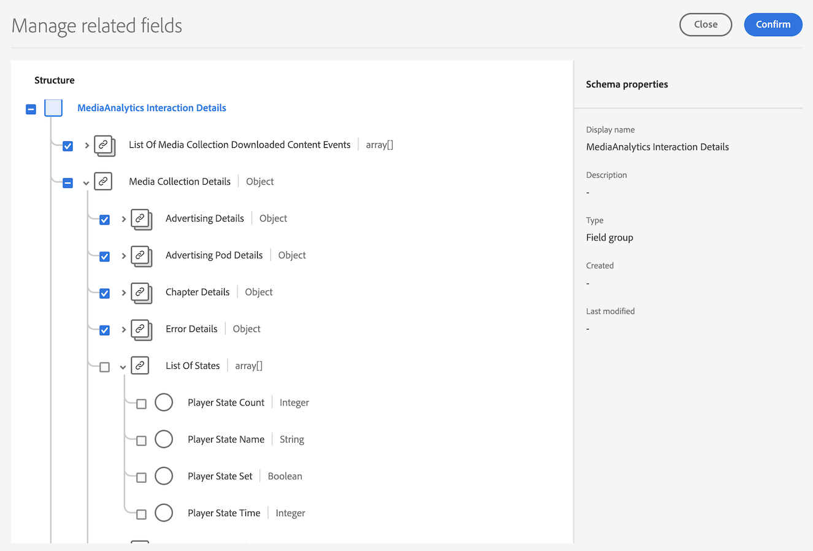

# Edge实施概述

Adobe Experience Platform Edge Network允许您将发送到多个产品的数据发送到单个端点，然后将该相应信息转发到每个产品。 这可以整合多个数据解决方案中的实施工作，并且是为Adobe Analytics和Customer Journey Analytics实施流媒体收集的建议方法。

无论您使用哪个代码库(Web SDK、Mobile SDK（iOS或Android）、Roku SDK或Media Edge API)，都必须首先完成本页中所述的平台设置：创建架构、创建数据集和配置数据流。

## 先决条件

1. **完成常规先决条件。** 请参阅[常规先决条件](/help/getting-started/prereqs.md)。

1. **确认兼容的Adobe解决方案。** 您必须具备有效的Customer Journey Analytics、Adobe Analytics、Adobe Journey Optimizer或Real-Time Customer Data Platform实施：
   * [Customer Journey Analytics指南](https://experienceleague.adobe.com/docs/analytics-platform/using/cja-landing.html?lang=zh-Hans)
   * [实施 Adobe Analytics](https://experienceleague.adobe.com/docs/analytics/implementation/home.html)
   * [Adobe Journey Optimizer文档](https://experienceleague.adobe.com/docs/journey-optimizer.html?lang=zh-Hans)
   * [Real-Time Customer Data Platform文档](https://experienceleague.adobe.com/docs/real-time-customer-data-platform.html)

## 在Adobe Experience Platform中设置架构

为了在使用Adobe Experience Platform的应用程序之间标准化数据收集，Adobe创建了一个公开记录的开放式Experience Data Model (XDM)标准。

1. 在Adobe Experience Platform中，按照[在UI中创建和编辑架构](https://experienceleague.adobe.com/docs/experience-platform/xdm/ui/resources/schemas.html?lang=en)中的说明开始创建架构。

1. 在“架构详细信息”页面上，选择&#x200B;**[!UICONTROL Experience Event]**&#x200B;作为架构的基类。

   

1. 选择&#x200B;**[!UICONTROL 下一步]**。

1. 指定架构显示名称和说明，然后选择&#x200B;**[!UICONTROL 完成]**。

1. 在&#x200B;**[!UICONTROL 合成]**&#x200B;区域的&#x200B;**[!UICONTROL 字段组]**&#x200B;部分中，选择&#x200B;**[!UICONTROL 添加]**，然后搜索并将以下字段组添加到架构中：
   * `End User ID Details`
   * `Implementation Details`
   * `MediaAnalytics Interaction Details`

   添加字段组后，它们将显示在&#x200B;**[!UICONTROL 字段组]**&#x200B;部分中：

   

1. 选择&#x200B;**[!UICONTROL 保存]**&#x200B;以保存更改。

1. （可选）您可以隐藏Media Edge API未使用的某些字段。 隐藏这些字段可以使架构更易于读取，但不是必需的。 这些字段仅引用`MediaAnalytics Interaction Details`字段组中的字段。

   +++ 展开以查看有关可隐藏字段的说明。

   1. 在&#x200B;**[!UICONTROL 结构]**&#x200B;区域中，选择`Media Collection Details`字段，然后选择&#x200B;**[!UICONTROL 管理相关字段]**。

      

   1. 启用该选项以&#x200B;**[!UICONTROL 显示字段]**&#x200B;的显示名称，然后按如下方式更新架构：

      * 在`Media Collection Details` > `Advertising Details`字段中，隐藏以下报表字段： `Ad Completed`、`Ad Started`和`Ad Time Played`。

      * 在`Media Collection Details` > `Advertising Pod Details`字段中，隐藏以下报告字段： `Ad Break ID`

      * 在`Media Collection Details` > `Chapter Details`字段中，隐藏以下报告字段： `Chapter Completed`、`Chapter ID`、`Chapter Started`和`Chapter Time Played`。

      * 在`Media Collection Details`字段中，隐藏`List Of States`字段。

        

      * 在`Media Collection Details` > `List Of States End`和`Media Collection Details` > `List Of States Start`字段中，隐藏以下报告字段： `Player State Count`、`Player State Set`和`Player State Time`。

        要隐藏的

      * 在`Media Collection Details` > `Qoe Data Details`字段中，隐藏以下报告字段： `Average Bitrate`、`Average Bitrate Bucket`、`Bitrate Change Impacted Streams`、`Bitrate Changes`、`Buffer Impacted Streams`、`Buffer Events`、`Dropped Frame Impacted Streams`、`Drops Before Starts`、`Errors`、`External Error IDs`、`Error Impacted Streams`、`Media SDK Error IDs`、`Player SDK Error IDs`、`Stalling Impacted Streams`、`Stalling Events`、`Total Buffer Duration`和`Total Stalling Duration`。

      * 在`Media Collection Details` > `Session Details`字段中，隐藏以下报告字段： `10% Progress Marker`、`25% Progress Marker`、`50% Progress Marker`、`75% Progress Marker`、`95% Progress Marker`、`Ad Count`、`Average Minute Audience`、`Content Completes`、`Chapter Count`、`Content Starts`、`Content Time Spent`、`Estimated Streams`、`Federated Data`、`Media Segment Views`、`Media Downloaded Flag`、`Media Starts`、`Media Session ID`、`Media Session Server Timeout`、`Media Time Spent`、`Pause Events`、`Pause Impacted Streams`、`Pev3`、`Pccr`、`Total Pause Duration`、`Unique Time Played`和`Video Segment`。

   1. 选择&#x200B;**[!UICONTROL 确认]**&#x200B;以保存更改。

   1. 在&#x200B;**[!UICONTROL 结构]**&#x200B;区域中，启用选项&#x200B;**[!UICONTROL 显示字段的显示名称]**，然后选择`List Of Media Collection Downloaded Content Events`字段。

   1. 选择&#x200B;**[!UICONTROL 管理相关字段]**，然后按如下方式更新架构：

      * 在`List Of Media Collection Downloaded Content Events` > `Media Details` > `Advertising Details`字段中，隐藏以下报告字段： `Ad Completed`、`Ad Started`和`Ad Time Played`。

      * 在`List Of Media Collection Downloaded Content Events` > `Media Details` > `Advertising Pod Details`字段中，隐藏以下报告字段： `Ad Break ID`

      * 在`List Of Media Collection Downloaded Content Events` > `Media Details` > `Chapter Details`字段中，隐藏以下报告字段： `Chapter Completed`、`Chapter ID`、`Chapter Started`和`Chapter Time Played`。

      * 在`List Of Media Collection Downloaded Content Events` > `Media Details`字段中，隐藏`List Of States`字段。

      * 在`List Of Media Collection Downloaded Content Events` > `Media Details` > `List Of States End`和`Media Collection Details` > `List Of States Start`字段中，隐藏以下报告字段： `Player State Count`、`Player State Set`和`Player State Time`。

      * 在`List Of Media Collection Downloaded Content Events` > `Media Details` > `Qoe Data Details`字段中，隐藏以下报告字段： `Average Bitrate`、`Average Bitrate Bucket`、`Bitrate Change Impacted Streams`、`Bitrate Changes`、`Buffer Events`、`Buffer Impacted Streams`、`Drops Before Starts`、`Dropped Frame Impacted Streams`、`Error Impacted Streams`、`Errors`、`External Error IDs`、`Media SDK Error IDs`、`Player SDK Error IDs`、`Stalling Events`、`Stalling Impacted Streams`、`Total Buffer Duration`和`Total Stalling Duration`。

      * 在`List Of Media Collection Downloaded Content Events` > `Media Details` > `Session Details`字段中，隐藏以下报告字段： `10% Progress Marker`、`25% Progress Marker`、`50% Progress Marker`、`75% Progress Marker`、`95% Progress Marker`、`Ad Count`、`Average Minute Audience`、`Chapter Count`、`Content Completes`、`Content Starts`、`Content Time Spent`、`Estimated Streams`、`Federated Data`、`Media Downloaded Flag`、`Media Segment Views`、`Media Session ID`、`Media Session Server Timeout`、`Media Starts`、`Media Time Spent`、`Pause Events`、`Pause Impacted Streams`、`Pccr`、`Pev3`、`Total Pause Duration`、`Unique Time Played`和`Video Segment`。

      * 在`List Of Media Collection Downloaded Content Events` > `Media Details`字段中，隐藏`Media Session ID`字段。

   1. 选择&#x200B;**[!UICONTROL 确认]**&#x200B;以保存更改。

   1. 在&#x200B;**[!UICONTROL 结构]**&#x200B;区域中，选择`Media Reporting Details`字段，然后选择&#x200B;**[!UICONTROL 管理相关字段]**。

   1. 启用该选项以&#x200B;**[!UICONTROL 显示字段]**&#x200B;的显示名称，然后按如下方式更新架构：

      * 在`Media Reporting Details`字段中，隐藏以下字段： `Error Details`、`List Of States End`、`List of States Start`和`Media Session ID`。

   1. 选择&#x200B;**[!UICONTROL 确认]** > **[!UICONTROL 保存]**&#x200B;以保存更改。

   +++

1. （可选）您可以将自定义元数据添加到架构中。 这使您可以根据特定需求或上下文包含其他用户定义的元数据。 有关使用Media Edge API自定义元数据的详细信息，请参阅[自定义元数据支持](custom-metadata.md)。

   +++ 展开以查看有关将自定义元数据添加到架构的说明。

   1. 通过选择&#x200B;**[!UICONTROL 帐户信息]** > **[!UICONTROL 分配的组织]** > [!UICONTROL _**组织名称**_] > **[!UICONTROL 租户]**，找到组织的租户名称。

      通过此路径接收自定义字段。 （例如，租户名称： _dcbl → myCustomField path： _dcbl.myCustomField。）

   1. 将自定义字段组添加到您定义的媒体架构。

      

   1. 将您要跟踪的任何自定义字段添加到字段组。

      

   1. [为请求有效负载中的自定义字段使用生成的路径](https://experienceleague.adobe.com/en/docs/experience-platform/xdm/ui/fields/overview#type-specific-properties)。

      

   +++

1. 继续[在Adobe Experience Platform](#create-a-dataset-in-adobe-experience-platform)中创建数据集。

## 在 Adobe Experience Platform 中创建数据集

1. 请确保按照[在Adobe Experience Platform中设置架构](#set-up-the-schema-in-adobe-experience-platform)中所述设置架构。

1. 在Adobe Experience Platform中，按照[数据集UI指南](https://experienceleague.adobe.com/docs/experience-platform/catalog/datasets/user-guide.html?lang=zh_Hans#create)中的说明开始创建数据集。

   为数据集选择架构时，请选择之前创建的架构。

1. 继续[在Adobe Experience Platform](#configure-a-datastream-in-adobe-experience-platform)中配置数据流。

## 在Adobe Experience Platform中配置数据流

1. 请确保按照[在Adobe Experience Platform中创建数据集](#create-a-dataset-in-adobe-experience-platform)中的说明创建了数据集。

1. 按照[配置数据流](https://experienceleague.adobe.com/docs/experience-platform/edge/datastreams/configure.html?lang=zh-Hans)中的说明创建新数据流。

   创建数据流时，进行以下选择：

   * 在&#x200B;**[!UICONTROL 事件架构]**&#x200B;字段中，选择您在[中创建的架构。在Adobe Experience Platform](#set-up-the-schema-in-adobe-experience-platform)中设置架构。 选择&#x200B;**[!UICONTROL 保存]**。

     >[!IMPORTANT]
     >
     >不要选择&#x200B;**[!UICONTROL 保存并添加映射]**，因为这样做会导致时间戳字段出现映射错误。

     

   * 根据您使用的是Adobe Analytics还是Customer Journey Analytics，将以下任一服务添加到数据流：

      * **[!UICONTROL Adobe Analytics]**（如果使用Adobe Analytics）

        如果您使用的是Adobe Analytics，请按照[创建报表包](https://experienceleague.adobe.com/en/docs/analytics/admin/admin-tools/manage-report-suites/c-new-report-suite/t-create-a-report-suite)中的说明定义报表包。

      * **[!UICONTROL Adobe Experience Platform]**（如果使用Customer Journey Analytics）

     有关将服务添加到数据流的信息，请参阅[配置数据流](https://experienceleague.adobe.com/docs/experience-platform/edge/datastreams/configure.html?lang=en#view-details)中的“将服务添加到数据流”。

     

   * 展开&#x200B;**[!UICONTROL 高级选项]**，然后启用&#x200B;**[!UICONTROL Media Analytics]**&#x200B;选项。

     

## 选择实施方法

准备好架构、数据集和数据流后，实施以下代码库之一以开始将流媒体数据发送到Edge Network。 每个页面都涵盖特定于流媒体的设置；每个事件和每个变量的代码都存在于[事件](/help/implementation/events/overview.md)和[变量](/help/implementation/variables/overview.md)中。

| 代码库 | In-code | 通过标记 |
|---|---|---|
| Web | [Web SDK](web-sdk.md) | [Web SDK标记扩展](web-sdk-tags.md) |
| iOS | [iOS](ios.md) | [iOS （标记）](ios-tags.md) |
| Android | [Android](android.md) | [Android （标记）](android-tags.md) |
| Roku | [Roku](roku.md) | — |
| API | [Media Edge API](media-edge-api.md) | — |

## 下一步

开始收集数据后，您可以配置报表：

* [为Edge实施设置报表](/help/reporting/setup/edge-reporting.md) (Customer Journey Analytics)
* [为仅Analytics实施设置报告](/help/reporting/setup/analytics-reporting.md)（如果您的数据流馈送Adobe Analytics）

>[!MORELIKETHIS]
>
>* [自定义元数据支持](custom-metadata.md)
>* [XDM报告架构](reporting-schema.md)
>* [事件概述](/help/implementation/events/overview.md)
