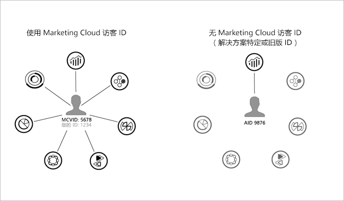

# 先决条件{#prerequisites}

## 决策 {#decision}

在开始跟踪实施之前，您需要就哪种实施对您的情况更有帮助做一些早期决策。

* **Media Analytics —** 使用最新的 Media SDK（标准、建议的实施）和/或媒体收集 API (RESTful)
* **里程碑 —** 旧版 Adobe 跟踪实施
* **Data Insertion API —** 无需使用 Media SDK 即可实施跟踪

## 任务 {#prereq-tasks}

对于 *Media Analytics* 实施，以下是您在开始之前必须完成的任务：

1. **启用 Experience Cloud。**

   您需要实施 Adobe Experience Platform Identity Service。

   Identity Service 允许将通用识别框架用于 Experience Cloud 核心服务、解决方案和客户属性，以及人员核心服务中的受众。Identity Service 通过向网站访客分配一个唯一的永久性 ID 来工作。当您的组织实施 ID 服务时，此 ID 允许您在不同的 Experience Cloud 解决方案中识别同一站点访客及其数据。

   

   ID 服务还可以替换解决方案特定的不同 ID（例如，Analytics AID）。通过[客户 ID 和身份验证状态](https://experienceleague.adobe.com/docs/id-service/using/reference/authenticated-state.html?lang=zh-Hans)功能，ID 服务允许您将自己的客户 ID 传递到 Experience Cloud。但是，请记住，ID 服务仅适用于您已订阅的解决方案。如果您未注册访问其他产品，则 ID 服务不提供访问权限。

   今后，ID 服务将成为许多当前和将来推出的 Experience Cloud 功能、增强功能和服务中的必备组件。当前，ID 服务支持 [Analytics](https://www.adobe.com/cn/marketing-cloud/web-analytics.html)、[Audience Manager](https://www.adobe.com/cn/marketing-cloud/data-management-platform.html) 和 [Target](https://www.adobe.com/cn/marketing-cloud/testing-targeting.html)。

   如果您还没有实施 ID 服务，现在是时候开始考虑迁移策略了。有关 ID 服务的重要性和角色的更多信息，请参阅[为什么您应考虑使用 Identity Service](https://theblog.adobe.com/why-new-adobe-marketing-cloud-id-service-should-be-on-your-radar/)。

   有关 Experience Cloud ID 的其他信息，请参阅 [Experience Cloud ID 概述](https://experienceleague.adobe.com/docs/id-service/using/intro/overview.html?lang=zh-Hans)和 [Adobe Experience Platform Identity Service](https://experienceleague.adobe.com/docs/id-service/using/home.html?lang=zh-Hans)。

1. **启用 Adobe Analytics 报表。**

   要启用 Analytics 中的报表并查看您正在收集的内容和广告数据，请参阅[媒体报表启用](/help/media-reports/media-reports-enable.md)。
