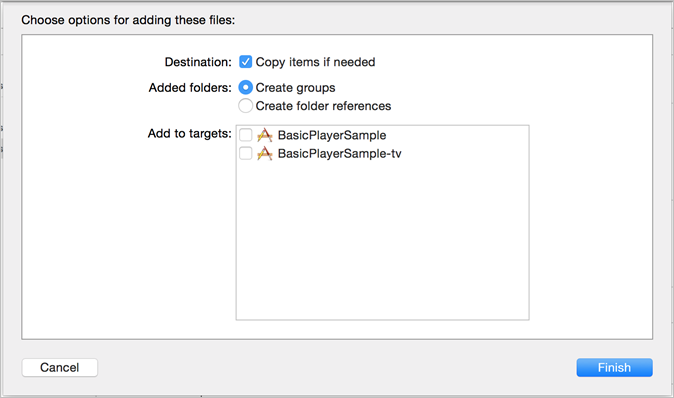

# 设置 iOS{#set-up-ios}

了解如何为iOS设备设置流媒体服务。

>[!IMPORTANT]
>
>Adobe 将于 2021 年 8 月 31 日终止支持版本 4 Mobile SDK，届时还将终止对适用于 iOS 和 Android 的 Media Analytics SDK 的支持。  有关更多信息，请参阅 [Media Analytics SDK 支持终止常见问题解答](/help/additional-resources/end-of-support-faqs.md)。

## 先决条件

* **获取Media SDK的有效配置参数**
在设置Analytics帐户后，这些参数可以从Adobe代表获取。
* **在应用程序中实施适用于iOS的ADBMobile**
有关Adobe Mobile SDK文档的更多信息，请参阅适用于Experience Cloud解决方案的[iOS SDK 4.x。](https://experienceleague.adobe.com/docs/mobile-services/ios/overview.html?lang=zh-Hans)

  >[!IMPORTANT]
  >
  >从 iOS 9 开始，Apple 引入了 App Transport Security (ATS) 功能。 此功能旨在通过确保您的应用程序仅使用行业标准协议和密码来提高网络安全性。 此功能默认处于启用状态，但您的配置选项为您提供了是否使用 ATS 的选项。 有关 ATS 的详细信息，请参阅 [App Transport Security](https://experienceleague.adobe.com/docs/mobile-services/ios/config-ios/app-transport-security.html?lang=zh-Hans)。

* **在媒体播放器中提供以下功能：**

   * _用于订阅播放器事件的 API_ – Media SDK 要求在播放器中发生事件时调用一组简单的 API。
   * _提供播放器信息的 API_ - 此信息包括媒体名称和播放头位置等详细信息。

## SDK 实施

>[!IMPORTANT]
>
>从版本 2.3.0 开始，SDK 通过 XCFramework 进行分发。
>
>SDK 版本 2.3.0 需要 Xcode 12.0 或更高版本以及（如果适用）Cocoapods 1.10.0 或更高版本。

* 每当提到二进制库文件时，应改用其 XCFramework 替换：
   * MediaSDK.a > MediaSDK.xcframework
   * MediaSDK_TV.a > MediaSDKTV.xcframework
* 如果手动将 Adobe XCFramework 添加到您的项目，请确保未嵌入它们。

1. 将[下载](/help/getting-started/download-sdks.md)的 Media SDK 添加到您的项目中。

   1. 验证以下软件组件存在于 `libs` 目录中：

      * `ADBMediaHeartbeat.h`：用于 iOS 心跳跟踪 API 的 Objective-C 头文件。
      * `ADBMediaHeartbeatConfig.h`：用于 SDK 配置的 Objective-C 头文件。
      * `MediaSDK.a`：启用了 bitcode 的胖二进制文件，其中包含用于 iOS 设备（armv7、armv7s、arm64）和模拟器（i386 和 x86_64）的库生成。

        当目标面向 iOS 应用程序时，应该关联此二进制文件。

      * `MediaSDK_TV.a`：启用了 bitcode 的胖二进制文件，其中包含用于新 Apple TV 设备 (arm64) 和模拟器 (x86_64) 的库生成。

        当目标面向 Apple TV (tvOS) 应用程序时，应该关联此二进制文件。

   1. 将库添加到您的项目中：

      1. 启动 Xcode IDE 并打开您的应用程序。
      1. 在&#x200B;**[!UICONTROL 项目导航器]**&#x200B;中，将 `libs` 目录拖放到您的项目下。

      1. 确保选中&#x200B;**[!UICONTROL 需要时复制项目]**&#x200B;复选框，选定&#x200B;**[!UICONTROL 创建群组]**，且未选中&#x200B;**[!UICONTROL 添加到目标]**&#x200B;中的任何复选框。

      

      1. 单击&#x200B;**[!UICONTROL 完成]**。
      1. 在&#x200B;**[!UICONTROL 项目导航器]**&#x200B;中，选择您的应用程序并选择您的目标。
      1. 在&#x200B;**[!UICONTROL 常规]**&#x200B;选项卡上的&#x200B;**[!UICONTROL 链接的框架]**&#x200B;和&#x200B;**[!UICONTROL 库]**&#x200B;区域，链接所需的框架和库。

         **iOS 应用程序目标:**

         * **AdobeMobileLibrary.a**
         * **MediaSDK.a**
         * **libsqlite3.0.tbd**

         **Apple TV (tvOS) 目标：**

         * **AdobeMobileLibrary_TV.a**
         * **MediaSDK_TV.a**
         * **libsqlite3.0.tbd**
         * **SystemConfiguration.framework**

      1. 确认您的应用程序在生成时没有出现错误。

1. 导入库。

   ```
   #import "ADBMediaHeartbeat.h"
   #import "ADBMediaHeartbeatConfig.h"
   ```

1. 创建一个 `ADBMediaHeartbeatConfig` 实例。

   本节将帮助您了解 `MediaHeartbeat` 配置参数并在您的 `MediaHeartbeat` 实例中设置正确的配置值，以便进行准确跟踪。

   以下是 `ADBMediaHeartbeatConfig` 初始化示例：

   ```
   // Media Heartbeat Initialization
   ADBMediaHeartbeatConfig *config = [[ADBMediaHeartbeatConfig alloc] init];
   config.trackingServer = <SAMPLE_HEARTBEAT_TRACKING_SERVER>;
   config.channel        = <SAMPLE_HEARTBEAT_CHANNEL>;
   config.appVersion     = <SAMPLE_HEARTBEAT_SDK_VERSION>;
   config.ovp            = <SAMPLE_HEARTBEAT_OVP_NAME>;
   config.playerName     = <SAMPLE_PLAYER_NAME>;
   config.ssl            = <YES/NO>;
   config.debugLogging   = <YES/NO>;
   ```

1. 实施 `ADBMediaHeartbeatDelegate` 协议。

   ```
   @interface VideoAnalyticsProvider : NSObject <ADBMediaHeartbeatDelegate>
   
   @end
   
   @implementation VideoAnalyticsProvider
   
   // Replace <bitrate>, <startuptime>, <fps> and <droppeFrames>  
   // with the current playback QoS values.
   - (ADBMediaObject *)getQoSObject {
       return [ADBMediaHeartbeat createQoSObjectWithBitrate:<bitrate>  
                                 startupTime:<startuptime>   
                                 fps:<fps>  
                                 droppedFrames:<droppedFrames>];
   }
   
   // Return the current video player playhead position.
   // Replace <currentPlaybackTime> with the video player current playback time
   - (NSTimeInterval)getCurrentPlaybackTime {
       return <currentPlaybackTime>;
   }
   
   @end
   ```

1. 使用 `ADBMediaHeartBeatConfig` 和 `ADBMediaHeartBeatDelegate` 创建 `ADBMediaHeartbeat` 实例。

   ```
   //Replace <ADBMediaHeartBeatDelegate> with your delegate instance
   _mediaHeartbeat = [[ADBMediaHeartbeat alloc] initWithDelegate:
     <ADBMediaHeartBeatDelegate> config:config];
   ```

   >[!IMPORTANT]
   >
   >在会话结束前，请确保您的 `ADBMediaHeartbeat` 实例可以访问且“未被取消分配”**。 此实例将用于以下所有的跟踪事件。

## 在 iOS 中从版本 1.x 迁移到 2.x {#migrate-to-two-x}

在版本 2.x 中，所有公共方法都已合并到 `ADBMediaHeartbeat` 类中，从而更加便于开发人员使用。 所有配置都已合并到 `ADBMediaHeartbeatConfig` 类中。

有关从 1.x 迁移到 2.x 的信息，请参阅旧版实施文档。

## 配置适用于 tvOS 的本地应用程序

新的 Apple TV 发布后，您现在可以创建要在本机 tvOS 环境中运行的应用程序。 您可以使用 iOS 中提供的几个框架中的任意一个来创建纯本机应用程序，也可以使用 XML 模板和 JavaScript 创建应用程序。 从 MediaSDK 版本 2.0 开始，提供对 tvOS 的支持。 有关 tvOS 的更多信息，请参阅 [tvOS 开发人员网站](https://developer.apple.com/cn/tvos/)。

在您的 Xcode 项目中执行以下步骤。 本指南的编写假定您的项目具有针对 tvOS 的 Apple TV 应用程序：

1. 将`VideoHeartbeat_TV.a`库文件拖到您项目的`lib`文件夹中。

1. 在tvOS应用程序目标的&#x200B;**[!UICONTROL 生成阶段]**&#x200B;选项卡中，展开&#x200B;**[!UICONTROL 将二进制文件与库关联]**&#x200B;部分，然后添加以下库：

   * `MediaSDK_TV.a`
   * `AdobeMobileLibrary_TV.a`
   * `libsqlite3.0.tbd`
   * `SystemConfiguration.framework`
