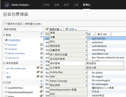
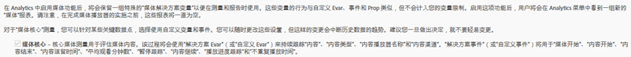
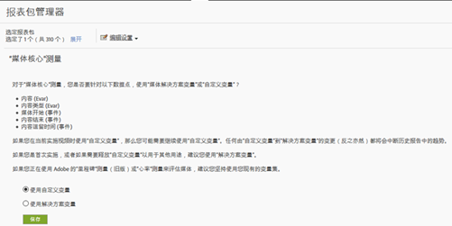
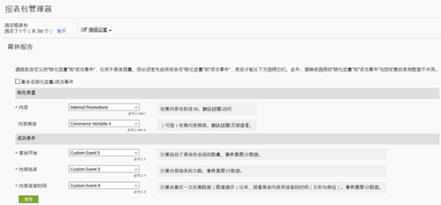

# 里程碑概述{#milestone-overview}

>[!CAUTION]
>
>此度量选项已弃用。

[旧版里程碑文档](milestone_analytics_video.pdf)

## 配置 {#configuration}

### 里程碑视频配置

要跟踪视频，请指定一组“自定义转化变量”**(eVar) 和“自定义事件”**，以用于跟踪和报告。有一个“自定义分析”**&#x200B;变量 () 也用于路径分析。`s.prop`

您为每个量度选择的变量会添加到视频配置页面。这允许系统自动生成标准视频报表并设置其格式。“视频名称”** eVar 和“视频查看”**&#x200B;计数器都是必需的。其他变量是可选的，但建议使用这些变量以实现完整的测量。在启用视频跟踪后，您可以查看从使用视频跟踪报告的视频数据生成的报表。

您还可以跟踪任意数量的其他视频量度。例如，如果您在网站上使用多个视频播放器，则可以在 eVar 中填充播放器名称。您选择的某些变量可能还会用在网站的其他区域。例如，在整个网站中使用时，“内容类型”**&#x200B;变量可让您测量页面查看次数中来自于视频的百分比，并允许您将转化事件关联到视频。

### 里程碑报告配置

To set-up video reporting for a Milestone implementation, go to **[!UICONTROL Admin &gt; Report Suite Manager].** 选择报表包，然后选择“视 **[!UICONTROL 频管理”&gt;“视频报表”]:**

<!--{width="248"}-->


在第一个屏幕中，只有“视频核心”可以使用里程碑数据。选择&#x200B;**[!UICONTROL 视频核心]**，然后单击&#x200B;**[!UICONTROL 保存]。**



On the next screen, select **[!UICONTROL Use Custom Variables].**

<!--{width="470"}-->


在最后一个屏幕中，选择要用于视频测量的两个 eVar 和三个事件：

<!---->


## 视频变量引用 {#video-variable-reference}

下表包含有关视频的商务变量和自定义事件的其他详细信息：

| 视频量度 | 变量类型 | 描述 |
| --- | --- | --- |
| 内容 | eVar默 <br/>认过期：访问 | （必需）收集实施中指定的视频名称。 |
| 内容类型 | eVar <br/>Default expiration: Page view | 收集由访客查看的内容类型相关数据。通过视频测量发送的点击被分配为内容类 `video.` 型。此 <br/>变量不需要专门为视频跟踪保留。 如果其他内容使用相同的变量报告内容类型，则可以分析不同类型内容中访客的分布情况。 例如，您可以使用此变量通过 `article` 或 `product page` 之类的值标记其他内容类型。<br/>从视频测量的角度来看，“内容类型”**&#x200B;允许您识别视频访客，从而计算视频转化率。 |
| 内容逗留时间 | Event <br/>Type: Counter | 以秒为单位，计算自上次数据收集流程（图像请求）以来，观看视频所花费的时间。 |
| 视频初始化 | Event <br/>Type: Counter | 表明访客已查看了视频的某些部分。但是它并不提供有关访客查看了视频中的多少内容或哪一部分的信息。 |
| 视频结束 | 事件 <br/>类型：计数器 | 表明用户已查看了完整的视频。默认情况下，完整的事件会在视频结束前 1 秒进行测量。<br/>在实施过程中，您可以指定希望在距离视频结束有多少秒时被视为查看完成。对于实时视频和其他未定义结尾的流，您可以指定一个自定义时间点来测量结束。例如，在查看了特定时间之后。 |

## 媒体模块变量 {#media-module-variables}

您可以使用以下变量配置视频测量。您必须为“必需变量”表中的变量定义值。此外，要跟踪视频播放器中的事件，您必须（为支持的播放器）启用自动跟踪功能，或使用 open、play、stop 和 close 方法实施自定义播放器事件跟踪。

| 变量    | 描述 |
| --- | --- |
| `Media.trackUsingContextData` | **语法：**<br/><br/> `s.Media.trackUsingContextData = true;`<br/>此选项可启用集成的视频跟踪。当设置为true时，媒体模块会生成用于媒体跟踪的上下文数据，而不是旧版数据 `pev3`。 <br/>可使用 `Media.contextDataMapping` 将上下文数据映射到选定的 eVar 和 event。<br/>默认值： `false` |
| `Media.contextDataMapping` | **语法：**<br/><br/> `s.Media.contextDataMapping = {`<br/>      `"a.media.name":"eVar2, prop2",` <br/>     `"a.media.segment":"eVar3",` <br/>     `"a.contentType":"eVar1",` <br/>     `"a.media.timePlayed":"event3",` <br/>     `"a.media.view":"event1",` <br/>     `"a.media.segmentView":"event2",` <br/>     `"a.media.complete":"event7",` <br/>     `"a.media.milestones":{` <br/>         `25:"event4",` <br/>         `50:"event5",` <br/>         `75:"event6"` <br/>     ` }` <br/> `};`<br/><br/>一个对象，可定义映射到要用于视频测量的 eVar 和 event 的变量。The object must map the following fields: <br/><br/> **a.media.name：**（必需）在变量中填充视频名称。提供您选择用来存储视频名称的 eVar，以及要用于视频路径的“自定义分析视频”变量 (`s.prop`)。Provide the values in a comma-separated list. <br/><br/> **a.media.segment：**（可选）要用于存储媒体区段名称的 eVar。a.contentType：（可选）要用于存储视频值的 eVar，其中包含已启用的用于生成视频访问和访客报表的访问和访客跟踪。您选择的变量可能已用于存储文章幻灯片或产品页面之类的数据 <br/><br/> **** a.media.view:（必需）要计算媒体查看次数的事件。 <br/><br/> **** a.media.segmentView:（可选）要计算区段查看次数的事件。 <br/><br/> **** a.media.complete:（可选）要计算完整视图的事件。 <br/><br/> **** a.media.timePlayed:（可选，强烈建议）要存储已播放视频秒数的数字事件。 <br/><br/> **a.media.milestones：**（可选）一个对象，可将 s.Media.trackMilestones 里程碑映射到计数器事件。Media.segmentByMilestones should be set to true if you define milestones. <br/><br/> **广告跟踪** 要跟踪广告，可使用以下上下文数据变量： <br/> **a.media.ad.name：**（必需）在变量中填充广告名称。提供您选择用来存储广告名称的 eVar，以及要用于路径的“自定义分析视频”变量 (`s.prop`)。Provide the values in a comma-separated list. <br/><br/> **** a.media.ad.pod:播放广告的主要内容中的位置。 <br/><br/> **** a.media.ad.podPosition:播放广告的窗格内的位置。 <br/><br/> **** a.media.ad.CPM:应用于此播放的CPM或加密CPM（前缀为“~”）。 <br/><br/> **a.media.ad.view**：与 的工作方式相同。`a.media.view`<br/><br/> **** a.media.ad.clicked:计算广告（调用）的点击`Media.click` 次数 <br/><br/> **a.media.ad.timePlayed**：与 的工作方式相同。`a.media.timePlayed`<br/><br/> **** a.media.ad.complete:工作方式与a.media.ad.se段相 `a.media.complete` 同：工作方式与 `a.media.segment`<br/><br/> **a.media.ad.segmentView**：与 的工作方式相同。`a.media.segmentView`<br/><br/> **a.media.ad.milestones**：与 的工作方式相同。`a.media.milestones`<br/><br/> **a.media.ad.offsetMilestones**：与 的工作方式相同。`a.media.offsetMilestones` |
| `Media.trackVars` | **语法：**<br/><br/> `s.Media.trackVars =` <br/>    `"events,` `prop2,` `eVar1,` `eVar2,` `eVar3";` <br/><br/>A comma-separated list of all variables that are set in your video tracking code. |
| `Media.trackEvents` | **语法：**<br/><br/> `s.Media.trackEvents =` <br/>    `"event1,` `event2,` `event3,` `event4,` `event5,` `event6,` `event7"` <br/><br/>A comma-separated list of all events that are set in your video tracking code. |

## 可选变量 {#optional-variables}

|  变量    | 描述 |
| --- | --- |
| `Media.autoTrack` | **语法：**<br/><br/> `s.Media.autoTrack = true`<br/><br/>为支持的播放器启用自动跟踪功能。支持的播放器包括： <ul> <li> 开源媒体框架 (OSMF) </li> <li> FLVPlayback（由 Flash Professional 中的导入视频向导创建的视频播放器） </li> <li> Silverlight </li> <li> MediaDisplay </li> <li> MediaPlayback </li> <li> Brightcove API 版本 2 和 3（请参阅 [Brightcove](https://marketing.adobe.com/resources/help/en_US/sc/appmeasurement/video/video_other_players.html)） </li> <li> 使用 JavaScript 的 Windows Media Player、Quicktime 或 Real Player </li> </ul> <br/><br/>如果您没有使用上述播放器之一，则可以使用它来 `Media.open` 跟 `Media.play` 踪 `Media.stop` 播 `Media.close` 放器事件。 |
| `Media.autoTrackNetStreams` | **语法：**<br/><br/> `s.Media.autoTrackNetStreams = true`<br/><br/>Flash 10.3 在 NetStream 组件中引入了新功能，以增强视频跟踪。如果您使用自定义 Flash NetStream 播放器，则可以启用此变量来使用类似于 autoTrack 的功能。此方法要求视频在 Flash 10.3 或更高版本中查看。 |
| `Media.completeByCloseOffset` | **语法：**<br/><br/> <br/><br/>`s.Media.completeByCloseOffset = true`<br/><br/>此设置允许您在视频实际结束前几秒计为一次完整的视频查看。<br/><br/>该事件基于 `completeCloseOffsetThreshold` 中指定的秒数发送。如果视频播放器从不报告等于视频长度的偏移，您便可以通过此方法测量结束。<br/><br/>默认情况下，此值设置为 true，阈值设置为 1 秒。使用这些默认设置，结束事件会在视频结束前 1 秒发送。 |
| `Media.completeCloseOffsetThreshold` | **语法：**<br/><br/> `s.Media.completeCloseOffsetThreshold = 1`<br/><br/>此阈值允许您在视频实际结束前几秒计为一次完整的视频查看。`Media.completeByCloseOffset` 必须设置为 true 才能使用此阈值。<br/><br/>您提供的整数值可决定在关闭时距离视频长度的偏移秒数，并且这仍将计为一次结束。如果视频播放器从不报告等于视频长度的偏移，您便可以通过此方法测量结束。<br/><br/>默认的阈值为 1 秒。 |
| `Media.playerName` | **语法：**<br/><br/> `s.Media.playerName = "Custom Player Name"`<br/><br/>指定一个自定义视频播放器名称。 |
| `Media.trackSeconds` | **语法：**<br/><br/> `s.Media.trackSeconds = 15`<br/><br/>定义在视频播放时将视频跟踪数据发送到 Adobe 数据收集服务器的间隔，以秒为单位。此值必须以 5 秒为增量进行设置。<br/><br/> 启用 `Media.trackSeconds` 只会触发中定义的事件 `Media.contextDataMapping`。 要发送为视频测量指定的变量以外的其他变量，您必须使用 Media.Monitor. |
| `Media.trackMilestones` | Tracks milestones as percentage of the video length.  <br/><br/> **语法：**<br/><br/> `s.Media.trackMilestones = "25, 50, 75";`<br/><br/>定义将视频跟踪数据发送到 Adobe 数据收集服务器的间隔，以视频长度的百分比表示。以逗号分隔整数列表的形式指定里程碑。例如：10 = 10%，23 = 23%。<br/><br/>由于这些里程碑是视频中的固定时间点，因此如果访客查看超过了 10% 里程碑，然后快退并再次超过 10% 里程碑，则媒体模块会发送跟踪数据多次。同样，如果访客快进超过了某个里程碑，则媒体模块不会发送该里程碑的跟踪数据。<br/><br/>启用 `Media.trackMilestones` 只会触发中定义的事件 `Media.contextDataMapping`。 要发送为视频测量指定的变量以外的其他变量，您必须使用 Media.Monitor. |
| `Media.trackOffsetMilestones` | Tracks milestones as seconds elapsed from the beginning of the video.  <br/><br/> **语法：**<br/><br/> `s.Media.trackOffsetMilestones = "20, 40, 60";`<br/><br/>定义将视频跟踪数据发送到 Adobe 数据收集服务器的间隔，以自视频开始后经过的秒数表示。以逗号分隔整数列表的形式指定里程碑。例如：20 = 20 秒，40 = 40 秒。<br/><br/>由于这些里程碑是视频中的固定时间点，因此如果访客查看超过了 20 秒里程碑，然后快退并再次超过 20 秒里程碑，则媒体模块会发送跟踪数据多次。同样，如果访客快进超过了某个里程碑，则媒体模块不会发送该里程碑的跟踪数据。<br/><br/> 启用 `Media.trackOffsetMilestones` 只会触发中定义的事件 `Media.contextDataMapping`。 要发送为视频测量指定的变量以外的其他变量，您必须使用 Media.Monitor. |
| `Media.segmentByMilestones` | **语法：**<br/><br/> `s.Media.segmentByMilestones = true;` 根据 <br/><br/>媒体的长度，自动生成区段名称、区段编号和区段长度数据，在使用时，只有按里程碑分段中指定的里程碑才能定义区段 `Media.trackMilestones`<br/><br/>`autoTrack`。 <br/><br/>默认值： `false` |
| `Media.segmentByOffsetMilestones` | **语法：**<br/><br/> `s.Media.segmentByOffsetMilestones = true;` 根据 <br/><br/>媒体的长度，自动生成区段名称、区段编号和区段长度数据，在使用时，只有按里程碑分段中指定的里程碑才能定义区段 `Media.trackOffsetMilestones`<br/><br/>`autoTrack`。  <br/><br/>默认值： `false` |

## 广告跟踪变量 {#ad-tracking-variables}

这些变量用于结合 openAd 方法发送广告信息。See [VAST Video Ad Tracking.](https://marketing.adobe.com/resources/help/en_US/sc/appmeasurement/video/video_ads.html)

| 变量    | 描述 |
| --- | --- |
| `Media.adTrackSeconds` | **语法：**<br/><br/> `s.Media.adTrackSeconds = 15;`<br/><br/>定义在视频播放时将视频广告跟踪数据发送到 Adobe 数据收集服务器的间隔，以秒为单位。此值必须以 5 秒为增量进行设置。<br/><br/> 启用 `Media.adTrackSeconds` 只会触发中定义的事件 `Media.contextDataMapping`。 要发送为视频测量指定的变量以外的其他变量，您必须使用 `Media.monitor`。 |
| `Media.adTrackMilestones` | Tracks ad milestones as percentage of the ad length.  <br/><br/> **语法：**<br/><br/> `s.Media.adTrackMilestones = "25, 50, 75";`<br/><br/>定义将广告跟踪数据发送到 Adobe 数据收集服务器的间隔，以广告长度的百分比表示。以逗号分隔整数列表的形式指定里程碑。例如：10 = 10%,23 = 23%)。  <br/><br/>由于这些里程碑是广告中的固定时间点，因此如果访客查看超过了 10% 里程碑，然后快退并再次超过 10% 里程碑，则媒体模块会发送跟踪数据多次。同样，如果访客快进超过了某个里程碑，则媒体模块不会发送该里程碑的跟踪数据。<br/><br/> 启用 `Media.adTrackMilestones` 只会触发中定义的事件 `Media.contextDataMapping`。 要发送为视频测量指定的变量以外的其他变量，您必须使用 `Media.monitor`。 |
| `Media.adTrackOffsetMilestones` | Tracks ad milestones as seconds elapsed from the beginning of the ad.  <br/><br/> **语法：**<br/><br/> `s.Media.adTrackOffsetMilestones = "20, 40, 60";`<br/><br/>定义将广告跟踪数据发送到 Adobe 数据收集服务器的间隔，以自广告开始后经过的秒数表示。以逗号分隔整数列表的形式指定里程碑。例如：20 = 20 秒，40 = 40 秒。<br/><br/>由于这些里程碑是广告中的固定时间点，因此如果访客查看超过了 20 秒里程碑，然后快退并再次超过 20 秒里程碑，则媒体模块会发送跟踪数据多次。同样，如果访客快进超过了某个里程碑，则媒体模块不会发送该里程碑的跟踪数据。<br/><br/> 启用 `Media.adTrackOffsetMilestones` 只会触发中定义的事件 `Media.contextDataMapping`。 要发送为视频测量指定的变量以外的其他变量，您必须使用 `Media.monitor`。 |
| `Media.adSegmentByMilestones` | **语法：**<br/><br/> `s.Media.adSegmentByMilestones = true;` 根据 <br/><br/>媒体的长度，自动生成区段名称、区段编号和区段长度数据，在使用时，只有按里程碑分段中指定的里程碑才能定义区段 `Media.adTrackMilestones`<br/><br/>`autoTrack`。  <br/><br/>默认值： `false` |
| `Media.adSegmentByOffsetMilestones` | **语法：**<br/><br/> `s.Media.adSegmentByOffsetMilestones = true;` 根据 <br/><br/>媒体的长度，自动生成区段名称、区段编号和区段长度数据，在使用时，只有按里程碑分段中指定的里程碑才能定义区段 `Media.adTrackOffsetMilestones`<br/><br/>`autoTrack`。 <br/><br/>默认值： `false` |

## 媒体模块方法 {#media-module-methods}

媒体模块方法用于手动跟踪播放器事件，以及跟踪未包含在标准视频报表中的其他量度。

如果您使用 `Media.autoTrack`，并且没有跟踪其他量度，则无需直接调用下面的任何方法。除非指定为可选，否则所有参数都是必需的。

| 方法    | 描述 |
| --- | --- |
| `Media.open` | **语法：**<br/><br/> `s.Media.open(mediaName, mediaLength, mediaPlayerName)`<br/><br/>准备好媒体模块以收集视频跟踪数据。此方法采用以下参数： <ul><li> **mediaName：**（必需）您希望在视频报表中显示的视频名称。 </li><li>  **mediaLength：**（必需）视频的长度，以秒为单位。  </li><li> **mediaPlayerName：**（必需）您希望在视频报表中显示的用来查看视频的媒体播放器名称。 </li></ul> |
| `Media.openAd` | **语法：**<br/><br/> `s.Media.openAd(name, length, playerName, parentName,`<br/>   准 `parentPod, parentPodPosition, CPM)`<br/><br/>备媒体模块以收集广告跟踪数据。 此方法采用以下参数： <ul> <li> **name：**（必需）广告的名称或 ID。  </li> <li> **length：**（必需）广告的长度。  </li> <li> **playerName：**（必需）用来查看广告的媒体播放器名称。  </li> <li> **parentName：**&#x200B;广告被嵌入到的主内容的名称或 ID。  </li> <li> **parentPod：**&#x200B;广告在主内容中播放的位置。  </li> <li> **parentPodPosition：**&#x200B;广告在面板中播放的位置。  </li> <li> **CPM：**&#x200B;应用于此播放的 CPM 或加密 CPM（具有前缀“~”）。  </li> </ul> |
| `Media.click` | **语法：**<br/><br/> `s.Media.click(name, offset)`<br/><br/>跟踪广告何时在视频中被点击。此方法采用以下参数： <ul> <li> **name：**&#x200B;广告的名称。此名称必须匹配 Media.openAd 中使用的名称。  </li> <li> **offset：**&#x200B;点击发生时在广告中的偏移。  </li> </ul> |
| `Media.close` | **语法：**<br/><br/> `s.Media.close(mediaName)`<br/><br/>结束视频数据收集并向 Adobe 数据收集服务器发送信息。在视频的结尾调用此方法。此方法采用以下参数： <br/><br/> **mediaName：**&#x200B;视频的名称。此名称必须匹配 `Media.open` 中使用的名称。 |
| `Media.complete` | **语法：**<br/><br/> `s.Media.complete(name, offset)`<br/><br/>此方法可手动跟踪结束事件。如果您在触发事件时需要使用的特殊逻辑无法使用 `Media.completeByCloseOffset` 进行处理，则可以使用此方法。<br/><br/>例如，如果您测量的实时流未定义结尾，您可能会在用户查看实时流长达 X 秒后触发一次结束。您可以使用基于内容长度和类型的百分比计算方法，来测量一次结束。此方法采用以下参数： <ul> <li> **mediaName：**&#x200B;视频的名称。此名称必须匹配 Media.open 中使用的名称。  </li> <li> **mediaOffset：**&#x200B;应发送结束事件时在视频中的偏移秒数。从零秒开始，指定基于视频的偏移。<br/><br/>如果您的媒体播放器使用毫秒跟踪，请确保将此值转化为调用 Media.complete 之前的秒数。  </li> </ul> 如果您计划手动调用完成，请设置 <br/><br/> `s.Media.completeByCloseOffset = false`。 |
| `Media.play` | **语法：**<br/><br/> `s.Media.play(name, offset, segmentNum, segment, segmentLength)`<br/><br/>无论视频何时开始播放，都调用此方法。在使用手动视频测量时，您可以在发送视频测量数据时提供当前区段数据。<br/><br/>如果您的播放器因某种原因从一个区段更改为另一个区段，您应该拨叫 `Media.stop``Media.play`。 <br/><br/>此方法采用以下参数： <br/><br/> **mediaName：**&#x200B;视频的名称。此名称必须匹配 Media.open 中使用的名称。  <br/><br/> **mediaOffset：**&#x200B;播放开始时在视频中的偏移秒数。从零秒开始，指定基于视频的偏移。如果您的媒体播放器使用毫秒跟踪，请确保将此值转化为调用 Media.play 之前的秒数。  <br/><br/> **segmentNum：**（可选）当前区段编号，市场营销报告使用该编号来对报表中的区段显示进行排序。segmentNum 参数必须大于零。  <br/><br/> **** 分部：（可选）当前区段名称。  <br/><br/> **** segmentLength:（可选）当 <br/><br/>前区段长度，以秒为单位。  <br/><br/>例如： <br/><br/> `s.Media.play("My Video", 1800, 2,"Second Quarter", 1800)` <br/><br/> `s.Media.play("My Video", 0, 1,"Preroll", 30)` |
| `Media.stop` | **语法：**<br/><br/> `s.Media.stop(mediaName, mediaOffset)`<br/><br/>跟踪指定视频的停止事件（停止、暂停等）。此方法采用以下参数： <ul> <li> **mediaName：**&#x200B;视频的名称。此名称必须匹配 `Media.open` 中使用的名称。  </li> <li> **mediaOffset：**&#x200B;发生停止或暂停事件时在视频中的偏移秒数。从零秒开始，指定基于视频的偏移。  </li> </ul> |
| `Media.monitor` | **语法：**<br/><br/> `s.Media.monitor(s, media)` <br/><br/> **Silverlight 语法：**<br/><br/> `s.Media.monitor =` Silverlight <br/>应 `new AppMeasurement_Media_Monitor(myMediaMonitor);`<br/><br/>用程序媒体监视器实现Objective-C委托设计模式。 类方 `myMediaMonitor` 法采用和 `s` 参数 `media` 。 <br/><br/>使用此方法可发送其他视频量度。您可以设置其他变量（prop、eVar、event），并基于所播放视频的当前状态使用 `Media.track` 发送它们。<br/><br/>请参 [阅使用Media.monitor测量其他指标。](https://marketing.adobe.com/resources/help/en_US/sc/appmeasurement/video/video_mediamonitor.html) 此方 <br/><br/>法采用以下参数： <br/><br/>  **** s:实 `AppMeasurement` 例(或JavaScript `s` 对象)。 <br/><br/> **** 媒体：具有提供视频状态的成员的对象。 这些成员包括：  <ul><li> `media.name:` 视频的名称。 This must match the name used in `Media.open`; </li><li> `media.length:` 调用中给定的视频长度（以秒为单位） `Media.open`; </li><li> `media.playerName:` 呼叫中给定的媒体播放器的名称 `Media.open`; </li><li> `media.openTime:` 包含调用时间相关数据的NSDate `Media.open` 对象； </li><li> `media.offset:` 视频中的当前偏移（以秒为单位）。 偏移从零开始（视频的第一秒为0秒）; </li><li> `media.percent:` 根据视频长度和当前偏移量，播放的视频的当前百分比；  </li><li> `media.timePlayed:` 到目前为止播放的总秒数；  </li><li> `media.eventFirstTime:` 指示这是否是第一次为此视频调用此媒体事件； </li><li> `media.mediaEvent:` 包含导致监视器调用的事件名称的字符串。 </li></ul> |
|  | `media.mediaEvent` 活动： <ul><li> `OPEN:` 当通过或调用首次观 `Media.autoTrack` 察播放时 `Media.play`; </li><li> `CLOSE:` 当播放结束时，通过或呼叫 `Media.autoTrack` 视频结束 `Media.close`;</li><li> `PLAY:` 当通过或第二次呼叫暂停或擦洗 `Media.autoTrack` 后恢复播放时 `Media.play`;</li><li> `STOP:` 当播放因滑动开始暂停或呼叫停 `Media.autoTrack` 止时 `Media.stop`;</li><li> `MONITOR:` 当我们的自动监视功能在视频播放时检查其状态时（每秒）;</li><li> `SECONDS:` 在变量定义的第二个区间 `Media.trackSeconds` 内；</li><li> `MILESTONE:` 在变量定义的里程碑 `Media.trackMilestones` 处； </li></ul> |
| `Media.track` | **语法：**<br/><br/> `s.Media.track(mediaName)`<br/><br/>立即发送当前视频状态，以及您定义的任何 `Media.trackVars` 和 Media.trackEvents。此方法在 `Media.monitor` 内使用。<br/><br/>请参 [阅使用Media.monitor测量其他指标。](https://marketing.adobe.com/resources/help/en_US/sc/appmeasurement/video/video_mediamonitor.html) 调 <br/><br/>用 `Media.open` 此方 `Media.play` 法之前，调用视频。 此方法采用以下参数： <ul> <li> **mediaName**：视频的名称。此名称必须匹配 `Media.open` 中使用的名称。</li> </ul> 此方法是在视频播放时发送其他变量的唯一方法。它可将秒数间隔和百分比里程碑计数器重置为零，以防止多次跟踪点击。 |


## 跟踪视频播放器事件 {#track-video-player-events}

您可以通过创建附加到视频播放器事件处理程序的函数来跟踪媒体播放器。This lets you call `Media.open`, `Media.play`, `Media.stop`, and `Media.close` at the appropriate times. 例如：

* **** 加载：致电 `Media.open` 和 `Media.play`
* **** 暂停：打 `Media.stop`电话。 例如，如果用户在 15 秒后暂停视频，则会调用 `s.Media.stop("Video1", 15)`
* **缓冲：**&#x200B;视频缓冲时调用 `Media.stop`。Call `Media.play` when playback resumes.
* **** 继续：打 `Media.play`电话。 例如，当用户继续之前播放了 15 秒的视频时，会调用 `s.Media.play("Video1", 15)`。
* **推移（滑块）：**&#x200B;用户拖动视频滑块时，调用 `Media.stop`。用户释放视频滑块时，调用 `Media.play`。
* **** 结束：那 `Media.stop`就打电话 `Media.close`。 For example, at the end of a 100-second video, call `s.Media.stop("Video1", 100)`, then `s.Media.close("Video1")`.

要完成此过程，您可以定义四个自定义函数，以从媒体播放器事件处理程序调用。The various parameters passed into `Media.open`, `Media.play`, `Media.stop`, and `Media.close` come from the player. 以下伪代码显示此过程：

```javascript
/* Call on video load */ 
function startMovie() { 
    s.Media.open(mediaName, mediaLength, mediaPlayerName); 
    playMovie(); 
} 
 
/* Call on video resume from pause and slider release */ 
function playMovie() { 
    s.Media.play(mediaName, 
                 mediaOffset,  
                 segmentNum,  
                 segment,  
                 segmentLength); 
} 
/* Call on video pause and slider grab */ 
function stopMovie() { 
    s.Media.stop(mediaName, mediaOffset); 
} 
 
/* Call on video end */ 
/* Measuring Video for Developers 43 */ 
function endMovie() { 
    stopMovie(); 
    s.Media.close(mediaName); 
} 
```

## JavaScript autotrack {#javascript-autotrack}

The JavaScript media module identifies all `<embed>` or `<object>` tags in the page HTML. 然后，它会搜索每个标记中的数据，以确定使用的是哪种媒体播放器（如果有）。如果播放器是 Windows Media Player、Quicktime 或 Real Player，则可以使用 `autoTrack`，不过适用于 Windows Media Player 的 只能在 Internet Explorer 中使用。`autoTrack`要支持其他所有浏览器，需要手动跟踪 Windows Media Player。

您必须在要跟踪的对象中设置 `classid` 属性。需要 `classid` 才能公开媒体模块使用的事件处理程序，从而自动跟踪视频。

```javascript
s.Media.autoTrack = true
```

## JavaScript 代码示例 {#javascript-sample-code}

```javascript
// Sample implementation 
s.usePlugins=true 
function s_doPlugins(s) { 
    /* Add manual calls to modules and plugins here */ 
} 
 
s.doPlugins=s_doPlugins 
 
/*********Media Module Calls**************/ 
s.loadModule("Media") 
 
/*Configure Media Module Functions */ 
s.Media.autoTrack= true; 
s.Media.trackVars="events, prop2, eVar1, eVar2, eVar3"; 
s.Media.trackEvents="event1, event2, event3, event4, event5, event6, event7" 
s.Media.trackMilestones="25, 50, 75"; 
s.Media.playerName="My Media Player"; 
s.Media.segmentByMilestones = true; 
s.Media.trackUsingContextData = true; 
s.Media.contextDataMapping = { 
    "a.media.name":"eVar2, prop2", 
    "a.media.segment":"eVar3", 
    "a.contentType":"eVar1", 
    "a.media.timePlayed":"event3", 
    "a.media.view":"event1", 
    "a.media.segmentView":"event2", 
    "a.media.complete":"event7", 
    "a.media.milestones":{ 
        25:"event4", 
        50:"event5", 
        75:"event6" 
    } 
} 
 
s.Media.monitor = function (s, media) { } //If Needed

/* Turn on and configure debugging here */ 
s.debugTracking = true; 
s.trackLocal = true; 
 
/* WARNING: Changing any of the below variables will cause drastic changes to how your visitor 
data is collected. Changes should only be made when instructed to do so by your account 
manager.*/ 
s.visitorNamespace = "yourNamespace"; 
s.trackingServer="metrics.mysite.com" //Use only if using first party cookies 
s.trackingServerSecure="smetrics.mysite.com" // Use only if using first party cookies in  
                                             // conjunction with SSL 
s.dc = '122'; 
 
/************************** PLUGINS SECTION *************************/ 
/* Insert any plugins code you want to use here. */ 
 
/****************************** MODULES *****************************/ 
/* Insert the media module tracking code here. */ 
```

