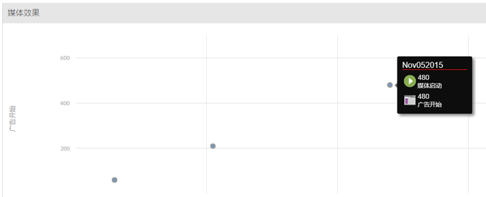

# 概述{#overview}

媒体收集 API 是 Adobe 针对客户端 Media SDK 的 RESTful 替代方案。借助媒体收集 API，播放器可以使用 RESTful HTTP 调用跟踪音频和视频事件。Media Collection API提供对Media SDK的相同实时跟踪，此外还提供一个附加功能：

* **下载的内容跟踪**

   此功能允许您在用户脱机时通过本地存储事件数据来跟踪媒体，直到用户的设备返回联机状态。 （有关详细信息，请参阅[跟踪下载的内容](track-downloaded-content.md)。）

媒体收集 API 本质上是一个适配器，充当 Media SDK 的服务器端版本。这意味着Media SDK文档的某些方面也与Media Collection API相关。 例如，两个解决方案都使用相同的 [音频和视频参数](/help/metrics-and-metadata/audio-video-parameters.md)，而收集的音频和视频跟踪数据会导致相同的报 [告和分析。](/help/media-reports/media-reports-enable.md)

## 媒体跟踪数据流 {#section_pwq_n34_qbb}

实施Media Collection API的媒体播放器直接向媒体跟踪后端服务器发出RESTful API跟踪调用，而实施Media SDK的播放器则向播放器应用程序内的SDK API发出跟踪调用。 通过 Web 进行调用的一个效果是，实施媒体收集 API 的播放器需要处理 Media SDK 自动处理的一些进程。(Media Collection实 [施中的详细信息。](mc-api-impl/mc-api-quick-start.md))

The tracking data captured with the Media Collection API is sent and initially processed differently than the tracking data captured in a Media SDK player, but the same processing engine on the back-end is used for both solutions.



## API概述 {#section_y4n_mcl_kcb}

**URI：**&#x200B;从 Adobe 代表处获得此信息。

**HTTP 方法：** POST，带有 JSON 请求正文。

### API Calls {#mc-api-calls}

* **`sessions`-** 与服务器建立会话，并返回在后续调用中使用的会话 `events` ID。 应用程序会在跟踪会话开始时调用一次。

   ```
   {uri}/api/v1/sessions
   ```

* **`events`-发送** 媒体跟踪数据。

   ```
   {uri}/api/v1/sessions/{session-id}/events
   ```

### Request Body {#mc-api-request-body}

```
{ 
    "playerTime": { 
        "playhead": {playhead position in seconds}, 
        "ts": {timestamp in milliseconds} 
    }, 
    "eventType": {event-type}, 
    "params": { 
        {parameter-name}: {parameter-value}, 
        ... 
        {parameter-name}: {parameter-value} 
    }, 
    "qoeData" : { 
        {parameter-name}: {parameter-value}, 
        ... 
        {parameter-name}: {parameter-value} 
    }, 
    "customMetadata": { 
        {parameter-name}: {parameter-value}, 
        ... 
        {parameter-name}: {parameter-value} 
    } 
} 
```

* `playerTime` -所有请求均为必填项。
* `eventType` -所有请求均为必填项。
* `params` - 对某些 `eventTypes` 而言，它是必选项；请检查 [JSON 验证架构](mc-api-ref/mc-api-json-validation.md)以确定哪些 eventTypes 是必选的，哪些是可选的。

* `qoeData` -对于所有请求为可选。
* `customMetadata` -对于所有请求都是可选的，但仅随、 `sessionStart`和事 `adStart`件类型 `chapterStart` 发送。

对于每个 `eventType`，都有一个公开可用的 [JSON 验证架构](mc-api-ref/mc-api-json-validation.md)，您应该使用它来验证参数类型，以及参数是特定事件的可选参数还是必选参数。

### 事件类型 {#mc-api-event-types}

* `sessionStart`
* `play`
* `ping`
* `pauseStart`
* `bufferStart`
* `adStart`
* `adComplete`
* `adSkip`
* `adBreakStart`
* `adBreakComplete`
* `chapterStart`
* `chapterSkip`
* `chapterComplete`
* `sessionEnd`
* `sessionComplete`

