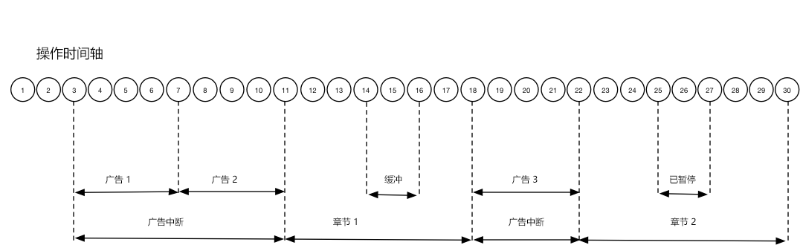

# 时间轴 1 - 观看到内容的结尾{#timeline-view-to-end-of-content}

## VOD、前置广告、暂停、缓冲、观看到内容的结尾

下图说明了播放头时间线和用户操作的相应时间线。 每项操作及其随附请求的详细信息如下所示。





## 操作详细信息

### 操作1 —— 开始会话 {#Action-1}

| 操作 | 操作时间轴（秒） | 播放头位置（秒） | 客户端请求 |
| --- | :---: | :---: | --- |
| 按自动播放或播放按钮，视频开始加载。 | 0 | 0 | `/api/v1/sessions` |

**实施详细信息**

此调用表示&#x200B;_用户播放视频的意图_。<br/><br/>它将一个会话ID( `{sid}`)返回给客户端，该客户端用于标识会话中的所有后续跟踪调用。 播放器状态不是“正在播放”，而是“正在启动”。<br/><br/>[强制会话参数](/help/media-collection-api/mc-api-ref/mc-api-sessions-req.md)必须包含在请求正文中的 `params` 映射中。<br/><br/>在后端，此调用会生成一个 Adobe Analytics 启动调用。

**示例请求主体**

```
{
    playerTime: {
        playhead: 0, ts: <timestamp>
    },
    eventType:sessionStart, params: {
        "media.playerName": "sample-html5-api-player",
        "analytics.trackingServer": "[ _YOUR_TS_ ]",
        "analytics.reportSuite": "[ _YOUR_RSID_ ]",
        "analytics.visitorId": "[ _YOUR_VISITOR_ID_ ]",
        "media.contentType": "VOD",
        "media.length": 60.3333333333333,
        "media.id": "VA API Sample Player",
        "visitor.marketingCloudOrgId": "[YOUR_MCID]",
        "media.name": "ClickMe",
        "media.channel": "sample-channel",
        "media.sdkVersion": "va-api-0.0.0",
        "analytics.enableSSL": false
    }
}
```

### 操作2 - Ping定时器开始 {#Action-2}

| 操作 | 操作时间轴（秒） | 播放头位置（秒） | 客户端请求 |
| --- | :---: | :---: | --- |
| 应用程序启动 Ping 时间计时器 | 0 | 0 | `/api/v1/sessions/{sid}/events` |  |

**实施详细信息**

启动应用程序的ping计时器。 如果有预先播放的广告，则第一个ping事件应触发1秒，否则触发10秒。

### 操作3 —— 广告中断开始 {#Action-3}

| 操作 | 操作时间轴（秒） | 播放头位置（秒） | 客户端请求 |
| --- | :---: | :---: | --- |
| 跟踪前置广告时间开始 | 0 | 0 | `/api/v1/sessions/{sid}/events` |

**实施详细信息**

只能在广告时间期间跟踪广告。

**示例请求主体**

```
{
    playerTime: {
        playhead: 0,
        ts: <timestamp>
    },
    eventType:adBreakStart, params: {
        "media.ad.podFriendlyName": "ad_pod1",
        "media.ad.podIndex": 0,
        "media.ad.podSecond": 0
    }
}
```

### 操作4 —— 广告开始 {#Action-4}

| 操作 | 操作时间轴（秒） | 播放头位置（秒） | 客户端请求 |
| --- | :---: | :---: | --- |
| 跟踪前置广告 #1 开始 | 0 | 0 | `/api/v1/sessions/{sid}/events` |

**实施详细信息**

开始跟踪第一个前置广告，其时长为 15 秒。包括含此 `adStart` 的自定义元数据。

**示例请求主体**

```
{
    playerTime: {
        playhead: 0,
        ts: &lt;timestamp&gt;
    },
    eventType:adStart,
    params: {
        "media.ad.podFriendlyName": "ad_pod1",
        "media.ad.name": "Ad 1",
        "media.ad.id": "001",
        "media.ad.length": 15,
        "media.ad.podPosition": 1,
        "media.ad.playerName": "Sample Player",
        "media.ad.advertiser": "Ad Guys",
        "media.ad.campaignId": "1",
        "media.ad.creativeId": "42",
        "media.ad.siteId": "XYZ",
        "media.ad.creativeURL": "https://xyz_creative.com",
        "media.ad.placementId": "sample_placement"
    },
    customMetadata: {
        "myCustomData1": "CustomData1",
        "myCustomData2": "CustomData2"
    }
}
```

### 操作5 —— 广告ping {#Action-5}

#### 操作5.1 —— 广告ping 1 {#Action-5-1}

| 操作 | 操作时间轴（秒） | 播放头位置（秒） | 客户端请求 |
| --- | :---: | :---: | --- |
| 应用程序发送 Ping 事件 | 1 | 0 | `/api/v1/sessions/{sid}/events` |

**实施详细信息**

在广告中每1秒Ping后端。

**示例请求主体**

```
{
    playerTime: {
        playhead: 0,
        ts: <timestamp>
    },
    eventType:ping
}
```

#### 操作5.2 —— 广告ping 2 {#Action-5-2}

| 操作 | 操作时间轴（秒） | 播放头位置（秒） | 客户端请求 |
| --- | :---: | :---: | --- |
| 应用程序发送 Ping 事件 | 2 | 0 | `/api/v1/sessions/{sid}/events` |

**实施详细信息**

在广告中每1秒Ping后端。

**示例请求主体**

```
{
    playerTime: {
        playhead: 0,
        ts: <timestamp>
    },
    eventType:ping
}
```

#### 操作5.3 —— 广告ping 3 {#Action-5-3}


| 操作 | 操作时间轴（秒） | 播放头位置（秒） | 客户端请求 |
| --- | :---: | :---: | --- |
| 应用程序发送 Ping 事件 | 3 | 0 | `/api/v1/sessions/{sid}/events` |

**实施详细信息**

在广告中每1秒Ping后端。

>[!NOTE]
>
>时间轴中的后续广告将跳过显示一秒钟的ping序列
>为了简洁……

**示例请求主体**

```
{
    playerTime: {
        playhead: 0,
        ts: <timestamp>
    },
    eventType:ping
}
```

### 操作6 —— 广告完成 {#Action-6}

| 操作 | 操作时间轴（秒） | 播放头位置（秒） | 客户端请求 |
| --- | :---: | :---: | --- |
| 跟踪前置广告 #1 完成 | 15 | 0 | `/api/v1/sessions/{sid}/events` |

**实施详细信息**

跟踪第一个前置广告的结束。

**示例请求主体**

```
{
    playerTime: {
        playhead: 0,
        ts: <timestamp>
    },
    eventType:adComplete
}
```

### 操作7 —— 广告开始 {#Action-7}

| 操作 | 操作时间轴（秒） | 播放头位置（秒） | 客户端请求 |
| --- | :---: | :---: | --- |
| 跟踪前置广告 #2 开始 | 15 | 0 | `/api/v1/sessions/{sid}/events` |

**实施详细信息**

跟踪第二个前置广告的开始，其时长为 7 秒。

**示例请求主体**

```
{
    playerTime: {
        playhead: 0,
        ts: <timestamp>
    },
    eventType:adStart, params: {
        "media.ad.podFriendlyName": "ad_pod1",
        "media.ad.name": "Ad 2",
        "media.ad.id": "002",
        "media.ad.length": 7,
        "media.ad.podPosition": 1,
        "media.ad.playerName": "Sample Player",
        "media.ad.advertiser": "Ad Guys",
        "media.ad.campaignId": "2",
        "media.ad.creativeId": "44",
        "media.ad.siteId": "XYZ",
        "media.ad.creativeURL": "https://xyz_creative.com",
        "media.ad.placementId": "sample_placement2"
    },
}
```

### 操作8 —— 广告ping {#Action-8}

| 操作 | 操作时间轴（秒） | 播放头位置（秒） | 客户端请求 |
| --- | :---: | :---: | --- |
| 应用程序发送 Ping 事件 | 20 | 0 | `/api/v1/sessions/{sid}/events` |

**实施详细信息**

每1秒Ping后端。

**示例请求主体**

```
{
    playerTime: {
        playhead: 0,
        ts: <timestamp>
    },
    eventType:ping
}
```

### 操作9 —— 广告完成 {#Action-9}

| 操作 | 操作时间轴（秒） | 播放头位置（秒） | 客户端请求 |
| --- | :---: | :---: | --- |
| 跟踪前置广告 #2 完成 | 22 | 0 | `/api/v1/sessions/{sid}/events` |

**实施详细信息**

跟踪第二个前置广告的结束。

**示例请求主体**

```
{
    playerTime: {
        playhead: 0,
        ts: <timestamp>
    },
    eventType:adComplete
}
```

### 操作10 —— 广告中断完成 {#Action-10}

| 操作 | 操作时间轴（秒） | 播放头位置（秒） | 客户端请求 |
| --- | :---: | :---: | --- |
| 跟踪前置广告时间完成 | 22 | 0 | `/api/v1/sessions/{sid}/events` |

**实施详细信息**

广告时间结束。在整个广告时间内，播放状态始终为“正在播放”。

**示例请求主体**

```
{
    playerTime: {
        playhead: 0,
        ts: <timestamp>
    },
    eventType:adBreakComplete
}
```

### 操作11 —— 播放内容 {#Action-11}

| 操作 | 操作时间轴（秒） | 播放头位置（秒） | 客户端请求 |
| --- | :---: | :---: | --- |
| 跟踪播放事件 | 22 | 0 | `/api/v1/sessions/{sid}/events` |

**实施详细信息**

在 `adBreakComplete` 事件后，使用 `play` 事件将播放器置于“正在播放”状态。

**示例请求主体**

```
{
    playerTime: {
        playhead: 0,
        ts: <timestamp>
    },
    eventType:play
}
```

### 操作12 - Ping {#Action-12}

| 操作 | 操作时间轴（秒） | 播放头位置（秒） | 客户端请求 |
| --- | :---: | :---: | --- |
| 应用程序发送 Ping 事件 | 30 | 8 | `/api/v1/sessions/{sid}/events` |

**实施详细信息**

每 10 秒对后端执行一次 Ping 操作。

**示例请求主体**

```
{
    playerTime: {
        playhead: 8,
        ts: <timestamp>
    },
    eventType:ping
}
```

### 操作13 —— 缓冲区开始 {#Action-13}

| 操作 | 操作时间轴（秒） | 播放头位置（秒） | 客户端请求 |
| --- | :---: | :---: | --- |
| 发生缓冲开始事件 | 33 | 11 | `/api/v1/sessions/{sid}/events` |

**实施详细信息**

跟踪播放器向“正在缓冲”状态的转变

**示例请求主体**

```
{
    playerTime: {
        playhead: 11,
        ts: <timestamp>
    }, eventType:bufferStart
}
```

### 操作14 —— 缓冲区结束 {#Action-14}

| 操作 | 操作时间轴（秒） | 播放头位置（秒） | 客户端请求 |
| --- | :---: | :---: | --- |
| 缓冲结束，应用程序跟踪内容恢复 | 36 | 11 | `/api/v1/sessions/{sid}/events` |

**实施详细信息**

缓冲在 3 秒后结束，因此请将播放器恢复到“正在播放”状态。您必须发送来自缓冲的另一个跟踪播放事件。**在`play`向后端`bufferStart`输入“bufferEnd”调用后的调用，** 因此不需要事 `bufferEnd` 件。

**示例请求主体**

```
{
    playerTime: {
        playhead: 11,
        ts: <timestamp>
    },
    eventType:play
}
```

### 操作15 - Ping {#Action-15}

| 操作 | 操作时间轴（秒） | 播放头位置（秒） | 客户端请求 |
| --- | :---: | :---: | --- |
| 应用程序发送 Ping 事件 | 40 | 15 | `/api/v1/sessions/{sid}/events` |

**实施详细信息**

每 10 秒对后端执行一次 Ping 操作。

**示例请求主体**

```
{
    playerTime: {
        playhead: 15,
        ts: <timestamp>
    }, eventType:ping
}
```

### 操作16 —— 广告中断开始 {#Action-16}

| 操作 | 操作时间轴（秒） | 播放头位置（秒） | 客户端请求 |
| --- | :---: | :---: | --- |
| 跟踪中置广告时间开始 | 46 | 21 | `/api/v1/sessions/{sid}/events` |

**实施详细信息**

持续时间为 8 秒的中置广告：发送 `adBreakStart`。

**示例请求主体**

```
{
    playerTime: {
        playhead: 21,
        ts: <timestamp>
    },
    eventType:adBreakStart,
    params: {
        "media.ad.podFriendlyName": "ad_pod2",
        "media.ad.podIndex": 1,
        "media.ad.podSecond": 21
    }
}
```

### 操作17 —— 广告开始 {#Action-17}

| 操作 | 操作时间轴（秒） | 播放头位置（秒） | 客户端请求 |
| --- | :---: | :---: | --- |
| 跟踪中置广告 #3 开始 | 46 | 21 | `/api/v1/sessions/{sid}/events` |

**实施详细信息**

跟踪中置广告。

**示例请求主体**

```
{
    playerTime: {
        playhead: 21,
        ts: <timestamp>
    },
    eventType:adStart, params: {
        "media.ad.podFriendlyName": "ad_pod2",
        "media.ad.name": "Ad 3",
        "media.ad.id": "003",
        "media.ad.length": 8,
        "media.ad.podPosition": 2,
        "media.ad.playerName": "Sample Player",
        "media.ad.advertiser": "Ad Guys",
        "media.ad.campaignId": "7",
        "media.ad.creativeId": "40",
        "media.ad.siteId": "XYZ",
        "media.ad.creativeURL": "https://xyz_creative.com",
        "media.ad.placementId": "sample_placement2"
    },
}
```

### 操作18 —— 广告ping {#Action-18}

| 操作 | 操作时间轴（秒） | 播放头位置（秒） | 客户端请求 |
| --- | :---: | :---: | --- |
| 应用程序发送 Ping 事件 | 50 | 21 | `/api/v1/sessions/{sid}/events` |

**实施详细信息**

每 10 秒对后端执行一次 Ping 操作。

**示例请求主体**

```
{
    playerTime: {
        playhead: 21,
        ts: <timestamp>
    }, eventType:ping
}
```

### 操作19 —— 广告完成 {#Action-19}

| 操作 | 操作时间轴（秒） | 播放头位置（秒） | 客户端请求 |
| --- | :---: | :---: | --- |
| 跟踪中置广告 #3 结束 | 54 | 21 | `/api/v1/sessions/{sid}/events` |

**实施详细信息**

中置广告完成。

**示例请求主体**

```
{
    playerTime: {
        playhead: 21,
        ts: <timestamp>
    },
    eventType:adComplete
}
```

### 操作20 —— 广告中断完成 {#Action-20}

| 操作 | 操作时间轴（秒） | 播放头位置（秒） | 客户端请求 |
| --- | :---: | :---: | --- |
| 跟踪中置广告时间完成 | 54 | 21 | `/api/v1/sessions/{sid}/events` |

**实施详细信息**

广告时间结束。

**示例请求主体**

```
{
    playerTime: {
        playhead: 21,
        ts: <timestamp>
    },
    eventType:adBreakComplete
}
```

### 操作21 - Ping {#Action-21}

| 操作 | 操作时间轴（秒） | 播放头位置（秒） | 客户端请求 |
| --- | :---: | :---: | --- |
| 应用程序发送 Ping 事件 | 60 | 27 | `/api/v1/sessions/{sid}/events` |

**实施详细信息**

每 10 秒对后端执行一次 Ping 操作。

**示例请求主体**

```
{
    playerTime: {
        playhead: 27,
        ts: <timestamp>
    },
    eventType:ping
}
```

### 操作22 —— 暂停 {#Action-22}

| 操作 | 操作时间轴（秒） | 播放头位置（秒） | 客户端请求 |
| --- | :---: | :---: | --- |
| 用户按下了暂停 | 64 | 31 | `/api/v1/sessions/{sid}/events` |

**实施详细信息**

用户的操作将播放状态转变为“已暂停”。

**示例请求主体**

```
{
    playerTime: {
        playhead: 31,
        ts: <timestamp>
    },
    eventType:pauseStart
}
```

### 操作23 - Ping {#Action-23}

| 操作 | 操作时间轴（秒） | 播放头位置（秒） | 客户端请求 |
| --- | :---: | :---: | --- |
| 应用程序发送 Ping 事件 | 70 | 31 | `/api/v1/sessions/{sid}/events` |

**实施详细信息**

每 10 秒对后端执行一次 Ping 操作。播放器仍处于“正在缓冲”状态，用户一直停留在 20 秒的内容中。正在运转中...

**示例请求主体**

```
{
    playerTime: {
        playhead: 31,
        ts: <timestamp>
    }, eventType:ping
}
```

### 操作24 —— 播放 {#Action-24}

| 操作 | 操作时间轴（秒） | 播放头位置（秒） | 客户端请求 |
| --- | :---: | :---: | --- |
| 用户按下了“播放”以恢复主内容 | 74 | 31 | `/api/v1/sessions/{sid}/events` |

**实施详细信息**

将播放状态转变为“正在播放”。**在后`play`端输入`pauseStart`“恢复”呼叫之后的呼叫，因此不需要事**`resume` 件。

**示例请求主体**

```
{
    playerTime: {
        playhead: 31,
        ts: <timestamp>
    }, eventType:play
}
```

### 操作25 - Ping {#Action-25}

| 操作 | 操作时间轴（秒） | 播放头位置（秒） | 客户端请求 |
| --- | :---: | :---: | --- |
| 应用程序发送 Ping 事件 | 80 | 37 | `/api/v1/sessions/{sid}/events` |

**实施详细信息**

每 10 秒对后端执行一次 Ping 操作。

**示例请求主体**

```
{
    playerTime: {
        playhead: 37,
        ts: <timestamp>
    }, eventType:ping
}
```

### 行动26 —— 会议完成 {#Action-26}

| 操作 | 操作时间轴（秒） | 播放头位置（秒） | 客户端请求 |
| --- | :---: | :---: | --- |
| 用户完成观看内容的结尾。 | 88 | 45 | `/api/v1/sessions/{sid}/events` |

**实施详细信息**

将 `sessionComplete` 发送到后端，以表明用户完成了对整个内容的观看。

**示例请求主体**

```
{
    playerTime: {
        playhead: 45,
        ts: <timestamp>
    }, eventType:sessionComplete
}
```

>[!NOTE]
>
>**无搜寻事件？ -** 媒体收集 API 中没有明确支持 `seekStart` 或 `seekComplete` 事件。这是因为当最终用户正在推移时，某些播放器会生成大量的此类事件，并且数百个用户可能会轻易地限制后端服务的网络带宽。Adobe 通过基于设备时间戳（而不是播放头位置）计算心率持续时间，来为搜寻事件提供明确的支持。

