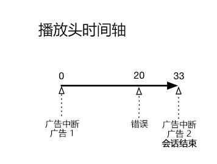
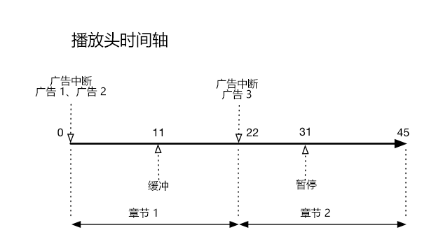

# 时间轴 2 - 用户放弃会话 {#timeline--2-user-abandons-session}

## VOD、前置广告、中置广告、用户提前放弃内容

下图说明了播放头时间轴和用户操作的相应时间轴。每项操作及其随附请求的详细信息如下所述。








## 操作详细信息

### 操作 1 - 开始会话 {#Action-1}

| 操作 | 操作时间轴（秒） | 播放头位置（秒） | 客户端请求 |
| --- | :---: | :---: | --- |
| 按下“自动播放”或“播放”按钮 | 0 | 0 | `/api/v1/sessions` |

**实施详细信息**

此调用表示&#x200B;_用户播放视频的意图_。它会向客户端返回一个会话 ID (`{sid}`)，用于标识会话中的所有后续跟踪调用。播放器状态不是“正在播放”，而是“正在启动”。[强制会话参数](/help/media-collection-api/mc-api-ref/mc-api-sessions-req.md)必须包含在请求正文中的 `params` 映射中。在后端，此调用会生成一个 Adobe Analytics 启动调用。

**示例请求正文**

```
{
    playerTime: {
        playhead: 0,
        ts: <timestamp>
    },
    eventType:sessionStart, params: {
        "media.playerName": "sample-html5-api-player",
        "analytics.trackingServer": "[ _YOUR-TS_ ]",
        "analytics.reportSuite": "[ _YOUR-RSID_ ]",
        "analytics.visitorId": "[ _YOUR-VISITOR-ID_ ]",
        "media.contentType": "VOD",
        "media.length": 60.3333333333333,
        "media.id": "VA API Sample Player",
        "visitor.marketingCloudOrgId": "[YOUR-MCID]",
        "media.name": "ClickMe",
        "media.channel": "sample-channel",
        "media.sdkVersion": "va-api-0.0.0",
        "analytics.enableSSL": false
    }
}
```

### 操作 2 - Ping 计时器启动 {#Action-2}

| 操作 | 操作时间轴（秒） | 播放头位置（秒） | 客户端请求 |
| --- | :---: | :---: | --- |
| 应用程序启动 Ping 事件计时器 | 0 | 0 |  |

**实施详细信息**

启动应用程序的 Ping 计时器。如果有前置广告，则第一个 Ping 事件应在 1 秒后触发，否则应在 10 秒后触发。

### 操作 3 - 广告时间开始 {#Action-3}

| 操作 | 操作时间轴（秒） | 播放头位置（秒） | 客户端请求 |
| --- | :---: | :---: | --- |
| 跟踪前置广告时间开始 | 0 | 0 | `/api/v1/sessions/{sid}/events` |

**实施详细信息**

必须跟踪前置广告。只能在广告时间期间跟踪广告。

**示例请求正文**

```
{
    playerTime: {
        playhead: 0,
        ts: <timestamp>
    },
    eventType:adBreakStart, params: {
        "media.ad.podFriendlyName": "ad_pod1",
        "media.ad.podIndex": 0,
        "media.ad.podSecond": 0
    }
}
```

### 操作 4 - 广告开始 {#Action-4}

| 操作 | 操作时间轴（秒） | 播放头位置（秒） | 客户端请求 |
| --- | :---: | :---: | --- |
| 跟踪前置广告 1 开始 | 0 | 0 | `/api/v1/sessions/{sid}/events` |

**实施详细信息**

一个时长为 12 秒的广告开始。

**示例请求正文**

```
{
    playerTime: {
        playhead: 0,
        ts: <timestamp>
    },
    eventType:adStart, params: {
        "media.ad.podFriendlyName": "ad_pod1",
        "media.ad.name": "Ad 1",
        "media.ad.id": "002",
        "media.ad.length": 7,
        "media.ad.podPosition": 1,
        "media.ad.playerName": "Sample Player",
        "media.ad.advertiser": "Ad Guys",
        "media.ad.campaignId": "1",
        "media.ad.creativeId": "42",
        "media.ad.siteId": "XYZ",
        "media.ad.creativeURL": "https://xyz-creative.com",
        "media.ad.placementId": "sample-placement2"
    },
}
```

### 操作 5 - 广告 Ping {#Action-5}

| 操作 | 操作时间轴（秒） | 播放头位置（秒） | 客户端请求 |
| --- | :---: | :---: | --- |
| 应用程序发送 Ping 事件 | 1 | 0 | `/api/v1/sessions/{sid}/events` |

**实施详细信息**

每 1 秒对后端执行一次 Ping 操作。（为简短起见，不显示后续广告 Ping。）

**示例请求正文**

```
{
    playerTime: {
        playhead: 0,
        ts: <timestamp>
    },
    eventType:ping
}
```

### 操作 6 - 广告结束 {#Action-6}

| 操作 | 操作时间轴（秒） | 播放头位置（秒） | 客户端请求 |
| --- | :---: | :---: | --- |
| 跟踪前置广告 1 结束 | 12 | 0 | `/api/v1/sessions/{sid}/events` |

**实施详细信息**

第一个前置广告结束。

**示例请求正文**

```
{
    playerTime: {
        playhead: 0,
        ts: <timestamp>
    },
    eventType:adComplete
}
```

### 操作 7 - 广告时间结束 {#Action-7}

| 操作 | 操作时间轴（秒） | 播放头位置（秒） | 客户端请求 |
| --- | :---: | :---: | --- |
| 跟踪前置广告时间结束 | 12 | 0 | `/api/v1/sessions/{sid}/events` |

**实施详细信息**

广告时间结束。在整个广告时间内，播放器一直处于“正在播放”状态。

**示例请求正文**

```
{
    playerTime: {
        playhead: 0,
        ts: <timestamp>
    },
    eventType:adBreakComplete
}
```

### 操作 8 - 播放内容 {#Action-8}

| 操作 | 操作时间轴（秒） | 播放头位置（秒） | 客户端请求 |
| --- | :---: | :---: | --- |
| 跟踪播放事件 | 12 | 0 | `/api/v1/sessions/{sid}/events` |

**实施详细信息**

将播放器转变为“正在播放”状态，开始跟踪内容播放的开始。

**示例请求正文**

```
{
    playerTime: {
        playhead: 0,
        ts: <timestamp>
    },
    eventType:play,
    qoeData: { bitrate: 10000 }
}
```

### 操作 9 - Ping {#Action-9}

| 操作 | 操作时间轴（秒） | 播放头位置（秒） | 客户端请求 |
| --- | :---: | :---: | --- |
| 应用程序发送 Ping 事件 | 20 | 8 | `/api/v1/sessions/{sid}/events` |

**实施详细信息**

每 10 秒对后端执行一次 Ping 操作。

**示例请求正文**

```
{
    playerTime: {
        playhead: 8ß,
        ts: <timestamp>
    },
    eventType:ping
}
```

### 操作 10 - Ping {#Action-10}

| 操作 | 操作时间轴（秒） | 播放头位置（秒） | 客户端请求 |
| --- | :---: | :---: | --- |
| 应用程序发送 Ping 事件 | 30 | 18 | `/api/v1/sessions/{sid}/events` |

**实施详细信息**

每 10 秒对后端执行一次 Ping 操作。

**示例请求正文**

```
{
    playerTime: {
        playhead: 18,
        ts: <timestamp>
    },
    eventType:ping
}
```

### 操作 11 - 错误 {#Action-11}

| 操作 | 操作时间轴（秒） | 播放头位置（秒） | 客户端请求 |
| --- | :---: | :---: | --- |
| 发生错误，应用程序发送错误信息。 | 32 | 20 | `/api/v1/sessions/{sid}/events` |

**实施详细信息**


**示例请求正文**

```
{
    playerTime: {
        playhead: 20,
        ts: <timestamp>
    },
    eventType:error
}
```

### 操作 12 - 播放内容 {#Action-12}

| 操作 | 操作时间轴（秒） | 播放头位置（秒） | 客户端请求 |
| --- | :---: | :---: | --- |
| 应用程序从错误中恢复，用户按“播放” | 37 | 20 | `/api/v1/sessions/{sid}/events` |

**实施详细信息**


**示例请求正文**

```
{
    playerTime: {
        playhead: 18,
        ts: <timestamp>
    },
    eventType:play, qoeData: { bitrate: 10000 }
}
```

### 操作 13 - Ping {#Action-13}

| 操作 | 操作时间轴（秒） | 播放头位置（秒） | 客户端请求 |
| --- | :---: | :---: | --- |
| 应用程序发送 Ping 事件 | 40 | 28 | `/api/v1/sessions/{sid}/events` |

**实施详细信息**

每 10 秒对后端执行一次 Ping 操作。

**示例请求正文**

```
{
    playerTime: {
        playhead: 28,
        ts: <timestamp>
    },
    eventType:ping
}
```

### 操作 14 - 广告时间开始 {#Action-14}

| 操作 | 操作时间轴（秒） | 播放头位置（秒） | 客户端请求 |
| --- | :---: | :---: | --- |
| 跟踪中置广告时间开始 | 45 | 33 | `/api/v1/sessions/{sid}/events` |

**实施详细信息**

持续时间为 8 秒的中置广告：发送 `adBreakStart`。

**示例请求正文**

```
{
    playerTime: {
        playhead: 33,
        ts: <timestamp>
    },
    eventType:adBreakStart, params: {
        "media.ad.podFriendlyName": "ad_pod2",
        "media.ad.podIndex": 1,
        "media.ad.podSecond": 33
    }
}
```

### 操作 15 - 广告开始 {#Action-15}

| 操作 | 操作时间轴（秒） | 播放头位置（秒） | 客户端请求 |
| --- | :---: | :---: | --- |
| 跟踪中置广告 1 开始 | 45 | 33 | `/api/v1/sessions/{sid}/events` |

**实施详细信息**

跟踪中置广告。

**示例请求正文**

```
{
    playerTime: { playhead: 33, ts: <timestamp>
    },
    eventType:adStart, params: {
        "media.ad.podFriendlyName": "ad_pod1",
        "media.ad.name": "Ad 1",
        "media.ad.id": "002",
        "media.ad.length": 8,
        "media.ad.podPosition": 1,
        "media.ad.playerName": "Sample Player",
        "media.ad.advertiser": "Ad Guys",
        "media.ad.campaignId": "7",
        "media.ad.creativeId": "40",
        "media.ad.siteId": "XYZ",
        "media.ad.creativeURL": "https://xyz_creative.com",
        "media.ad.placementId": "sample_placement2"
    },
}
```

### 操作 16 - 关闭应用程序 {#Action-16}

| 操作 | 操作时间轴（秒） | 播放头位置（秒） | 客户端请求 |
| --- | :---: | :---: | --- |
| 用户关闭应用程序。应用程序确定用户已放弃查看，并且未返回到此会话。 | 48 | 33 | `/api/v1/sessions/{sid}/events` |

**实施详细信息**

将 `sessionEnd` 发送到 VA 后端，以指示应立即关闭会话，无需进一步处理。

**示例请求正文**

```
{
    playerTime: {
        playhead: 33,
        ts: <timestamp>
    },
    eventType:sessionEnd
}
```
