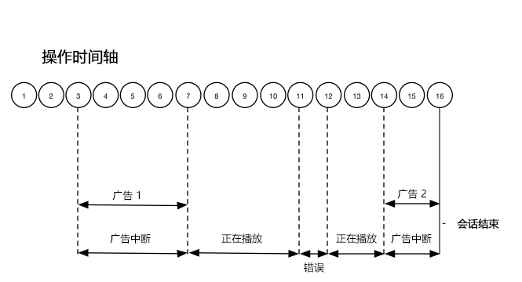
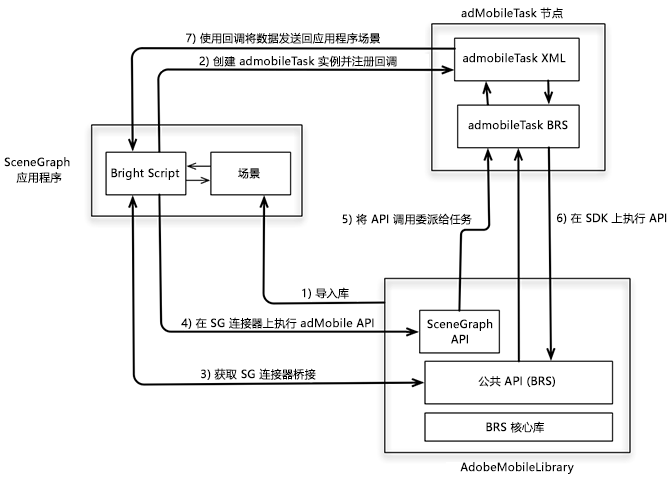

# 时间轴 3 - 章节 {#timeline-3-chapters}

## VOD、前置广告、暂停、缓冲、观看到内容的结尾


以下示意图说明了用户操作的播放头时间线和相应的时间线。下面介绍了每个操作及其附带请求的详细信息。








## 操作详细信息


### Action 1 - Start session {#Action-1}

| 操作 | 操作时间轴（秒） | 播放头位置（秒） | 客户端请求 |
| --- | :---: | :---: | --- |
| 按自动播放或播放按钮，视频开始加载。 | 0 | 0 | `/api/v1/sessions` |

**实施详细信息**

This call signals _the intention of the user to play_ a video. It returns a Session ID ( `{sid}` ) to the client that is used to identify all subsequent tracking calls within the session. 播放器状态不是“正在播放”，而是“正在启动”。[强制会话参数](../../media-collection-api/mc-api-ref/mc-api-sessions-req.md)必须包含在请求正文中的 `params` 映射中。在后端，此调用会生成一个 Adobe Analytics 启动调用。

**请求主体示例**

```
{
    playerTime: {
        playhead: 0,
        ts: <timestamp>
    },
    eventType:sessionStart, params: {
        "media.playerName": "sample-html5-api-player",
        "analytics.trackingServer": "[ _YOUR-TS_ ]",
        "analytics.reportSuite": "[ _YOUR_RSID_ ]",
        "analytics.visitorId": "[ _YOUR_VISITOR_ID_ ]",
        "media.contentType": "VOD",
        "media.length": 60.3333333333333,
        "media.id": "VA API Sample Player",
        "visitor.marketingCloudOrgId": "[YOUR_MCID]",
        "media.name": "ClickMe",
        "media.channel": "sample-channel",
        "media.sdkVersion": "va-api-0.0.0",
        "analytics.enableSSL": false
    }
}
```

### Action 2 - Ping timer starts {#Action-2}

| 操作 | 操作时间轴（秒） | 播放头位置（秒） | 客户端请求 |
| --- | :---: | :---: | --- |
| 应用程序启动 Ping 时间计时器 | 0 | 0 |  |

**实施详细信息**

启动ping定时器。然后，首次ping事件应在有前置广告时触发秒，否则为10秒。

### Action 3 - Ad break start {#Action-3}

| 操作 | 操作时间轴（秒） | 播放头位置（秒） | 客户端请求 |
| --- | :---: | :---: | --- |
| 跟踪前置广告时间开始 | 0 | 0 | `/api/v1/sessions/{sid}/events` |

**实施详细信息**

只能在广告时间期间跟踪广告。

**请求主体示例**

```
{
    playerTime: {
        playhead: 0,
        ts: <timestamp>
    },
    eventType:adBreakStart, params: {
        "media.ad.podFriendlyName": "ad_pod1",
        "media.ad.podIndex": 0, "media.ad.podSecond": 0
    }
}
```

### Action 4 - Ad start {#Action-4}

| 操作 | 操作时间轴（秒） | 播放头位置（秒） | 客户端请求 |
| --- | :---: | :---: | --- |
| 跟踪前置广告 #1 开始 | 0 | 0 | `/api/v1/sessions/{sid}/events` |

**实施详细信息**

开始跟踪第一个前置广告，其时长为 15 秒。包括含此 `adStart` 的自定义元数据。

**请求主体示例**

```
{
    playerTime: {
        playhead: 0,
        ts: <timestamp>
    },
    eventType:adStart, params: {
        "media.ad.podFriendlyName": "ad_pod1",
        "media.ad.name": "Ad 1",
        "media.ad.id": "001",
        "media.ad.length": 15,
        "media.ad.podPosition": 1,
        "media.ad.playerName": "Sample Player",
        "media.ad.advertiser": "Ad Guys",
        "media.ad.campaignId": "1",
        "media.ad.creativeId": "42",
        "media.ad.siteId": "XYZ",
        "media.ad.creativeURL": "https://xyz_creative.com",
        "media.ad.placementId": "sample_placement"
    },
    customMetadata: {
        "myCustomData1": "CustomData1",
        "myCustomData2": "CustomData2"
    }
}
```

### Action 5 - Ad pings {#Action-5}

| 操作 | 操作时间轴（秒） | 播放头位置（秒） | 客户端请求 |
| --- | :---: | :---: | --- |
| 应用程序发送 Ping 事件 | 10 | 0 | `/api/v1/sessions/{sid}/events` |

**实施详细信息**

每秒ping后端。(随后的广告转换不会以简单的方式显示。)

**请求主体示例**

```
{
    playerTime: {
        playhead: 0,
        ts: <timestamp>
    },
    eventType:ping
}
```

### Action 6 - Ad complete {#Action-6}

| 操作 | 操作时间轴（秒） | 播放头位置（秒） | 客户端请求 |
| --- | :---: | :---: | --- |
| 跟踪前置广告 #1 完成 | 15 | 0 | `/api/v1/sessions/{sid}/events` |

**实施详细信息**

跟踪第一个前置广告的结束。

**请求主体示例**

```
{
    playerTime: {
        playhead: 0,
        ts: <timestamp>
    },
    eventType:adComplete
}
```

### Action 7 - Ad start {#Action-7}

| 操作 | 操作时间轴（秒） | 播放头位置（秒） | 客户端请求 |
| --- | :---: | :---: | --- |
| 跟踪前置广告 #2 开始 | 15 | 0 | `/api/v1/sessions/{sid}/events` |

**实施详细信息**

跟踪第二个前置广告的开始，其时长为 7 秒。

**请求主体示例**

```
{
    playerTime: {
        playhead: 0,
        ts: <timestamp>
    },
    eventType:adStart, params: {
        "media.ad.podFriendlyName": "ad_pod1",
        "media.ad.name": "Ad 2",
        "media.ad.id": "002",
        "media.ad.length": 7,
        "media.ad.podPosition": 1,
        "media.ad.playerName": "Sample Player",
        "media.ad.advertiser": "Ad Guys",
        "media.ad.campaignId": "2",
        "media.ad.creativeId": "44",
        "media.ad.siteId": "XYZ",
        "media.ad.creativeURL": "https://xyz_creative.com",
        "media.ad.placementId": "sample_placement2"
    },
}
```

### Action 8 - Ad pings {#Action-8}

| 操作 | 操作时间轴（秒） | 播放头位置（秒） | 客户端请求 |
| --- | :---: | :---: | --- |
| 应用程序发送 Ping 事件 | 16 | 0 | `/api/v1/sessions/{sid}/events` |

**实施详细信息**

每秒ping后端。(随后的广告转换不会以简单的方式显示。)

**请求主体示例**

```
{
    playerTime: {
        playhead: 0,
        ts: <timestamp>
    },
    eventType:ping
}
```

### Action 9 - Ad complete {#Action-9}

| 操作 | 操作时间轴（秒） | 播放头位置（秒） | 客户端请求 |
| --- | :---: | :---: | --- |
| 跟踪前置广告 #2 完成 | 22 | 0 | `/api/v1/sessions/{sid}/events` |

**实施详细信息**

跟踪第二个前置广告的结束。

**请求主体示例**

```
{
    playerTime: {
        playhead: 0,
        ts: <timestamp>
    },
    eventType:adComplete
}
```

### Action 10 - Ad break complete {#Action-10}

| 操作 | 操作时间轴（秒） | 播放头位置（秒） | 客户端请求 |
| --- | :---: | :---: | --- |
| 跟踪前置广告时间完成 | 22 | 0 | `/api/v1/sessions/{sid}/events` |

**实施详细信息**

广告时间结束。在整个广告时间内，播放状态始终为“正在播放”。

**请求主体示例**

```
{
    playerTime: {
        playhead: 0,
        ts: <timestamp>
    },
    eventType:adBreakComplete
}
```

### Action 11 - Play content {#Action-11}

| 操作 | 操作时间轴（秒） | 播放头位置（秒） | 客户端请求 |
| --- | :---: | :---: | --- |
| 跟踪播放事件 | 22 | 0 | `/api/v1/sessions/{sid}/events` |

**实施详细信息**

在 `adBreakComplete` 事件后，使用 `play` 事件将播放器置于“正在播放”状态。

**请求主体示例**

```
{
    playerTime: {
        playhead: 0,
        ts: <timestamp>
    },
    eventType:play
}
```

### Action 12 - Chapter start {#Action-12}

| 操作 | 操作时间轴（秒） | 播放头位置（秒） | 客户端请求 |
| --- | :---: | :---: | --- |
| 跟踪章节开始事件 | 23 | 1 | `/api/v1/sessions/{sid}/events` |

**实施详细信息**

播放事件后，跟踪第一个章节的开始。

**请求主体示例**

```
{
    playerTime: {
        playhead: 0,
        ts: <timestamp>
    },
    eventType:chapterStart, params: {
        "media.chapter.index": 1,
        "media.chapter.offset": 0, "media.chapter.length": 20, "media.chapter.friendlyName": "Chapter Uno"
    },
}
```

### Action 13 - Ping {#Action-13}

| 操作 | 操作时间轴（秒） | 播放头位置（秒） | 客户端请求 |
| --- | :---: | :---: | --- |
| 应用程序发送 Ping 事件 | 30 | 8 | `/api/v1/sessions/{sid}/events` |

**实施详细信息**

每 10 秒对后端执行一次 Ping 操作。

**请求主体示例**

```
{
    playerTime: {
        playhead: 8,
        ts: <timestamp>
    },
    eventType:ping
}
```

### Action 14 - Buffer start {#Action-14}

| 操作 | 操作时间轴（秒） | 播放头位置（秒） | 客户端请求 |
| --- | :---: | :---: | --- |
| 发生缓冲开始事件 | 33 | 11 | `/api/v1/sessions/{sid}/events` |

**实施详细信息**

跟踪移动到“buffering”状态。

**请求主体示例**

```
{
    playerTime: {
        playhead: 11,
        ts: <timestamp>
    },
    eventType:bufferStart
}
```

### Action 15 - Buffer end (play) {#Action-15}

| 操作 | 操作时间轴（秒） | 播放头位置（秒） | 客户端请求 |
| --- | :---: | :---: | --- |
| 缓冲结束，应用程序跟踪内容恢复 | 36 | 11 | `/api/v1/sessions/{sid}/events` |

**实施详细信息**

缓冲在 3 秒后结束，因此请将播放器恢复到“正在播放”状态。您必须发送来自缓冲的另一个跟踪播放事件。**在将“bufferEnd”称为“bufferEnd”之后，该`play``bufferStart`调用将** 调用后端，因此 `bufferEnd` 无需活动。

**请求主体示例**

```
{
    playerTime: {
        playhead: 11,
        ts: <timestamp>
    },
    eventType:play
}
```

### Action 16 - Ping {#Action-16}

| 操作 | 操作时间轴（秒） | 播放头位置（秒） | 客户端请求 |
| --- | :---: | :---: | --- |
| 应用程序发送 Ping 事件 | 40 | 15 | `/api/v1/sessions/{sid}/events` |

**实施详细信息**

每 10 秒对后端执行一次 Ping 操作。

**请求主体示例**

```
{
    playerTime: {
        playhead: 15,
        ts: <timestamp>
    },
    eventType:ping
}
```

### Action 17 - Chapter end {#Action-17}

| 操作 | 操作时间轴（秒） | 播放头位置（秒） | 客户端请求 |
| --- | :---: | :---: | --- |
| 应用程序跟踪章节结束 | 45 | 20 | `/api/v1/sessions/{sid}/events` |

**实施详细信息**

第一个章节结束，正好在第二个广告时间之前。

**请求主体示例**

```
{
    playerTime: {
        playhead: 20,
        ts: <timestamp>
    },
    eventType:chapterEnd
}
```

### Action 18 - Ad break start {#Action-18}

| 操作 | 操作时间轴（秒） | 播放头位置（秒） | 客户端请求 |
| --- | :---: | :---: | --- |
| 跟踪中置广告时间开始 | 46 | 21 | `/api/v1/sessions/{sid}/events` |

**实施详细信息**

持续时间为 8 秒的中置广告：发送 `adBreakStart`。

**请求主体示例**

```
{
    playerTime: {
        playhead: 21,
        ts: <timestamp>
    },
    eventType:adBreakStart, params: {
        "media.ad.podFriendlyName": "ad_pod2",
        "media.ad.podIndex": 1, "media.ad.podSecond": 21
    }
}
```

### Action 19 - Ad start {#Action-19}

| 操作 | 操作时间轴（秒） | 播放头位置（秒） | 客户端请求 |
| --- | :---: | :---: | --- |
| 跟踪中置广告 #3 开始 | 46 | 21 | `/api/v1/sessions/{sid}/events` |

**实施详细信息**

跟踪中置广告。

**请求主体示例**

```
{
    playerTime: {
        playhead: 21,
        ts: <timestamp>
    },
    eventType:adStart, params: {
        "media.ad.podFriendlyName": "ad_pod2",
        "media.ad.name": "Ad 3",
        "media.ad.id": "003",
        "media.ad.length": 8,
        "media.ad.podPosition": 2,
        "media.ad.playerName": "Sample Player",
        "media.ad.advertiser": "Ad Guys",
        "media.ad.campaignId": "7",
        "media.ad.creativeId": "40",
        "media.ad.siteId": "XYZ",
        "media.ad.creativeURL": "https://xyz_creative.com",
        "media.ad.placementId": "sample_placement2"
    },
}
```

### Action 20 - Ad Pings {#Action-20}

| 操作 | 操作时间轴（秒） | 播放头位置（秒） | 客户端请求 |
| --- | :---: | :---: | --- |
| 应用程序发送 Ping 事件 | 47 | 21 | `/api/v1/sessions/{sid}/events` |

**实施详细信息**

每秒ping后端。(随后的广告转换不会以简单的方式显示。)

**请求主体示例**

```
{
    playerTime: {
        playhead: 21,
        ts: <timestamp>
    },
    eventType:ping
}
```

### Action 21 - Ad complete {#Action-21}

| 操作 | 操作时间轴（秒） | 播放头位置（秒） | 客户端请求 |
| --- | :---: | :---: | --- |
| 跟踪中置广告 #3 结束 | 54 | 21 | `/api/v1/sessions/{sid}/events` |

**实施详细信息**

中置广告完成。

**请求主体示例**

```
{
    playerTime: {
        playhead: 21,
        ts: <timestamp>
    },
    eventType:adComplete
}
```

### Action 22 - Ad break complete {#Action-22}

| 操作 | 操作时间轴（秒） | 播放头位置（秒） | 客户端请求 |
| --- | :---: | :---: | --- |
| 跟踪中置广告时间完成 | 54 | 21 | `/api/v1/sessions/{sid}/events` |

**实施详细信息**

广告时间结束。

**请求主体示例**

```
{
    playerTime: {
        playhead: 21,
        ts: <timestamp>
    },
    eventType:adBreakComplete
}
```

### Action 23 - Chapter start {#Action-23}

| 操作 | 操作时间轴（秒） | 播放头位置（秒） | 客户端请求 |
| --- | :---: | :---: | --- |
| 跟踪章节 2 的开始 | 55 | 22 | `/api/v1/sessions/{sid}/events` |

**实施详细信息**


**请求主体示例**

```
{
    playerTime: {
        playhead: 22,
        ts: <timestamp>
    },
    eventType:chapterStart, params: {
        "media.chapter.index": 2,
        "media.chapter.offset": 22, "media.chapter.length": 22, "media.chapter.friendlyName": "Chapter Dos"
    },
}
```

### Action 24 - Ping {#Action-24}

| 操作 | 操作时间轴（秒） | 播放头位置（秒） | 客户端请求 |
| --- | :---: | :---: | --- |
| 应用程序发送 Ping 事件 | 60 | 27 | `/api/v1/sessions/{sid}/events` |

**实施详细信息**

每 10 秒对后端执行一次 Ping 操作。

**请求主体示例**

```
{
    playerTime: {
        playhead: 27,
        ts: <timestamp>
    },
    eventType:ping
}
```

### Action 25 - Pause {#Action-25}

| 操作 | 操作时间轴（秒） | 播放头位置（秒） | 客户端请求 |
| --- | :---: | :---: | --- |
| 用户按下了暂停 | 64 | 31 | `/api/v1/sessions/{sid}/events` |

**实施详细信息**

用户动作将播放状态移动到“暂停”。

**请求主体示例**

```
{
    playerTime: {
        playhead: 31,
        ts: <timestamp>
    },
    eventType:pauseStart
}
```

### Action 26 - Ping {#Action-26}

| 操作 | 操作时间轴（秒） | 播放头位置（秒） | 客户端请求 |
| --- | :---: | :---: | --- |
| 应用程序发送 Ping 事件 | 70 | 31 | `/api/v1/sessions/{sid}/events` |

**实施详细信息**

每 10 秒对后端执行一次 Ping 操作。播放器仍处于“正在缓冲”状态，用户一直停留在 20 秒的内容中。正在运转中...

**请求主体示例**

```
{
    playerTime: {
        playhead: 31,
        ts: <timestamp>
    },
    eventType:ping
}
```

### Action 27 - Play content {#Action-27}

| 操作 | 操作时间轴（秒） | 播放头位置（秒） | 客户端请求 |
| --- | :---: | :---: | --- |
| 用户按下了“播放”以恢复主内容 | 74 | 31 | `/api/v1/sessions/{sid}/events` |

**实施详细信息**

将播放状态转变为“正在播放”。**`play`后的`pauseStart`调用一定会对后端进行“”调用**，因此不需要 `resume`resume 事件。

**请求主体示例**

```
{
    playerTime: {
        playhead: 31,
        ts: <timestamp>
    },
    eventType:play
}
```

### Action 28 - Ping {#Action-28}

| 操作 | 操作时间轴（秒） | 播放头位置（秒） | 客户端请求 |
| --- | :---: | :---: | --- |
| 应用程序发送 Ping 事件 | 80 | 37 | `/api/v1/sessions/{sid}/events` |

**实施详细信息**

每 10 秒对后端执行一次 Ping 操作。

**请求主体示例**

```
{
    playerTime: {
        playhead: 37,
        ts: <timestamp>
    },
    eventType:ping
}
```

### Action 29 - Chapter end {#Action-29}

| 操作 | 操作时间轴（秒） | 播放头位置（秒） | 客户端请求 |
| --- | :---: | :---: | --- |
| 章节 2 结束 | 87 | 44 | `/api/v1/sessions/{sid}/events` |

**实施详细信息**

跟踪第二个和最后一个章节的结束

**请求主体示例**

```
{
    playerTime: {
        playhead: 0,
        ts: <timestamp>
    },
    eventType:chapterEnd
}
```

### Action 30 - Session complete {#Action-30}

| 操作 | 操作时间轴（秒） | 播放头位置（秒） | 客户端请求 |
| --- | :---: | :---: | --- |
| 用户完成观看内容的结尾。 | 88 | 45 | `/api/v1/sessions/{sid}/events` |

**实施详细信息**

将 `sessionComplete` 发送到后端，以表明用户完成了对整个内容的观看。

**请求主体示例**

```
{
    playerTime: {
        playhead: 45,
        ts: <timestamp>
    },
    eventType:sessionComplete
}
```


>[!NOTE]
>
>**不寻找事件？-** 媒体收集 API 中没有明确支持 `seekStart` 或 `seekComplete` 事件。这是因为当最终用户正在推移时，某些播放器会生成大量的此类事件，并且数百个用户可能会轻易地限制后端服务的网络带宽。Adobe 通过基于设备时间戳（而不是播放头位置）计算心率持续时间，来为搜寻事件提供明确的支持。

