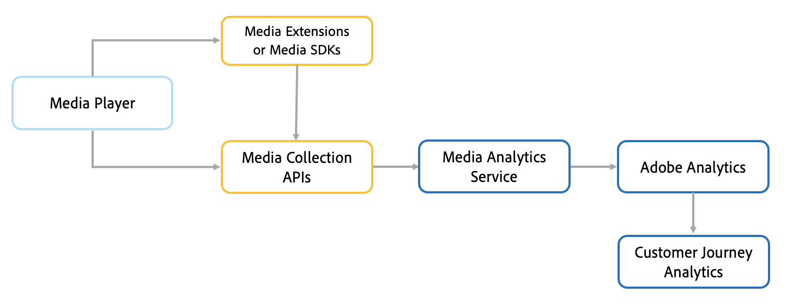

# Adobe Analytics for Streaming Media 概述

Adobe Analytics for Streaming Media 是 Adobe Analytics 的一个附加产品，可提供针对音频、视频和广告的强大测量工具。借助适用于流媒体的 Analytics，您可以获得关于持续时间、停止和开始的近乎实时、精细的详细信息，以便您评估和组合视频和音频指标。这些洞察信息使您能够了解客户的观看和收听习惯，并通过高度个性化的推荐提高参与度。

Adobe Analytics for Streaming Media 使您能够跟踪整个网站和流媒体应用程序的客户历程。您可以将流媒体指标与其他 Adobe Analytics 功能（例如 Audience Analytics、Mobile 或跨设备分析）结合使用。这些指标可轻松地集成到 Adobe Analytics 报表和其他 Adobe Experience Platform 产品中。媒体测量让您可以将数据分类为多个维度和区段，从而捕获执行完整的详细分析所需的所有元数据。然后，您可以分析数据并将成功标准归因于充分使用的媒体、平均逗留时间和已完成的广告。

可测量与体验质量 (QoE) 相关的重要的投放指标，如丢帧数、缓冲用时和平均比特率。并且这些指标可与您的网站或应用程序数据相结合，将客户路径和兴趣可视化 - 从而使用 Adobe Experience Platform 提供增强的推荐并使客户体验个性化。

## 工作原理

使用 Media SDK 或 Adobe Experience Platform 媒体扩展和媒体收集 API 从播放器收集流媒体跟踪数据。将所有粒度的数据（最长 10 秒）发送到 Media Analytics 服务，该服务收集并处理每个播放会话的数据。回放会话结束后，将计算得出的跟踪数据发送到 Adobe Analytics 以供存储和编制报表。通过 Adobe Customer Journey Analytics (CJA) 实施，可使用 Analytics Data Connector (ADC) 将数据发送到 CJA，以使客户可使用 CJA 作为报表工具。

<!--  -->

## 功能

Adobe Analytics for Streaming Media 具备以下优势：实时监控、详细分析、切实可行的洞察信息以及盈利机会。

* **实时分析**：在多个渠道间利用关键性能指标（如媒体开始播放次数）做出实时、切实可行的决策。

* **推动参与**：通过减少缓冲事件以及通过了解应在内容中的何时何处播放广告以提供流畅、更不令人反感的体验，促使用户重复访问，从而充分吸引用户参与。

* **纵览全貌**：整合所有内容分发商的多个数据点以全面了解您的所有媒体活动。通过 Federated Analytics 功能测量所有可采用的渠道上的参与度以及查看/收听次数。

* **提高精细粒度**：在非常精细的粒度级别评估查看行为，包括个别访客的当天时间、各分钟同时存在的查看者或收听者以及使用内容的平均持续时间。

* **精确测量**：在用于媒体消费的多种设备（包括 OTT、智能手机、平板电脑、桌面计算机等等）上测量以监测用户参与模式和习惯。

* **分段**：将分类应用于您的播放器、设备、流派、章节和节目，以了解每个分类对于内容、音频、广告和这几项组合的总查看/收听次数和客户参与有多大影响。
