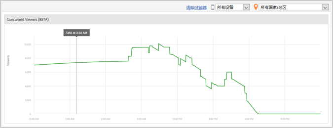

# 媒体并行查看者{#media-concurrent-viewers}

“媒体并行查看者”仪表板显示一天内的并行查看者。数据可以按内容、设备类型或国家/地区进行过滤。

>[!TIP]
>
> 此报表基于并行活动媒体会话。要按独特访客以及通过应用区段、进行细分和比较的附加功能查看并行查看者，请使用 [Analysis Workspace 中的“媒体并行查看者”面板](https://docs.adobe.com/content/help/zh-Hans/analytics/analyze/analysis-workspace/panels/media-concurrent-viewers.html)。

## 报表特点 {#report-features}

以下是此报表的一些特点：

* 非实时。具有正常 Adobe Analytics 延迟。
* 报表涵盖 24 小时时间范围。x 轴是基于报表包时区的每日时间。
* 以分钟粒度显示并行查看者。
* 有一个“媒体并行查看者报表”**，其中显示了在所有内容中正在观看或收听的查看者数量。
* “媒体详细信息”**&#x200B;报表内有一个“并行查看者”报表，其中显示了正在观看或收听某一特定媒体项目的查看者数量。
* 报表仅在一天内有效。
* 客户可以查看并行查看者历史报表（仅限一天）。

## 限制 {#limitations}

以下是此报表的一些限制：

* 如果选择的间隔不是一整天，则不会显示任何数据。
* 无法导出数据，如 ReportBuilder。
* 不能以表格式显示数据。
* 无法通过电子邮件发送报表。
* 即使不跟踪广告，也必须重新启用媒体跟踪并选择“媒体广告”模块。
* 在使用具有暂停跟踪功能的心率库时，此功能将提供准确的数据。
