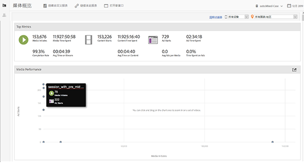
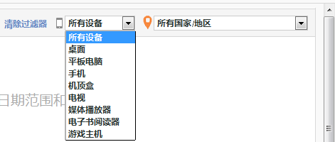
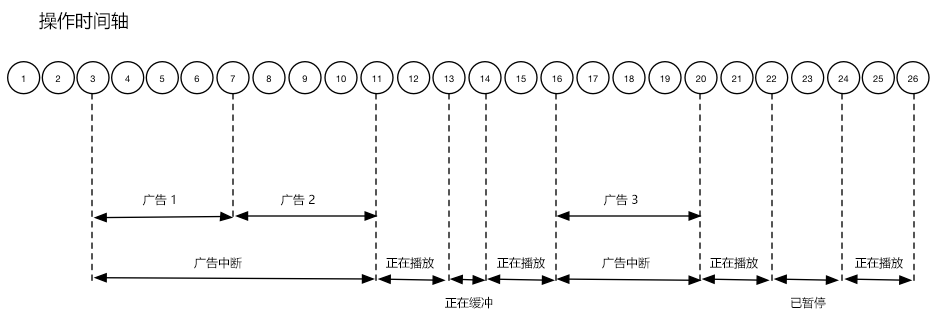

# 媒体概览{#media-overview}

“媒体概览”功能板旨在让您监测整个网站中的媒体。“媒体概览”屏幕显示了若干汇总测量，这样您便可以快速监测媒体是否如期执行。图表会在广告开始次数旁显示内容开始次数，以便快速查看每个媒体项目的这些量度。

{width=“672px”}

## 快速过滤器 {#section_8DF3E4A6734145B082657C6BECFA0BBE}

按设备或国家/地区快速显示媒体量度：

{width=“400px”}

## 媒体效果 {#section_288FB476EDA44761BB8A86551F0A110C}

单击并拖动以放大，然后将鼠标悬停在上面以查看特定媒体的精细量度。单击  

在缩放后重置视图。

{width=“400px”}

