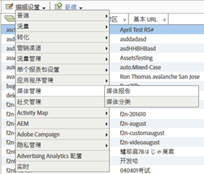

# 媒体报表启用{#media-reports-enablement}

在发送媒体数据之前，必须配置每个收集媒体度量的报告套件。

>[!TIP]
>
>要利用新功能，现有Media Analytics客户应重新启用RSID的媒体跟踪。

1. In [Reports &amp; Analytics](https://my.omniture.com/login/) click **[!UICONTROL Admin &gt; Report Suites].**
1. Select the report suite(s) where you are collecting media data and click **[!UICONTROL Edit Settings &gt; Media Management &gt; Media Reporting].**

   {width="400px"}

1. On the **[!UICONTROL Media Reporting]** page, enable **[!UICONTROL Media Core],** and optionally enable **[!UICONTROL Media Ads],** **[!UICONTROL Media Chapters],** and **[!UICONTROL Media Quality].**

   媒体测量包括以下模块：

   * **媒体核心**

      核心媒体测量用于媒体内容。这将使用解决方案（或自定义）eVar来跟踪内容、内容类型、内容播放器名称和内容渠道。 解决方案（或自定义）事件将用于媒体开始、内容开始、内容完成和内容停留时间。

   * **媒体广告**

      媒体广告测量用于测量媒体内容中的广告。 这将使用解决方案 eVar 来测量“广告”、“广告播放器名称”、“广告面板”和“面板中的广告位置”。解决方案事件将用于“广告开始”、“广告结束”、“广告逗留时间”和“视频逗留时间”。

   * **媒体章节**

      视频章节测量用于章节的测量。 章节是单个媒体内容的分类。 这将使用解决方案 eVar 来存储“章节 ID”。解决方案事件将用于“章节开始”、“章节结束”和“章节逗留时间”。“章节名称”和“章节位置”的其他章节元数据将作为“章节 ID”的分类提供。

   * **媒体质量**

      视频质量测量用于测量内容回放的质量。 这将使用解决方案 eVar 来存储“开始时间”、“缓冲事件”、“缓冲总持续时间”、“比特率切换”、“平均比特率”、“错误”和“丢帧”。解决方案事件将用于“开始时间”、“开始前丢帧”、“受缓冲影响的流”、“缓冲事件”、“缓冲总持续时间”、“受比特率更改影响的流”、“比特率更改”、“平均比特率”、“受错误影响的流”、“错误事件”、“受丢帧影响的流”和“丢帧”。

   * **视频和视频广告元数据**

      元数据可附加到媒体和／或广告以进一步描述和分类该媒体／广告。 将通过解决方案变量和分类收集标准化的媒体和广告元数据。 它的值包括：节目、季、剧集、资产 ID、流派、首次播放日期、首次数字化日期、内容分级、创作者、网络、节目类型、广告载入次数、MVPD、已授权、播放时段、媒体会话 ID、广告商、促销活动 ID 以及创作 ID。

   * **音频和音频广告元数据**

      可以将元数据附加到音频和/或广告中，以进一步对该音频/广告加以说明和分类。标准化的音频和广告元数据将通过解决方案变量和分类进行收集。具体的值包括:“艺人”、“专辑”、“标签”、“作者”、“发行者”、“电台/电视台”、“表演”、“季”、“剧集”、“资产 ID”、“流派、“首次播放日期”、“首次数字化日期”、“内容评级”、“创作者”、“表演类型”、“广告载入次数”、“播出时段”、“媒体会话 ID”、“广告商”、“促销活动 ID”和“创作 ID”。
   启用每个模块会保留一组变量并创建一组新报表。除了质量之外，除非已完成相应的实施，否则报表中没有任何数据。实施核心模块还会实施您启用的质量模块。

   如果您尚未跟踪广告、章节或播放质量，则可以随时启用其他选项。

1. Click **[!UICONTROL Save].**

   If this report suite is already configured to collect media data, after you click **[!UICONTROL Save]**, an additional configuration page is displayed. 如果您看到“**[!UICONTROL ‘媒体核心’测量]”页面，请继续执行下一步。**

1. (Conditional) On the **[!UICONTROL Media Core measurement]** page, choose to continue using custom variables or choose to use solution variables.

   | 选项 | 注释 |
   | --- | --- |
   | 继续使用自定义变量 | 利弊：<ul> <li> **优点：**&#x200B;内容趋势在迁移后继续可用。 </li> <li> **** 缺点：要求您保留两个自定义eVar和三个自定义事件分配给媒体。 您可重新获得一个自定义 eVar 和一个自定义事件的使用权。 </li> </ul> 要继续使用自定义变量，请执行以下操作： <ol> <li>Select **[!UICONTROL Use Custom Variables,]** then click **[!UICONTROL Save.]** </li> <li>When prompted, map your current custom eVars and events and then click **[!UICONTROL Save:]** </li> </ol> |
   | 迁移到解决方案变量 | 利弊：<ul> <li> **优点：**&#x200B;您可重新获得三个自定义 eVar 和四个自定义事件的使用权。 </li> <li> **缺点：**&#x200B;您会丢失&#x200B;**所有**&#x200B;历史趋势和媒体报表对比。这意味着您在迁移到心率之前，无法跟踪任意日期的内容查看次数或内容播放时间趋势。 </li> </ul> **限制：**&#x200B;除非您确定不希望保留此趋势，否则请不要迁移到解决方案变量！只有在需要保留历史连续性时，所有客户才应该使用解决方案变量和处理规则来将媒体数据置入现有的 prop 和 eVar 中。要迁移到解决方案变量，请执行以下操作：选择“ **[!UICONTROL 使用解决方案变量]** ”，然后单 **[!UICONTROL 击“保存]”。** 重    要：迁移到解决方案变量会导致您丢失 **媒体报告的** 所有历史趋势和比较。 |

>[!IMPORTANT]
>
>请勿更改“度量”和元数据表(例如，音频和视频参数 )中列出的任何变量的分类名称，这些变量在“报告／保留变量”下描述为“分类”。 在启用报表包进行媒体跟踪时，将定义媒体分类。 Adobe会不时添加新属性，一旦出现这种情况，客户必须重新启用其报表包才能访问新的媒体属性。 在更新过程中，Adobe通过检查变量名称来确定是否启用了分类。 如果其中任何一个缺失，Adobe会再次添加缺失的。
