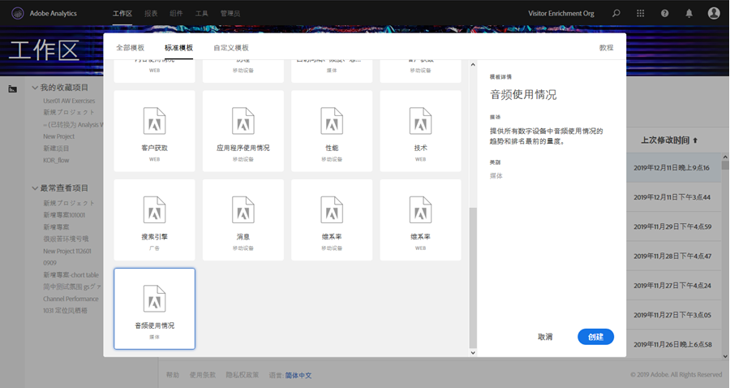
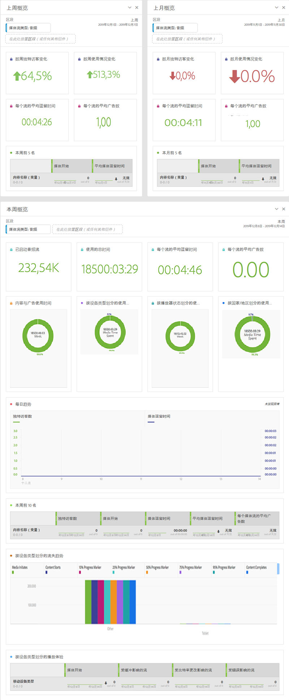

# 媒体工作区模板{#media-workspace-templates}

通过 Adobe Analytics 工作区，您可以快速设置功能板以对跟踪数据进行分析。在创建新项目，或进入工作区来管理现有项目时，您可以从包含常见的一般跟踪方案（例如客户获取、音频和视频使用情况等）的标准模板中进行选择。您还可以创建、修改和保存自己的自定义模板。

在创建或管理项目时，可以使用 Adobe Analytics 的“工作区”选项卡中的模板。当您最初进入到工作区时，系统将显示用于创建新项目或打开现有项目的选项：

* **创建新项目 -**&#x200B;在单击工作区中的&#x200B;**[!UICONTROL 新建项目]按钮时，系统将显示一个对话框，您可以从该对话框的模板集合（包括标准模板和自定义模板）中进行选择：**

   

   例如，如果选择“音频使用情况”模板，则将呈现一个项目，其中具有以下以音频为导向的功能板：

   

* **管理项目 -**&#x200B;在现有项目中，您可以修改呈现的数据并将其另存为模板，以创建自己的自定义模板集合。

