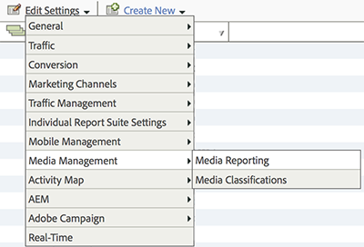

# 媒体报表启用{#media-reports-enablement}

收集媒体量度的每个报表包必须在发送媒体数据之前进行配置。

只有在启用“媒体核心”并为[体验质量](/help/use-cases/track-qos/track-qos-overview.md)启用跟踪后，高级客户才能使用 Analysis Workspace 中的媒体面板。

>[!TIP]
>
>要利用新功能，现有的流媒体客户应当为他们的RSID重新启用媒体跟踪。

1. 在 [Reports &amp; Analytics](https://my.omniture.com/login/) 中，单击&#x200B;**[!UICONTROL 管理员 > 报表包]。**
1. 选择要在其中收集媒体数据的报表包，然后单击&#x200B;**[!UICONTROL 编辑设置 > 媒体管理 > 媒体报告]。**

   

1. 在&#x200B;**[!UICONTROL 媒体报告]**&#x200B;页面中，启用&#x200B;**[!UICONTROL 媒体核心]，**&#x200B;也可选择启用&#x200B;**[!UICONTROL 媒体广告]、**&#x200B;**[!UICONTROL 媒体章节]**&#x200B;和&#x200B;**[!UICONTROL 媒体质量]。**

   媒体测量包括以下模块：

   * **媒体核心**

     核心媒体测量用于媒体内容。它将使用解决方案（或自定义）eVar 来跟踪内容、内容类型、内容播放器名称和内容渠道。解决方案（或自定义）事件将用于“媒体开始”、“内容开始”、“内容结束”和“内容逗留时间”。

   * **媒体广告**

     媒体广告测量用于测量媒体内容中的广告。这将使用解决方案 eVar 来测量广告、广告播放器名称、广告面板和广告在面板中的位置。解决方案事件将用于广告开始、广告结束、广告逗留时间和视频逗留时间。

   * **媒体章节**

     视频章节测量用于测量章节。章节是单个媒体中的一小部分内容。这将使用解决方案 eVar 存储章节 ID。解决方案事件将用于章节开始、章节结束和章节逗留时间。章节名称和章节位置的其他章节元数据将作为章节 ID 的分类提供。

   * **媒体质量**

     视频质量测量用于测量内容播放的质量。这将使用解决方案 eVar 存储“开始时间”、“缓冲事件”、“缓冲总持续时间”、“比特率开关”、“平均比特率”、“错误”和“丢帧”。解决方案事件将用于开始时间、开始前丢帧、受缓冲影响的流、缓冲事件、缓冲总持续时间、受比特率更改影响的流、比特率更改、平均比特率、受错误影响的流、错误事件、受丢帧影响的流以及丢帧。

   * **视频和视频广告元数据**

     可以将元数据附加到媒体和/或广告中，从而对该媒体/广告进一步说明和分类。将通过解决方案变量和分类，收集标准化的媒体和广告元数据。它的值包括：节目、季、剧集、资产 ID、流派、首次播放日期、首次数字化日期、内容分级、创作者、网络、节目类型、广告载入次数、MVPD、已授权、播放时段、媒体会话 ID、广告商、促销活动 ID 以及创作 ID。

   * **音频和音频广告元数据**

     可以将元数据附加到音频和/或广告中，以进一步对该音频/广告加以说明和分类。标准化的音频和广告元数据将通过解决方案变量和分类进行收集。具体的值包括:“艺人”、“专辑”、“标签”、“作者”、“发行者”、“电台/电视台”、“表演”、“季”、“剧集”、“资产 ID”、“流派、“首次播放日期”、“首次数字化日期”、“内容评级”、“创作者”、“表演类型”、“广告载入次数”、“播出时段”、“媒体会话 ID”、“广告商”、“促销活动 ID”和“创作 ID”。

   启用每个模块可保留一组变量并创建一组新报表。除“质量”外，除非完成相应的实施，否则报表中不会有任何数据。如果启用“质量”模块，则实施“核心”模块也会实施“质量”模块。

   如果您尚未跟踪广告、章节或播放质量，则可以随时启用其他选项。

1. 单击&#x200B;**[!UICONTROL 保存]。**

   如果此报表包已配置为收集媒体数据，则单击&#x200B;**[!UICONTROL 保存]**&#x200B;后，会显示额外的配置页面。如果您看到&#x200B;**[!UICONTROL “媒体核心”测量]**&#x200B;页面，请继续执行下一步。

1. （视情况而定）在&#x200B;**[!UICONTROL “媒体核心”测量]**&#x200B;页面中，选择继续使用自定义变量还是使用解决方案变量。

   | 选项 | 注释 |
   | --- | --- |
   | 继续使用自定义变量 | 优点和缺点：<ul> <li> **优点：**&#x200B;内容趋势在迁移后继续可用。 </li> <li> **缺点：**&#x200B;需要您保留分配给媒体的两个自定义 eVar 和三个自定义事件。您可以重新使用一个自定义 eVar 和一个自定义事件。 </li> </ul> 要继续使用自定义变量，请执行以下操作： <ol> <li>选择&#x200B;**[!UICONTROL 使用自定义变量]**，然后单击&#x200B;**[!UICONTROL 保存]**。 </li> <li>出现提示时，映射您当前的自定义 eVar 和事件，然后单击&#x200B;**[!UICONTROL 保存]**。 </li> </ol> |
   | 迁移到解决方案变量 | 优点和缺点：<ul> <li> **优点：**&#x200B;您可以重新使用三个自定义 eVar 和四个自定义事件。 </li> <li> **缺点：**&#x200B;您会失去媒体报表的&#x200B;**所有**&#x200B;历史趋势和对比。这意味着在迁移到心率之前，您无法对任何日期的内容观看次数或播放的内容时间进行趋势分析。 </li> </ul> **限制：**&#x200B;除非您确定不希望保留此趋势，否则请不要迁移到解决方案变量！只有在需要保留历史连续性时，所有客户才应该使用解决方案变量和处理规则来将媒体数据置入现有的 prop 和 eVar 中。要迁移到解决方案变量：请选择&#x200B;**[!UICONTROL 使用解决方案变量]**，然后单击&#x200B;**[!UICONTROL 保存]**。  重要信息：迁移到解决方案变量会导致您丢失&#x200B;**所有**&#x200B;历史趋势和媒体报表对比。 |

>[!IMPORTANT]
>
>请勿更改在“指标和元数据”表（如[音频和视频参数](/help/implementation/variables/audio-video-parameters.md)）中列出的在“报表/保留的变量”下被描述为“分类”的任何变量的分类名称。在启用报表包进行媒体跟踪后，将定义媒体分类。Adobe 会不时添加新属性，如果添加了新属性，客户必须重新启用其报表包才能访问新的媒体属性。在更新过程中，Adobe 会通过检查变量名称来确定是否启用了分类。如果任何变量名称缺失，Adobe 会再次添加缺失的变量名称。
