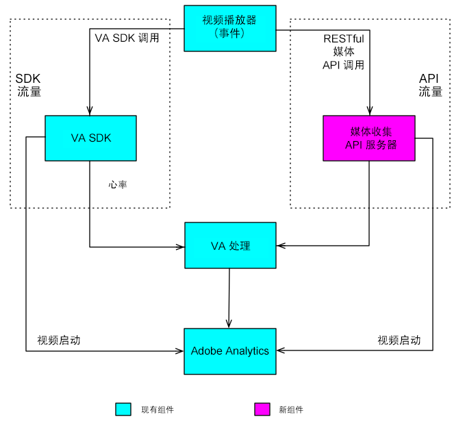

# 在 SceneGraph (Roku) 中跟踪{#tracking-in-scenegraph-roku}

## 简介 {#section_vfr_zcz_y2b}

Roku 引入了一个用于开发应用程序的新编程框架：SceneGraph XML 编程框架。这个新框架包含两个新的关键概念：

* 应用程序屏幕的 SceneGraph 渲染
* SceneGraph 屏幕的 XML 配置

Adobe Mobile SDK for Roku 是使用 BrightScript 编写的。SDK 使用的许多组件并不适用于在 SceneGraph（例如，线程）上运行的应用程序。因此，打算使用 SceneGraph 框架的 Roku 应用程序开发人员无法调用 Adobe Mobile SDK API（后者类似于旧版 BrightScript 应用程序中提供的 API）。

## 架构 {#section_dj5_1dz_y2b}

为了向 AdobeMobile SDK 添加 SceneGraph 支持，Adobe 已添加了一个新的 API，通过此 API，可在 AdobeMobile SDK 和 `adbmobileTask` 之间创建一个连接器桥。后者是用于 SDK API 执行的 SceneGraph 节点。（在本文档的其他部分中对 `adbmobileTask` 的用法进行了详细解释。）

连接器桥用于执行以下操作：

* 该桥返回 AdobeMobile SDK 的 SceneGraph 兼容实例。与 SceneGraph 兼容的 SDK 拥有旧版 SDK 公开的所有 API。
* 您在 SceneGraph 中使用 AdobeMobile SDK API 的方式与使用旧版 API 的方式非常相似。
* 该桥还公开了一种机制来监听返回某些数据的 API 回调。



## 组件 {#section_jwl_wqx_1bb}

**SceneGraph 应用程序：**

* 通过 SceneGraph 连接器桥 API 使用 `AdobeMobileLibrary` API。
* 在 `adbmobileTask` 中为预期的输出数据变量注册响应回调。

**AdobeMobileLibrary：**

* 公开了一组公共 API（旧版），包括连接器桥 API。
* 返回包含所有旧版公共 API 的 SceneGraph 连接器实例。
* 与用于执行 API 的 `adbmobileTask` SceneGraph 节点通信。

**adbmobileTask 节点：**

* 可在后台线程上执行 `AdobeMobileLibrary` API 的 SceneGraph 任务节点。
* 用作将数据返回到应用程序场景的委托。

## 公共 SceneGraph API {#section_jyd_hdz_y2b}

### ADBMobileConnector

| 类别 | 方法名称 | 描述 |
|---|---|---|
| **常量** |  |  |
|  | `sceneGraphConstants` | Returns an object containing `SceneGraphConstants`. 有关详细信息，请参阅上表。 |
|  |  |  |
| **调试日志记录** |  |  |
|  | `setDebugLogging` | 用于在 ADBMobile SDK 中设置调试日志记录的 SceneGraph API。 |
|  | `getDebugLogging` | 用于从 ADBMobile SDK 获取调试日志记录的 SceneGraph API。 |
|  | 有关更多信息，请参阅旧版 SDK 的“调试日志记录”部分。 |  |
|  |  |  |
| **隐私状态/选择禁用** |  |  |
|  | `setPrivacyStatus` | 用于在 ADBMobile SDK 中设置隐私状态的 SceneGraph API。 |
|  | `getPrivacyStatus` | 用于从 ADBMobile SDK 获取隐私状态的 SceneGraph API。 |
|  | 有关更多信息，请参阅旧版 SDK 的“选择禁用/隐私状态”部分。 |  |
|  |  |  |
| **Analytics** |  |  |
|  | `trackState` | 用于在 ADBMobile SDK 中跟踪状态的 SceneGraph API。 |
|  | `trackAction` | 用于在 ADBMobile SDK 中跟踪操作的 SceneGraph API。 |
|  | `trackingIdentifier` | 用于从 ADBMobile SDK 获取跟踪标识符的 SceneGraph API。 |
|  | `userIdentifier` | 用于从 ADBMobile SDK 获取用户标识符的 SceneGraph API。 |
|  | `setUserIdentifier` | 用于在 ADBMobile SDK 中设置用户标识符的 SceneGraph API。 |
|  | `getAllIdentifiers` | 可检索 Roku SDK 已知并保留的所有用户标识的 SceneGraph API。 |
|  | 有关更多信息，请参阅旧版 SDK 的 Analytics 部分。 |  |
|  |  |  |
| **Experience Cloud** |  |  |
|  | `visitorSyncIdentifiers` | 用于在 ADBMobile SDK 中同步 Experience Cloud 标识符的 SceneGraph API。 |
|  | `visitorMarketingCloudID` | 用于从 ADBMobile SDK 获取访客 Experience Cloud ID 的 SceneGraph API。 |
|  | 有关更多信息，请参阅旧版 SDK 的 Experience Cloud 部分。 |  |
|  |  |  |
| **Audience Manager** |  |  |
|  | `audienceSubmitSignal` | 用于发送含特征的受众管理信号的 SceneGraph API。 |
|  | `audienceVisitorProfile` | 用于从 ADBMobile SDK 获取 Audience Manager 访客配置文件的 SceneGraph API。 |
|  | `audienceDpid` | 用于从 ADBMobile SDK 获取受众 Dpid 的 SceneGraph API。 |
|  | `audienceDpuuid` | 用于从 ADBMobile SDK 获取受众 Dpuuid 的 SceneGraph API。 |
|  | `audienceSetDpidAndDpuuid` | 用于在 ADBMobile SDK 中设置受众 Dpid 和 Dpuuid 的 SceneGraph API。 |
|  | 有关更多信息，请参阅旧版 SDK 的 Audience Manager 部分。 |  |
|  |  |  |
| **MediaHeartbeat** |  |  |
|  | `mediaTrackLoad` | 用于加载视频内容以进行 MediaHeartbeat 跟踪的 SceneGraph API。 |
|  | mediaTrackStart | 使用 MediaHeartbeat 开始视频跟踪会话的 SceneGraph API。 |
|  | `mediaTrackUnload` | 用于从 MediaHeartbeat 跟踪中卸载视频内容的 SceneGraph API。 |
|  | `mediaTrackPlay` | 用于跟踪视频内容播放的 SceneGraph API。 |
|  | mediaTrackPause | 用于跟踪视频内容暂停的 SceneGraph API。 |
|  | `mediaTrackComplete` | 用于跟踪视频内容播放结束的 SceneGraph API。 |
|  | `mediaTrackError` | 用于跟踪播放错误的 SceneGraph API。 |
|  | mediaTrackEvent | 用于在跟踪期间，跟踪播放事件的 SceneGraph API。例如：广告、章节。 |
|  | `mediaUpdatePlayhead` | 用于在视频跟踪期间，将播放头更新发送到 MediaHeartbeat 的 SceneGraph API。 |
|  | `mediaUpdateQoS` | 用于在视频跟踪期间，将 QoS 更新发送到 MediaHeartbeat 的 SceneGraph API。 |
|  | 有关更多信息，请参阅旧版 SDK 的“媒体心率”部分。 |  |

### SceneGraphConstants

| 常量名称 | 描述 |
|---|---|
| `API_RESPONSE` | Used to retrieve the response object from `adbmobileTask` node's `adbmobileApiResponse` field |
| `DEBUG_LOGGING` | `apiName` 用于 `getDebugLogging` |
| `PRIVACY_STATUS` | `apiName` 用于 `getPrivacyStatus` |
| `TRACKING_IDENTIFIER` | `apiName` 用于 `trackingIdentifier` |
| `USER_IDENTIFIER` | `apiName` 用于 `userIdentifier` |
| `VISITOR_MARKETING_CLOUD_ID` | `apiName` 用于 `visitorMarketingCloudID` |
| `AUDIENCE_VISITOR_PROFILE` | `apiName` 用于 `audienceVisitorProfile` |
| `AUDIENCE_DPID` | `apiName` 用于 `audienceDpid` |
| `AUDIENCE_DPUUID` | `apiName` 用于 `audienceDpuuid` |

### adbmobileTask 节点

<table>
<thead>
<tr>
<td> 字段 </td><td> 类型 </td><td> 默认值 </td><td> 使用情况 </td>
</tr>
</thead>
<tbody>
<tr>
<td> adbmobileApiCall </td>
<td> assocarray </td>
<td> 无效 </td>
<td> 请勿修改该字段或让应用程序使用该字段。ADBMobile SceneGraphConnector 使用该字段来通过 SceneGraph 节点路由 API 调用并获取响应。因此，这是 AdobeMobileSDK 为兼容 SceneGraph 而保留的键/字段。<b>重要信息：</b>对此字段的任何修改都可能导致 AdobeMobileSDK 无法正常运行。</td>
</tr>
<tr>
<td> adbmobileApiResponse </td>
<td> assocarray </td>
<td> 无效 </td>
<td> 只读所有在AdobeMobilesDK上执行的API将返回此字段上的响应。应注册监听此字段更新的回调以接收响应对象。以下是响应对象的格式：  
<codeblock>
response={“apinName”：&lt;sceneGraphel常量。
 API_ NAME&gt;
“returnValue：&lt; API_ PORMANSE&gt;} 
</codeblock>
将为 AdobeMobileSDK 中的任何 API 调用发送此响应对象的实例，根据 API 引用指南，该 API 调用应会返回一个值。例如，对visitorMarketingCloud()的API调用将返回以下响应对象： 
<codeblock>
response={“apinName”：m.
 AdbMobileConstants.
 CLUTOR_ Marketing_ CLOUD_ ID
“returnValue：“07050x25671x3360x72644x14”} 
</codeblock>
或者，响应数据也可能无效： 
<codeblock>
response={
“apineName”：m.
 AdbMobileConstants.
 CLUTOR_ Marketing_ CLOUD_ ID
“returnValue：invalid} 
</codeblock>
</td>
</tr>
</tbody>
</table>

### `adbmobile.brs`

#### `getADBMobileConnectorInstance`

API 签名: `ADBMobile().getADBMobileConnectorInstance()`\
Input: `adbmobileTask`
Return Type: `ADBMobileConnector`

#### `sgConstants`

API Signature: `ADBMobile().sgConstants()`
Input: None\
返回类型: `SceneGraphConstants`

>[!NOTE]
>Refer to the `ADBMobileConnector` API reference for details.

### ADBMobile 常量

|  功能  | 常量名称 | 描述   |
|---|---|---|
| 版本控制 | `version` | 用于检索 AdobeMobileLibrary 版本信息的常量 |
| 隐私/选择禁用 | `PRIVACY_STATUS_OPT_IN` | 表示“已选择启用”隐私状态的常量 |
|  | `PRIVACY_STATUS_OPT_OUT` | 表示“已选择禁用”隐私状态的常量 |
| MediaHeartbeat 常量 | Refer to the constants on this page: <br/><br/>[Media Heartbeat Methods.](/help/sdk-implement/track-av-playback/track-core/track-core-roku.md) | 将这些常量与MediaHeartBeis API结合使用 |
| 标准元数据 | Refer to the constants on this page: <br/><br/>[Standard Metadata Parameters.](/help/sdk-implement/track-av-playback/impl-std-metadata/impl-std-metadata-roku.md) | 使用这些常量可在 MediaHeartbeat API 中附加标准视频/广告元数据 |

Globally defined utility `MediaHeartbeat` APIs on the legacy AdobeMobileLibrary are accessible *as is* in the SceneGraph enviromnent because they do not use any Brightscript components that are unavailable in SceneGraph nodes. 有关这些方法的更多信息，请参阅下表：

### 适用于 MediaHeartbeat 的全局方法

| 方法 | 描述 |
| --- | --- |
| `adb_media_init_mediainfo` | 此方法返回初始化的媒体信息对象 `Function adb_media_init_mediainfo(name As String, id As String, length As Double, streamType As String) As Object` |
| `adb_media_init_adinfo` | 此方法返回初始化的广告信息对象 `Function adb_media_init_adinfo(name As String, id As String, position As Double, length As Double) As Object` |
| `adb_media_init_chapterinfo` | This method returns initialized Chapter Information object.  `Function adb_media_init_adbreakinfo(name As String, startTime as Double, position as Double) As Object` |
| `adb_media_init_adbreakinfo` | This method returns initialized AdBreak Information object.  `Function adb_media_init_chapterinfo(name As String, position As Double, length As Double, startTime As Double) As Object` |
| `adb_media_init_qosinfo` | This method returns an initialized QoS Information object.  `Function adb_media_init_qosinfo(bitrate As Double, startupTime as Double, fps as Double, droppedFrames as Double) As Object` |

## 实施 {#section_dbz_ydz_y2b}

1. **下载Roku库-** 下载 [最新的Roku库。](https://github.com/Adobe-Marketing-Cloud/media-sdks/releases/tag/roku-v2.2.0)

1. **设置开发环境**

   1. Copy `adbmobile.brs` (AdobeMobileLibrary) into your `pkg:/source/` directory.

   1. For Scene Graph support, copy `adbmobileTask.brs` and `adbMobileTask.xml` into your `pkg:/components/` directory.

1. **初始化**

   1. Import `adbmobile.brs` into your Scene.

      ```
      <script type="text/brightscript" uri="pkg:/source/adbmobile.brs" />
      ```

   1. 在场景中创建一个 `adbmobileTask` 节点的实例。

      ```
      m.adbmobileTask = createObject("roSGNode", "adbmobileTask")
      ```

   1. 使用 `adbmobile` 实例获取 SceneGraph 的 `adbmobileTask` 连接器实例。

      ```
      m.adbmobile = ADBMobile().getADBMobileConnectorInstance(m.adbmobileTask)
      ```

   1. Get `adbmobile` SG constants.

      ```
      m.adbmobileConstants = m.adbmobile.sceneGraphConstants()
      ```

   1. 注册一个回调以接收所有 `AdbMobile` API 调用的响应对象。

      ```
      m.adbmobileTask.ObserveField(m.adbmobileConstants.API_RESPONSE,  
                                   "onAdbmobileApiResponse") 
      
      ' Sample implementation of the callback 
      ' Listen for all the constants for which API calls are made on the SDK 
      function onAdbmobileApiResponse() as void 
          responseObject = m.adbmobileTask[m.adbmobileConstants.API_RESPONSE] 
      
          if responseObject <> invalid 
              methodName = responseObject.apiName 
              retVal = responseObject.returnValue 
      
              if methodName = m.adbmobileConstants.DEBUG_LOGGING 
                  if retVal 
                      print "API Response: DEBUG LOGGING: " + "True" 
                  else 
                      print "API Response: DEBUG LOGGING: " + "False" 
                  endif 
              else if methodName = m.adbmobileConstants.PRIVACY_STATUS 
                  print "API Response: PRIVACY STATUS: " + retVal 
              else if methodName = m.adbmobileConstants.TRACKING_IDENTIFIER 
                  if retVal <> invalid 
                      print "API Response: TRACKING IDENTIFIER: " + retVal 
                  else 
                      print "API Response: TRACKING IDENTIFIER: " + "invalid" 
                  endif 
              else if methodName = m.adbmobileConstants.USER_IDENTIFIER 
                  if retVal <> invalid 
                      print "API Response: USER IDENTIFIER: " + retVal 
                  else 
                      print "API Response: USER IDENTIFIER: " + "invalid" 
                  endif 
              else if methodName = m.adbmobileConstants.VISITOR_MARKETING_CLOUD_ID 
                  if retVal <> invalid 
                      print "API Response: MCID: " + retVal 
                  else 
                      print "API Response: MCID: " + "invalid" 
                  endif 
              else if methodName = m.adbmobileConstants.AUDIENCE_DPID 
                  if retVal <> invalid 
                      print "API Response: AUDIENCE DPID: " + retVal 
                  else 
                      print "API Response: AUDIENCE DPID: " + "invalid" 
                  endif 
              else if methodName = m.adbmobileConstants.AUDIENCE_DPUUID 
                  if retVal <> invalid 
                      print "API Response: AUDIENCE DPUUID: " + retVal 
                  else 
                      print "API Response: AUDIENCE DPUUID: " + "invalid" 
                  endif 
              else if methodName = m.adbmobileConstants.AUDIENCE_VISITOR_PROFILE 
                  if retVal <> invalid 
                      print "API Response: AUDIENCE VISITOR PROFILE: Valid Object" 
                  else 
                      print "API Response: AUDIENCE VISITOR PROFILE: " + "invalid" 
                  endif 
              endif 
          endif 
      end function 
      ```

## 实施示例 {#section_mld_lfz_y2b}

### 旧版 SDK 中的 API 调用示例

```
'get an instance of SDK 
m.adbmobile = ADBMobile() 
   
'execute setter APIs 
m.adbmobile.setDebugLogging(true) 
   
'execute getter APIs 
debugLogging = m.adbmobile.getDebugLogging()
```

### SG SDK 中的 API 调用示例

```
'create adbmobileTask instance 
m.adbmobileTask = createObject("roSGNode", "adbmobileTask") 
   
'get an instance of SDK using task instance 
m.adbmobile =  
  ADBMobile().getADBMobileConnectorInstace(m.adbmobileTask) 
m.adbmobileConstants = m.adbmobile.sceneGraphConstants() 
'execute setter APIs 
m.adbmobile.setDebugLogging(true) 
  
'execute getter APIs 
m.adbmobileTask.ObserverField(m.adbConstants.API_RESPONSE,  
                              "onAdbmobileApiResponse") 
m.adbmobile.getDebugLogging() 
   
'listen for return data in registered callbacks 
function onAdbmobileApiResponse() as void 
    responseObject = m.adbmobileTask[m.adbmobileConstants.API_RESPONSE] 
  
        if responseObject <> invalid 
            methodName = responseObject.apiName 
            retVal = responseObject.returnValue 
  
        if methodName = m.adbmobileConstants.DEBUG_LOGGING 
            if retVal 
                print "API Response: DEBUG LOGGING: " + "True" 
            else 
                print "API Response: DEBUG LOGGING: " + "False" 
         endif 
    endif 
end function
```

