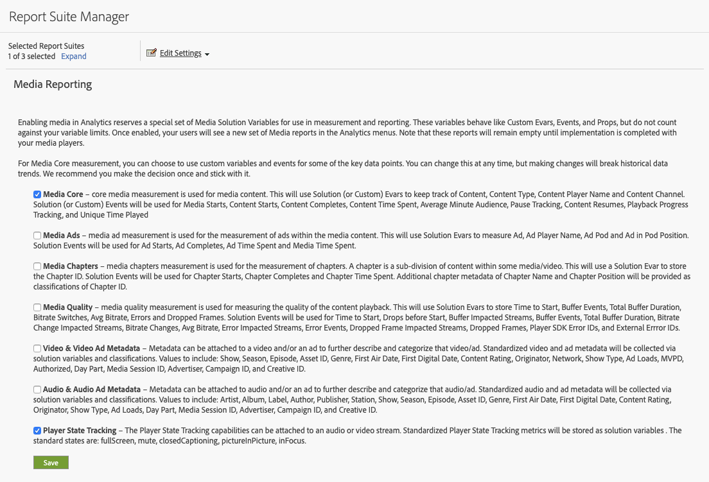

# 实施和报告

在播放会话期间，必须单独跟踪每个状态出现情况(开始到结束)。 Media SDK和Media Collection API为此功能提供新的跟踪方法。

Media SDK包括两种用于自定义状态跟踪的新方法：

`trackStateStart("state_name")`

`trackStateClose("state_name")`


Media Collection API包括两个新事件，它 `media.stateName` 们作为所需参数：

`stateStart` 和 `stateEnd`

## Media SDK实施

播放器状态开始

```
// StateStart (ex: Mute is switched on)
var stateObject = ADB.Media.createStateObject(ADB.Media.PlayerState.Mute);
tracker.trackEvent(ADB.Media.Event.StateStart, stateObject);
```

播放器状态结束

```
// StateEnd (ex: Mute is switched off)
tracker.trackEvent(ADB.Media.Event.StateEnd, stateObject);
```


## Media Collection API实施

播放器状态开始

```
// StateStart (ex: Mute is switched on)
http(s)://<Analytics_Visitor_Namespace>.hb-api.omtrdc.net/api/v1/sessions/<SID>/events
{
  "eventType": "stateStart",
  "params": {
    "media.state.name": "mute"
  },
  "playerTime": {
    "playhead": 0,
    "ts": 1569999130627
  }
}
```

播放器状态结束

```
// StateEnd (ex: Mute is switched off)
http(s)://<Analytics_Visitor_Namespace>.hb-api.omtrdc.net/api/v1/sessions/<SID>/events

{
  "eventType": "stateEnd",
  "params": {
    "media.state.name": "mute"
  },
  "playerTime": {
    "playhead": 600,
    "ts": 1569999730638
  }
}
```

## 状态指标

为每个状态提供的量度将作为上下文数据参数计算并推送到Adobe Analytics，并存储为报告目的。 每个状态有三个可用的指标：

* `a.media.states.[state.name].set = true` —如果每个流的特定播放至少设置一次状态，则设置为true。
* `a.media.states.[state.name].count = 4` —标识在每次播放流时的状态出现次数
* `a.media.states.[state.name].time = 240` —以秒为单位标识流的每个单独播放的总状态持续时间

## 报表

在启用报表包进行播放器状态跟踪后，所有播放器状态度量都可用于分析工作区或组件（区段、计算度量）中的任何报告可视化。 可以使用“媒体报告设置”(“编辑设置”>“媒体管理”>“媒体报告”)从Admin Console为每个报告启用新指标。



在Analytics Workspace中，所有新属性都位于“度量”面板中。 例如，您可以通过搜索 `full screen` 在“度量”面板中视图全屏数据。


## 将播放器声明的指标导入Adobe Experience Platform

存储在Analytics中的数据可用于任何目的，并且播放器状态指标可以使用XDM导入Adobe Experience Platform，并与客户旅程分析一起使用。 标准状态属性具有特定属性，而自定义状态是属性可通过自定义事件使用。 有关其他信息，请参阅XDM标识的属性列表，网址为？LINK TO METRIC列表?。
