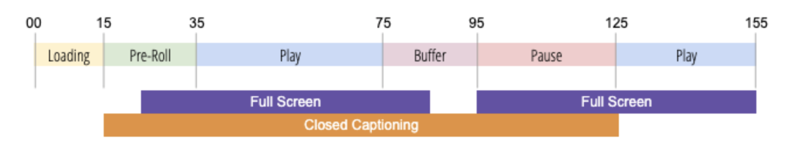

# 关于播放器状态跟踪

要优化您的产品体验并提升业务价值，在观看视频时了解客户行为非常重要。 这包括在不同播放器状态中所花费的时间。  为了优化您的理解，您需要根据需要灵活创建和衡量新的播放器状态和事件。

播放器状态跟踪功能使用一套标准的解决方案变量在播放过程中捕获查看器交互，这些变量适用于全屏、关闭的字幕、静音、画中画和焦点。  播放器状态跟踪还提供了创建自定义播放器状态的灵活性。  播放器状态跟踪变量可用于报告分析工作区。

要捕获对播放器状态的更改，播放器状态跟踪会更新视频测量元数据。 例如，要确定“真”视频参与度，播放器状态跟踪会测量关闭音效或处于正常与全屏模式时，与被动或未参与的视频视图相比，在声音上花费的时间。

播放器状态跟踪具有以下优点：

* 提供标准变量，用于衡量常见状态，如全屏或隐藏式字幕
* 提供可自定义的变量，以在播放会话期间测量自定义状态
* 度量在自定义播放器状态中停留的时间
* 测量可能并发的多个状态

## 要求

播放器状态跟踪要求Media Analytics Extension与Adobe Experience Platform(AEP SDK)结合使用，具体如下：
* Web: 适用于音频和视频v1.0+的Adobe Media Analytics(3.x SDK)
* 移动： 适用于音频和视频的Adobe Media Analytics v2.0+

如果您决定不使用AEP SDK，您可以将以下内容与播放器状态跟踪结合使用：
* Media JS SDK 3.0+
* Media Collection API版本？

## 准则

在实施播放器状态跟踪之前，请考虑以下准则。

* 播放器状态是跨所有播放状态计算的-（无拆分）
* 您可以同时测量多个播放器状态
* 在播放过程中可跟踪的播放器状态最大数为10 
* 播放器状态度量仅会发送到Analytics以在“媒体关闭”呼叫中报告
* 为每个单独的播放会话捕获播放器状态——不会在播放中计算播放器状态 
