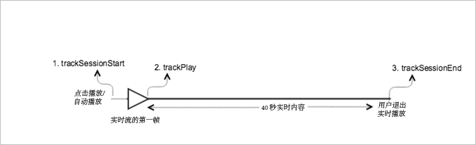

# 实时主内容{#live-main-content}

## 方案 {#scenario}

在此方案中，有一个实时资产，在加入实时流后 40 秒内不播放任何广告。

| 触发器 | 心率方法 | 网络调用 | 注释   |
|---|---|---|---|
| 用户点击&#x200B;**[!UICONTROL 播放]** | `trackSessionStart` | Analytics 内容开始，心率内容开始 | 这可以是用户点击&#x200B;**[!UICONTROL 播放]**&#x200B;或自动播放事件。 |
| 播放媒体的第一帧。 | `trackPlay` | 心率内容播放 | 此方法将触发计时器。只要继续播放，就会每 10 秒发送一次心率。 |
| 将播放内容。 |  | 内容心率 |  |
| 会话结束。 | `trackSessionEnd` |  | `SessionEnd` 是指观看会话结束。即使用户没有观看至媒体结束，也必须调用此 API。 |

## 参数 {#parameters}

您在 Adobe Analytics 内容开始调用中看到的很多值，同样也会在心率内容开始调用中看到。您还会看到许多其他参数，Adobe 使用这些参数填充 Adobe Analytics 中的各种媒体报表。我们不会在这里涵盖所有这些变量，而是只列出一些非常重要的变量。

### 心率内容开始

| 参数 | 值 | 注释 |
|---|---|---|
| `s:sc:rsid` | &lt;您的 Adobe 报表包 ID> |  |
| `s:sc:tracking_serve` | &lt;您的 Analytics 跟踪服务器 URL> |  |
| `s:user:mid` | `s:user:mid` | 应当匹配 Adobe Analytics 内容开始调用中的中间值 |
| `s:event:type` | &quot;start&quot; |  |
| `s:asset:type` | &quot;main&quot; |  |
| `s:asset:mediao_id` | &lt;您的媒体名称> |  |
| `s:stream:type` | live |  |
| `s:meta:*` | 可选 | 对媒体设置的自定义元数据 |

## 内容心率 {#content-heartbeats}

在媒体播放期间，有一个计时器将会每 10 秒发送一次主内容的一个或多个心率（或 ping），每 1 秒发送一次广告的一个或多个心率（或 ping）。这些心率将包含有关播放、广告、缓冲和许多其他内容的信息。每个心率的确切内容不在本文档涵盖的范围之内，验证的关键内容是在持续播放期间始终触发心率。

在内容心率中，查找一些特定的内容：

| 参数 | 值 | 注释 |
|---|---|---|
| `s:event:type` | &quot;play&quot; |  |
| `l:event:playhead` | &lt;播放头位置> 例如，50、60、70 | 这应该反映播放头的当前位置。 |

## 心率内容结束 {#heartbeat-content-complete}

由于实时流从不结束，因此这种情况下不会有结束调用。

## 播放头值设置

对于实时流，您需要将播放头值设置为自当天午夜UTC以来的秒数，以便在报表中，分析师可以确定用户在24小时视图内加入和离开实时流的时间点。

### 开始时

对于实时媒体，当用户开始播放流时，您需要将`l:event:playhead`设置为自当天午夜UTC以来的秒数。 这与 VOD 相反，在 VOD 中，您需要将播放头设置为“0”。

例如，假设实时流事件从午夜开始，并且持续 24 小时（`a.media.length=86400`；`l:asset:length=86400`）。然后，再假设某位用户在中午 12:00 开始播放该实时流。在此方案中，您应将`l:event:playhead`设置为43200（自当天UTC午夜12小时起，以秒为单位）。

### 暂停时

当用户暂停播放时，必须应用在播放开始时所应用的相同“实时播放头”逻辑。当用户返回播放实时流时，您必须根据自UTC午夜以来的新秒数(_not_)将`l:event:playhead`值设置为用户暂停实时流的点。

## 示例代码 {#sample-code}



### Android

以下是预期的 API 调用顺序：

```java
// Set up mediaObject 
MediaObject mediaInfo = MediaHeartbeat.createMediaObject( 
  Configuration.MEDIA_NAME,  
  Configuration.MEDIA_ID,  
  Configuration.MEDIA_LENGTH,  
  MediaHeartbeat.StreamType.LIVE 
); 

HashMap<String, String> mediaMetadata = new HashMap<String, String>(); 
mediaMetadata.put(CUSTOM_VAL_1, CUSTOM_KEY_1); 
mediaMetadata.put(CUSTOM_VAL_2, CUSTOM_KEY_2); 

// 1. Call trackSessionStart() when the user clicks Play or if autoplay is used,  
//    i.e., there is an intent to start playback.  
_mediaHeartbeat.trackSessionStart(mediaInfo, mediaMetadata); 

...... 
...... 

// 2. Call trackPlay() when the playback actually starts, i.e., when the first  
//    frame of main content is rendered on the screen. 
_mediaHeartbeat.trackPlay(); 

....... 
....... 

// 3. Call trackSessionEnd() when user ends the playback session.  
//    Since the user does not watch live media to completion, there  
//    is no need to call trackComplete().  
_mediaHeartbeat.trackSessionEnd(); 
....... 
....... 
```

### iOS

以下是预期的 API 调用顺序：

```
// Set up mediaObject 
ADBMediaObject *mediaObject =  
[ADBMediaHeartbeat createMediaObjectWithName:MEDIA_NAME  
                   length:MEDIA_LENGTH  
                   streamType:ADBMediaHeartbeatStreamTypeLIVE]; 
 
NSMutableDictionary *mediaContextData = [[NSMutableDictionary alloc] init]; 
[mediaContextData setObject:CUSTOM_VAL_1 forKey:CUSTOM_KEY_1]; 
[mediaContextData setObject:CUSTOM_VAL_2 forKey:CUSTOM_KEY_2]; 
 
// 1. Call trackSessionStart when the user clicks Play or if autoplay is used,  
//    i.e., there is an intent to start playback. 
[_mediaHeartbeat trackSessionStart:mediaObject data:mediaContextData]; 
...... 
...... 
 
// 2. Call trackPlay when the playback actually starts, i.e., when the first  
//    frame of the main content is rendered on the screen. 
[_mediaHeartbeat trackPlay]; 
....... 
....... 
 
// 3. Call trackSessionEnd when user ends the playback session. Since the user  
//    does not watch live media to completion, there is no need to call  
//    trackComplete. 
[_mediaHeartbeat trackSessionEnd]; 
........ 
........ 
```

### JavaScript

以下是预期的 API 调用顺序：

```js
// Set up mediaObject 
var mediaInfo =  
MediaHeartbeat.createMediaObject(Configuration.MEDIA_NAME,  
                                 Configuration.MEDIA_ID,  
                                 Configuration.MEDIA_LENGTH,  
                                 MediaHeartbeat.StreamType.VOD); 

var mediaMetadata = { 
  CUSTOM_KEY_1 : CUSTOM_VAL_1,  
  CUSTOM_KEY_2 : CUSTOM_VAL_2,  
  CUSTOM_KEY_3 : CUSTOM_VAL_3 
}; 

// 1. Call trackSessionStart() when Play is clicked or if autoplay  
//    is used, i.e., there's an intent to start playback. 
this._mediaHeartbeat.trackSessionStart(mediaInfo, mediaMetadata); 

...... 
...... 

// 2. Call trackPlay() when the playback actually starts, i.e., when the  
//    first frame of media is rendered on the screen. 
this._mediaHeartbeat.trackPlay(); 

....... 
....... 

// 3. Call trackSessionEnd() when user ends the playback session.  
//    Since user does not watch live media to completion, there is  
//    no need to call trackComplete(). 
this._mediaHeartbeat.trackSessionEnd(); 

........ 
........ 
```
