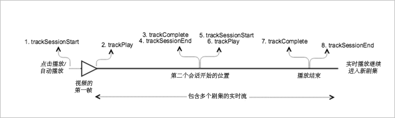

# 具有连续跟踪的实时主内容{#live-main-content-with-sequential-tracking}

## 情景 {#section_E4B558253AD84ED59256EDB60CED02AE}

在此方案中，有一个加入实时流之后 40 秒不播放广告的实时资产。

此方案与[不含广告的 VOD 播放](/help/sdk-implement/tracking-scenarios/vod-no-intrs-details.md)方案相同，只是移过了部分内容，并且完成了从主内容中的一个点到另一个点的搜寻。

| 触发器 | 心率方法 | 网络调用   | 注释   |
| --- | --- | --- | --- |
| 用户点击[!UICONTROL 播放] | `trackSessionStart` | Analytics 内容开始，心率内容开始 | 测量库不知道存在一个前置广告，因此这些网络调用与[不含广告的 VOD 播放](/help/sdk-implement/tracking-scenarios/vod-no-intrs-details.md)方案相同。 |
| 播放内容的第一帧。 | `trackPlay` | 心率内容播放 | 当章节内容在主内容之前播放时，章节开始时心率即会开始。 |
| 内容播放 |  | 内容心率 | 此网络调用与[不含广告的 VOD 播放](/help/sdk-implement/tracking-scenarios/vod-no-intrs-details.md)方案完全相同。 |
| 会话 1 结束（第 1 集结束） | `trackComplete` `trackSessionEnd` | 心率内容结束 | 结束是指第 1 集的会话 1 已到达结尾并观看完毕。在开始下一集的会话之前，必须先结束此会话。 |
| 第 2 集开始（会话 2 开始） | `trackSessionStart` | 分析内容开始心跳内容开始 | 这是因为用户观看了第 1 集并继续观看另一剧集 |
| 第一个媒体帧 | `trackPlay` | 心率内容播放 | 此方法会触发计时器，并且从此刻起，只要播放继续，每 10 秒就会发送一次心率。 |
| 内容播放 |  | 内容心率 |  |
| 会话结束（第 2 集结束） | `trackComplete` `trackSessionEnd` | 心率内容结束 | 结束是指第 2 集的会话 2 已到达结尾并观看完毕。在开始下一集的会话之前，必须先结束此会话。 |

## 参数 {#section_D52B325B99DA42108EF560873907E02C}

### 心率内容开始

| 参数 | 值 | 注释 |
|---|---|---|
| `s:sc:rsid` | &lt;您的 Adobe 报表包 ID&gt; |  |
| `s:sc:tracking_serve` | &lt;您的 Analytics 跟踪服务器 URL&gt; |  |
| `s:user:mid` | `s:user:mid` | 应当匹配 Adobe Analytics 内容开始调用中的中间值 |
| `s:event:type` | `"start"` |  |
| `s:asset:type` | `"main"` |  |
| `s:asset:media_id` | &lt;您的媒体名称&gt; |  |
| `s:stream:type` | `live` |  |
| `s:meta:*` | *可选* | 在媒体上设置自定义元数据 |

## 心率内容播放 {#section_B6AD9225747943F881DCA8E6A1D5710E}

这应当看起来与心率内容开始调用几乎完全相似，但关键的区别在于“s:event:type”参数。所有参数应当也位于此处。

| 参数 | 值 | 注释 |
|---|---|---|
| `s:event:type` | `"play"` |  |
| `s:asset:type` | `"main"` |  |

## 内容心率 {#section_7B387303851A43E5993F937AE2B146FE}

在媒体播放过程中，有一个定时器每10秒为主要内容发送一个或多个心跳，每秒为广告发送一次。这些心率将包含有关播放、广告、缓冲等的信息。本文档不包含各个心率的确切内容，但需要确认的一个关键点是，在继续播放时，将会持续触发心率。

在内容心率中，查找几个特定的参数：

| 参数 | 值 | 注释 |
|---|---|---|
| `s:event:type` | `"play"` |  |
| `l:event:playhead` | &lt;播放头位置&gt; 例如 50、60、70 | 这应该反映播放头的当前位置。 |

## 心率内容结束 {#section_2CA970213AF2457195901A93FC9D4D0D}

当任何给定剧集的播放已结束时（播放头越过剧集边界），将发送一个心率内容结束调用。此调用看起来类似于其他心率调用，但包含几个特定的参数：

| 参数 | 值 | 注释 |
|---|---|---|
| `s:event:type` | `"complete"` |  |
| `s:asset:type` | `"main"` |  |

## 示例代码 {#section_mpx_q2j_x2b}



### Android

以下是预期的 API 调用顺序：

```java
// Set up mediaObject 
MediaObject mediaInfo = MediaHeartbeat.createMediaObject( 
  Configuration.MEDIA_NAME,  
  Configuration.MEDIA_ID,  
  Configuration.MEDIA_LENGTH,  
  MediaHeartbeat.StreamType.LIVE 
); 

HashMap<String, String> mediaMetadata = new HashMap<String, String>(); 
mediaMetadata.put(CUSTOM_VAL_1, CUSTOM_KEY_1); 
mediaMetadata.put(CUSTOM_VAL_2, CUSTOM_KEY_2); 

// 1. Call trackSessionStart() when the user clicks Play or if autoplay is used,  
//    i.e., when there is an intent to start playback.  
_mediaHeartbeat.trackSessionStart(mediaInfo, mediaMetadata); 

...... 
...... 

// 2. Call trackPlay() when the playback actually starts, i.e., when the first  
//    frame of main content is rendered on the screen.  
_mediaHeartbeat.trackPlay(); 

....... 
....... 

// 3. Call trackComplete() when the playback reaches the end of session,  
//    i.e., when the media completes and finishes playing 1st episode/session.  
_mediaHeartbeat.trackComplete(); 

........ 
........ 

// 4. Call trackSessionEnd() to end session 1 
_mediaHeartbeat.trackSessionEnd(); 

........ 
........ 

// Start tracking session 2 /episode 2 of the same live stream.  
// There is no need to reinstantiate a mediaHeartbeat instance for tracking sesison 2. 
// Set up mediaObject 
MediaObject mediaInfo = MediaHeartbeat.createMediaObject( 
  Configuration.MEDIA_NAME,  
  Configuration.MEDIA_ID,  
  Configuration.MEDIA_LENGTH,  
  MediaHeartbeat.StreamType.LIVE 
); 

HashMap<String, String> mediaMetadata = new HashMap<String, String>(); 
mediaMetadata.put(CUSTOM_VAL_1, CUSTOM_KEY_1); 
mediaMetadata.put(CUSTOM_VAL_2, CUSTOM_KEY_2); 

// 5. Call trackSessionStart() when the playhead reaches a point that denotes the 
//    start of session 2 
_mediaHeartbeat.trackSessionStart(mediaInfo, mediaMetadata); 

...... 
...... 

// 6. Call trackPlay() to start tracking session 2 playback  
_mediaHeartbeat.trackPlay(); 

....... 
....... 

// 7. Call trackComplete() when the playback reaches the end of session 2,  
//    i.e., the media completes and finishes playing.  
_mediaHeartbeat.trackComplete(); 

........ 
........ 

// 8. Call trackSessionEnd() to end session 2 
_mediaHeartbeat.trackSessionEnd(); 

........ 
........ 

// Continue similarly tracking further sessions in the live stream if required 
```

### iOS

以下是预期的 API 调用顺序：

```
// Set up mediaObject 
ADBMediaObject *mediaObject =  
[ADBMediaHeartbeat createMediaObjectWithName:MEDIA_NAME  
                   length:MEDIA_LENGTH  
                   streamType:ADBMediaHeartbeatStreamTypeLIVE]; 
  
NSMutableDictionary *mediaContextData = [[NSMutableDictionary alloc] init]; 
[mediaContextData setObject:CUSTOM_VAL_1 forKey:CUSTOM_KEY_1]; 
[mediaContextData setObject:CUSTOM_VAL_2 forKey:CUSTOM_KEY_2]; 
  
// 1. Call trackSessionStart when the user clicks Play or if autoplay is used,  
//    i.e., there is an intent to start playback. 
[_mediaHeartbeat trackSessionStart:mediaObject data:mediaContextData]; 
...... 
...... 
  
// 2. Call trackPlay when the playback actually starts, i.e., when the first  
//    frame of main content is rendered on the screen. 
[_mediaHeartbeat trackPlay]; 
....... 
....... 

// 3. Call trackComplete when the playback reaches the end of session,  
//    i.e., when the media completes and finishes playing the first 
//    episode/session. 
[_mediaHeartbeat trackComplete]; 
....... 
....... 

// 4. Call trackSessionEnd to end session 1 
[_mediaHeartbeat trackSessionEnd]; 
........ 
........ 

// Start tracking session 2 / episode 2 of the same live stream, No need to  
// reinstantiate mediaHeartbeat instance for tracking sesison 2. 

// Set up mediaObject 
ADBMediaObject *mediaObject =  
[ADBMediaHeartbeat createMediaObjectWithName:MEDIA_NAME  
                   length:MEDIA_LENGTH  
                   streamType:ADBMediaHeartbeatStreamTypeLIVE]; 
 
NSMutableDictionary *mediaContextData = [[NSMutableDictionary alloc] init]; 
[mediaContextData setObject:CUSTOM_VAL_1 forKey:CUSTOM_KEY_1]; 
[mediaContextData setObject:CUSTOM_VAL_2 forKey:CUSTOM_KEY_2]; 
 
// 5. Call trackSessionStart when the playhead reaches a point that denotes  
//    start of session 2 
[_mediaHeartbeat trackSessionStart:mediaObject data:mediaContextData]; 
...... 
...... 
 
// 6. Call trackPlay to start tracking session 2 playback 
[_mediaHeartbeat trackPlay]; 
....... 
....... 
 
// 7. Call trackComplete when the playback reaches the end of session 2,  
//    i.e., when the media completes and finishes playing. 
[_mediaHeartbeat trackComplete]; 
........ 
........ 
 
// 8. Call trackSessionEnd to end the session 2 
[_mediaHeartbeat trackSessionEnd]; 
........ 
........ 

// Continue tracking further sessions in live stream similarly if required 
```

### JavaScript

以下是预期的 API 调用顺序：

```js
// Set up mediaObject 

var mediaInfo = MediaHeartbeat.createMediaObject( 
  Configuration.MEDIA_NAME,  
  Configuration.MEDIA_ID,  
  Configuration.MEDIA_LENGTH,  
  MediaHeartbeat.StreamType.VOD 
); 

var mediaMetadata = { 
  CUSTOM_KEY_1 : CUSTOM_VAL_1,  
  CUSTOM_KEY_2 : CUSTOM_VAL_2,  
  CUSTOM_KEY_3 : CUSTOM_VAL_3 
}; 

// 1. Call trackSessionStart() when Play is clicked or if autoplay is used,  
//    i.e., there's an intent to start playback. 
this._mediaHeartbeat.trackSessionStart(mediaInfo, mediaMetadata); 

...... 
...... 

// 2. Call trackPlay() when the playback actually starts, i.e., when the  
//    first frame of media is rendered on the screen. 
this._mediaHeartbeat.trackPlay(); 

....... 
....... 

// 3. Call trackComplete() when the playback reaches the end of a session,  
//    i.e., whn playback completes and finishes playing the 1st episode/session. 
this._mediaHeartbeat.trackComplete(); 

........ 
........ 

// 4. Call trackSessionEnd() to end session 1 
this._mediaHeartbeat.trackSessionEnd(); 

........ 
........ 

// Start tracking session 2/episode 2 of the same live stream. There is no need  
// to reinstantiate a mediaHeartbeat instance for tracking sesison 2. 

// Set up mediaObject 
var mediaInfo2 = MediaHeartbeat.createMediaObject( 
  Configuration.MEDIA_NAME,  
  Configuration.MEDIA_ID,  
  Configuration.MEDIA_LENGTH,  
  MediaHeartbeat.StreamType.LIVE 
); 

var mediaMetadata2 = { 
  CUSTOM_KEY_1 : CUSTOM_VAL_1,  
  CUSTOM_KEY_2 : CUSTOM_VAL_2,  
  CUSTOM_KEY_3 : CUSTOM_VAL_3 
}; 

// 5. Call trackSessionStart() when the playhead reaches a point that denotes  
//    the start of session 2 
this._mediaHeartbeat.trackSessionStart(mediaInfo2, mediaMetadata2); 

...... 
...... 

// 6. Call trackPlay() to start tracking session 2 playback 
this._mediaHeartbeat.trackPlay(); 

....... 
....... 

// 7. Call trackComplete() when the playback reaches the end of session 2,  
//    i.e., playback completes and finishes playing. 
this._mediaHeartbeat.trackComplete(); 

........ 
........ 

// 8. Call trackSessionEnd() to end session 2 
this._mediaHeartbeat.trackSessionEnd(); 

........ 
........ 

// Continue tracking further sessions in live stream similarly if required 
```

