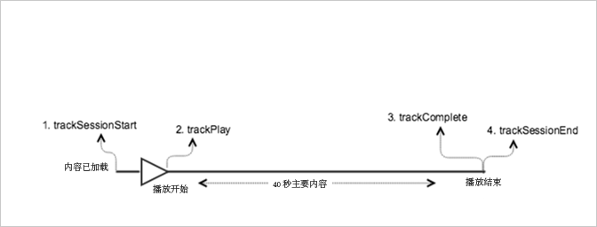

# 不含广告的 VOD 播放{#vod-playback-with-no-ads}

## 方案 {#scenario}

此方案有一个不含广告的 VOD 资产，该资产将从头到尾播放一次。

| 触发器 | 心率方法 | 网络调用 | 注释   |
|---|---|---|---|
| 用户点击&#x200B;**[!UICONTROL 播放]** | `trackSessionStart` | Analytics 内容开始，心率内容开始 | 这可以是用户点击“播放”或自动播放事件。 |
| 媒体的第一帧 | `trackPlay` | 心率内容播放 | 此方法会触发计时器，从此刻开始，在播放期间，每 10 秒将发送一次心率。 |
| 内容播放 |  | 内容心率 |  |
| 内容结束 | `trackComplete` | 心率内容结束 | *结束*&#x200B;表示到达播放头的结尾。 |

## 参数 {#parameters}

您在心率内容开始调用中看到的许多值也会在 Adobe Analytics `Content Start` 调用中看到。Adobe 使用许多参数填充各种媒体报表，但下表中仅列出了最重要的参数：

### 心率内容开始

| 参数 | 值 | 注释   |
|---|---|---|
| `s:sc:rsid` | &lt;您的 Adobe 报表包 ID> |  |
| `s:sc:tracking_server` | &lt;您的 Analytics 跟踪服务器 URL> |  |
| `s:user:mid` | 必须设置 | 应当匹配 `Adobe Analytics Content Start` 调用中的中间值。 |
| `s:event:type` | `"start"` |  |
| `s:asset:type` | `"main"` |  |
| `s:asset:media_id` | &lt;您的媒体名称> |  |
| `s:meta:*` | 可选 | 对媒体设置的自定义元数据。 |

## 心率内容播放 {#heartbeat-content-play}

这些参数应当看起来与 `Heartbeat Content Start` 调用几乎完全相同，但关键的区别在于 `s:event:type` 参数。所有其他参数仍应该存在。

| 参数 | 值 | 注释   |
|---|---|---|
| `s:event:type` | `"play"` |  |
| `s:asset:type` | `"main"` |  |

## 内容心率 {#content-heartbeats}

在媒体播放期间，计时器至少每 10 秒发送一次心率。这些心率包含有关播放、广告、缓冲等的信息。每个心率的确切内容超出了此文档的范围，但关键问题是在播放持续的同时始终触发心率。

在内容心率中，查找以下参数：

| 参数 | 值 | 注释   |
|---|---|---|
| `s:event:type` | `"play"` |  |
| `l:event:playhead` | &lt;播放头位置> 例如，50,60,70 | 此参数反映播放头的当前位置。 |

## 心率内容结束 {#heartbeat-content-complete}

当播放结束（即，到达播放头的结尾）时，将发送 `Heartbeat Content Complete` 调用。此调用与其他心率调用类似，但包含一些特定参数：

| 参数 | 值 | 注释   |
|---|---|---|
| `s:event:type` | `"complete"` |  |
| `s:asset:type` | `"main"` |  |

## 示例代码 {#sample-code}

在此方案中，内容的长度为 40 秒。在结束之前，它将一至播放，不会受到任何干扰。



### Android

```java
// Set up  mediaObject 
MediaObject mediaInfo = MediaHeartbeat.createMediaObject( 
  Configuration.MEDIA_NAME,  
  Configuration.MEDIA_ID,  
  Configuration.MEDIA_LENGTH,  
  MediaHeartbeat.StreamType.VOD 
); 

HashMap<String, String> mediaMetadata = new HashMap<String, String>(); 
mediaMetadata.put(CUSTOM_VAL_1, CUSTOM_KEY_1); 
mediaMetadata.put(CUSTOM_VAL_2, CUSTOM_KEY_2); 

// 1. Call trackSessionStart() when the user clicks Play or if autoplay  
//    is used, i.e., there's an intent to start playback.  
_mediaHeartbeat.trackSessionStart(mediaInfo, mediaMetadata); 

...... 
...... 

// 2. Call trackPlay() when the playback actually starts,  
//    i.e., the first frame of media is rendered on the screen.  
_mediaHeartbeat.trackPlay(); 

....... 
....... 

// 3. Call trackComplete() when the playback reaches the end,  
//    i.e., when the media completes and finishes playing.  
_mediaHeartbeat.trackComplete(); 

........ 
........ 

// 4. Call trackSessionEnd() when the playback session is over.  
//    This method must be called even if the user does not watch  
//    the media to completion.  
_mediaHeartbeat.trackSessionEnd(); 

........ 
........ 
```

### iOS

```
when the user clicks Play 
ADBMediaObject *mediaObject =  
[ADBMediaHeartbeat createMediaObjectWithName:MEDIA_NAME  
                   length:MEDIA_LENGTH  
                   streamType:ADBMediaHeartbeatStreamTypeVOD]; 

NSMutableDictionary *mediaContextData = [[NSMutableDictionary alloc] init]; 
[mediaContextData setObject:CUSTOM_VAL_1 forKey:CUSTOM_KEY_1]; 
[mediaContextData setObject:CUSTOM_VAL_2 forKey:CUSTOM_KEY_2]; 

// 1. Call trackSessionStart when the user clicks Play or if autoplay is used,  
//    i.e., there's an intent to start playback. 
[_mediaHeartbeat trackSessionStart:mediaObject data:mediaContextData]; 
...... 
...... 

// 2. Call trackPlay when the playback actually starts, i.e., when the  
//    first frame of main content is rendered on the screen. 
[_mediaHeartbeat trackPlay]; 
....... 
....... 

// 3. Call trackComplete when the playback reaches the end, i.e.,  
//    when the media completes and finishes playing. 
[_mediaHeartbeat trackComplete]; 
........ 
........ 

// 4. Call trackSessionEnd when the playback session is over. This method  
//    must be called even if the user does not watch the media to completion. 
[_mediaHeartbeat trackSessionEnd]; 
........ 
........ 
```

### JavaScript

```js
// Set up mediaObject 

var mediaInfo = MediaHeartbeat.createMediaObject(Configuration.MEDIA_NAME, Configuration.MEDIA_ID,  
Configuration.MEDIA_LENGTH,MediaHeartbeat.StreamType.VOD); 
var mediaMetadata = { 
  CUSTOM_KEY_1 : CUSTOM_VAL_1,  
  CUSTOM_KEY_2 : CUSTOM_VAL_2,  
  CUSTOM_KEY_3 : CUSTOM_VAL_3 

}; 

// 1. Call trackSessionStart() when the user clicks play, or when autoplay is used,  
//    i.e., there's an intent to start playback. 
this._mediaHeartbeat.trackSessionStart(mediaInfo, mediaMetadata); 

...... 
...... 

// 2. Call trackPlay() when the main content starts, i.e.,  
//    the first frame of the media content is rendered on the screen. 
this._mediaHeartbeat.trackPlay(); 

....... 
....... 

// 3. Call trackComplete() when the playback reaches the end,  
    i.e., the media completes and finishes playing. 
this._mediaHeartbeat.trackComplete(); 

........ 
........ 

// 4. Call trackSessionEnd() when the playback session is over.  
//    This method must be called even if the user does not  
//    watch the media to completion. 
this._mediaHeartbeat.trackSessionEnd(); 

........ 
........
```

