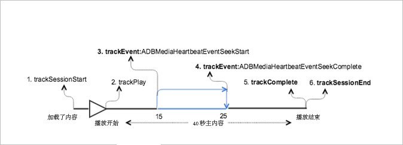

# 在主内容中进行搜寻的 VOD 播放{#vod-playback-with-seeking-in-the-main-content}

## 情景 {#scenario}

在此方案中，播放期间在主内容中进行搜寻。

此方案与[不含广告的 VOD 播放](/help/sdk-implement/tracking-scenarios/vod-no-intrs-details.md)方案相同，只是移过了部分内容，并且完成了从主内容中的一个点到另一个点的搜寻。

| 触发器   | 心率方法   | 网络调用   | 注释   |
| --- | --- | --- | --- |
| 用户点击[!UICONTROL 播放] | `trackSessionStart` | Analytics 内容开始，心率内容开始 | 测量库不知道存在一个前置广告，因此这些网络调用与[不含广告的 VOD 播放](/help/sdk-implement/tracking-scenarios/vod-no-intrs-details.md)方案相同。 |
| 播放内容的第一帧。 | `trackPlay` | 心率内容播放 | 当章节内容在主内容之前播放时，章节开始时心率即会开始。 |
| 内容播放 |  | 内容心率 | 此网络调用与[不含广告的 VOD 播放](/help/sdk-implement/tracking-scenarios/vod-no-intrs-details.md)方案完全相同。 |
| 用户开始在内容中执行搜寻操作 | `trackSeekStart` |  | No heartbeats go out till seek is complete, for example, `trackSeekComplete` |
| 搜寻操作结束 | `trackSeekComplete` |  | 搜寻完成后心率即开始发出。提示：播放头值应该表示搜寻后正确的新播放头。 |
| 内容结束 | `trackComplete` | 心率内容结束 | 此网络调用与[不含广告的 VOD 播放](/help/sdk-implement/tracking-scenarios/vod-no-intrs-details.md)方案完全相同。 |
| 会话结束 | `trackSessionEnd` |  | `SessionEnd` |

## 示例代码 {#sample-code}

在此方案中，用户将在主内容播放时进行搜寻。



### Android

要在 Android 中查看此方案，请设置以下代码：

```java
// Set up mediaObject 
MediaObject mediaInfo = MediaHeartbeat.createMediaObject( 
  Configuration.MEDIA_NAME,  
  Configuration.MEDIA_ID,  
  Configuration.MEDIA_LENGTH,  
  MediaHeartbeat.StreamType.VOD 
); 

HashMap<String, String> mediaMetadata = new HashMap<String, String>(); 
mediaMetadata.put(CUSTOM_KEY_1, CUSTOM_VAL_1); 
mediaMetadata.put(CUSTOM_KEY_2, CUSTOM_VAL_2); 

// 1. Call trackSessionStart() when the user clicks Play or if autoplay is used,  
//    i.e., there is an intent to start playback.  
_mediaHeartbeat.trackSessionStart(mediaInfo, mediaMetadata); 

...... 
...... 

// 2. Call trackPlay() when the playback actually starts, i.e., whn the first frame  
//    of the main content is rendered on the screen.  
_mediaHeartbeat.trackPlay(); 

....... 
....... 

// 3. Track the MediaHeartbeat.Event.SeekStart event when the user begins to seek.  
_mediaHeartbeat.trackEvent(MediaHeartbeat.Event.SeekStart, null, null); 

....... 
....... 

// 4. Track the MediaHeartbeat.Event.SeekComplete event when the user completes seeking 
_mediaHeartbeat.trackEvent(MediaHeartbeat.Event.SeekComplete, null, null); 

....... 
....... 

// 5. Call trackComplete() when the playback reaches the end, i.e., when the media 
//    completes and finishes playing. 
_mediaHeartbeat.trackComplete(); 

........ 
........ 

// 6. Call trackSessionEnd() when the playback session is over. This method must be  
//    called even if the user does not watch the media to completion.  
_mediaHeartbeat.trackSessionEnd(); 

........ 
........ 
```

### iOS

要在 iOS 中查看此方案，请设置以下代码：

```
// Set up mediaObject 
ADBMediaObject *mediaObject =  
[ADBMediaHeartbeat createMediaObjectWithName:MEDIA_NAME o 
                   length:MEDIA_LENGTH  
                   streamType:ADBMediaHeartbeatStreamTypeVOD]; 
 
NSMutableDictionary *mediaContextData = [[NSMutableDictionary alloc] init]; 
[mediaContextData setObject:CUSTOM_VAL_1 forKey:CUSTOM_KEY_1]; 
[mediaContextData setObject:CUSTOM_VAL_2 forKey:CUSTOM_KEY_2]; 

// 1. Call trackSessionStart when the user clicks Play or if autoplay is used,  
//    i.e., there is an intent to start playback. 
[_mediaHeartbeat trackSessionStart:mediaObject data:mediaContextData]; 
....... 
....... 

// 2. Call trackPlay when the playback actually starts, i.e., when the 
//    first frame of the main content is rendered on the screen. 
[_mediaHeartbeat trackPlay];  
....... 
....... 

// 3. Track the trackEvent:ADBMediaHeartbeatEventSeekStart event when the user  
//    begins to seek out of the chapter with the intent to skip it. 
[_mediaHeartbeat trackEvent:ADBMediaHeartbeatEventSeekStart  
               mediaObject:nil  
               data:nil]; 
....... 
....... 

// 4. Track the trackEvent:ADBMediaHeartbeatEventSeekComplete event when the  
//    user seeks out of the chapter with the intent to skip it. 
[_mediaHeartbeat trackEvent:ADBMediaHeartbeatEventSeekComplete  
               mediaObject:nil  
               data:nil]; 
....... 
....... 

// 5. Call trackComplete when the playback reaches the end, i.e., completes  
//    and finishes playing. 
[_mediaHeartbeat trackComplete]; 
....... 
....... 

// 6. Call trackSessionEnd when the playback session is over. This method must  
//    be called even if the user does not watch the media to completion. 
[_mediaHeartbeat trackSessionEnd]; 
....... 
....... 
```

### JavaScript

要查看此方案，请输入以下文本：

```js
// Set up mediaObject 
var mediaInfo = MediaHeartbeat.createMediaObject( 
  Configuration.MEDIA_NAME,  
  Configuration.MEDIA_ID,  
  Configuration.MEDIA_LENGTH,  
  MediaHeartbeat.StreamType.VOD 

); 

var mediaMetadata = { 
  CUSTOM_KEY_1 : CUSTOM_VAL_1,  
  CUSTOM_KEY_2 : CUSTOM_VAL_2,  
  CUSTOM_KEY_3 : CUSTOM_VAL_3 

}; 

// 1. Call trackSessionStart() when Play is clicked or if autoplay is used,  
//    i.e., there's an intent to start playback. 
this._mediaHeartbeat.trackSessionStart(mediaInfo, mediaMetadata); 

...... 
...... 

// 2. Call trackPlay() when the playback actually starts, i.e., when the  
//    first frame of the ad media is rendered on the screen. 
this._mediaHeartbeat.trackPlay(); 

....... 
....... 

// 3. Track the MediaHeartbeat.Event.SeekStart event when the user  
//    begins to seek. 
this._mediaHeartbeat.trackEvent(MediaHeartbeat.Event.SeekStart); 

....... 
....... 

// 4. Track the MediaHeartbeat.Event.SeekComplete event when the user  
//    completes seeking. 
this._mediaHeartbeat.trackEvent(MediaHeartbeat.Event.SeekComplete); 

....... 
....... 

// 5. Call trackComplete() when the playback reaches the end, i.e., when 
//    playback completes and finishes playing. 
this._mediaHeartbeat.trackComplete(); 

........ 
........ 

// 6. Call trackSessionEnd() when the playback session is over. This method must be called  
//    even if the user does not watch the media to completion. 
this._mediaHeartbeat.trackSessionEnd(); 

........ 
........ 
```

