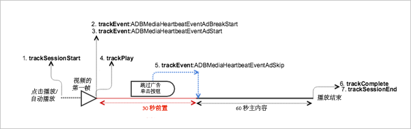

# 跳过广告的 VOD 播放{#vod-playback-with-skipped-ads}

## 情景 {#section_DAC4BCE25F4A4C4991AD0AE495D15B00}

此方案包含跳过广告的 VOD 内容播放。

### 一个已跳过的预先滚动广告的VOD

This is the same scenario as [VOD playback with pre-roll ads](/help/sdk-implement/tracking-scenarios/vod-preroll-ads.md), except the application has a provision to let the user skip the ad, on the click of a skip button perhaps.

| 触发器   | 心率方法  | 网络调用   | 注释   |
| --- | --- | --- | --- |
| 用户点击[!UICONTROL 播放] | `trackSessionStart()` | Analytics 内容开始，心率内容开始 | 测量库不知道存在一个前置广告。这些网络调用仍然与[不含广告的 VOD 播放](/help/sdk-implement/tracking-scenarios/vod-no-intrs-details.md)方案相同。 |
| 广告开始。 | <ul> <li> `trackEvent:AdBreakStart` </li> <li> `trackEvent:AdStart` </li> </ul> | Analytics 广告开始，心率广告开始 |  |
| 播放广告的第一帧。 | `trackPlay()` | 心率广告播放 | 当广告内容在主内容之前播放时，将在广告开始播放时开始心率。 |
| 播放广告。 |  | 广告心率 |  |
| 跳过广告。 | `trackEvent:trackAdSkip` |  | 没有广告结束网络调用。 |
| 播放内容。 |  | 内容心率 | These network calls are exactly the same as the [VOD playback with no ads](/help/sdk-implement/tracking-scenarios/vod-no-intrs-details.md) scenario. |
| 内容结束播放。 | `trackComplete()` | 心率内容结束 | 此网络调用与[不含广告的 VOD 播放](/help/sdk-implement/tracking-scenarios/vod-no-intrs-details.md)方案完全相同。 |
| 会话结束。 | `trackSessionEnd()` |  | `SessionEnd` |

## 参数 {#section_4A0F92BF3DDD4623A1EE61C76582A4A6}

这些参数与[包含前置广告的 VOD 播放](/help/sdk-implement/tracking-scenarios/vod-preroll-ads.md)方案中的参数相同，不同之处在于此方案没有广告结束和广告时间结束调用。

## 示例代码 {#section_lxt_qz3_x2b}



### Android

要在 Android 中查看此方案，请设置以下代码：

```java
// Set up mediaObject 
MediaObject mediaInfo = MediaHeartbeat.createMediaObject( 
  Configuration.MEDIA_NAME,  
  Configuration.MEDIA_ID,  
  Configuration.MEDIA_LENGTH,  
  MediaHeartbeat.StreamType.VOD 
); 

HashMap<String, String> mediaMetadata = new HashMap<String, String>(); 
mediaMetadata.put(CUSTOM_KEY_1, CUSTOM_VAL_1); 
mediaMetadata.put(CUSTOM_KEY_2, CUSTOM_VAL_2); 

// 1. Call trackSessionStart() when the user clicks Play or if autoplay is used,  
//    i.e., there is an intent to start playback.  
_mediaHeartbeat.trackSessionStart(mediaInfo, mediaMetadata); 

...... 
...... 

// Pre-roll 
MediaObject adBreakInfo =  
MediaHeartbeat.createAdBreakObject(ADBREAK_NAME,  
                                   ADBREAK_POSITION,  
                                   ADBREAK_START_TIME); 
MediaObject adInfo =  
MediaHeartbeat.createAdObject(AD_NAME,  
                              AD_ID,  
                              AD_POSITION,  
                              AD_LENGTH); 

// Context ad data 
HashMap<String, String> adMetadata = new HashMap<String, String>(); 
adMetadata.put(CUSTOM_KEY_1, CUSTOM_VAL_1); 
adMetadata.put(CUSTOM_KEY_2, CUSTOM_VAL_2); 

// 2. Track the MediaHeartbeat.Event.AdBreakStart event when the pre-roll pod starts to play.  
//    Note that since this is a pre-roll, track the "MediaHeartbeat.Event.AdBreakStart"  
//    event before you call trackPlay().  
_mediaHeartbeat.trackEvent(MediaHeartbeat.Event.AdBreakStart, adBreakInfo, null); 

....... 
....... 

// 3. Track the MediaHeartbeat.Event.AdStart event when the pre-roll pod's ad starts to play.  
//    Note that since this is a pre-roll, track the "MediaHeartbeat.Event.AdStart" event  
//    before you call trackPlay().  
_mediaHeartbeat.trackEvent(MediaHeartbeat.Event.AdStart, adInfo, adMetadata); 

....... 
....... 

// 4. Call trackPlay() when the playback actually starts, i.e. when the first frame of the  
//    main content is rendered on the screen.  
_mediaHeartbeat.trackPlay(); 

....... 
....... 

// 5. Track the MediaHeartbeat.Event.AdSkip event when the user intends to and is able to 
//    skip an ad.  For example, this could be tied to a "Skip Ad" button onClick handler.  
//    The application could have the viewer land in main content post ad.  
_mediaHeartbeat.trackEvent(MediaHeartbeat.Event.AdSkip, null, null); 

....... 
....... 

// 6. Call trackComplete() when the playback reaches the end, i.e., when the media  
//    completes and finishes playing.  
_mediaHeartbeat.trackComplete(); 

........ 
........ 

// 7. Call trackSessionEnd() when the playback session is over. This method must be called  
//    even if the user does not watch the media to completion.  
_mediaHeartbeat.trackSessionEnd(); 

........ 
........ 
```

### iOS

要查看此方案，请输入以下文本：

```
when the user clicks Play 
ADBMediaObject *mediaObject =  
[ADBMediaHeartbeat createMediaObjectWithName:MEDIA_NAME  
                   length:MEDIA_LENGTH  
                   streamType:ADBMediaHeartbeatStreamTypeVOD]; 
  
NSMutableDictionary *mediaContextData = [[NSMutableDictionary alloc] init]; 
[mediaContextData setObject:CUSTOM_VAL_1 forKey:CUSTOM_KEY_1]; 
[mediaContextData setObject:CUSTOM_VAL_2 forKey:CUSTOM_KEY_2]; 
 
// 1. Call trackSessionStart when the user clicks Play or if autoplay is used,  
//    i.e., there is an intent to start playback. 
[_mediaHeartbeat trackSessionStart:mediaObject data:mediaContextData]; 
....... 
....... 

// Pre-roll 
ADBMediaObject *adBreakInfo =  
[ADBMediaHeartbeat createAdBreakObjectWithName:AD_BREAK_NAME  
                   position:AD_BREAK_POSITION  
                   startTime:AD_BREAK_START_TIME]; 
ADBMediaObject *adInfo =  
[ADBMediaHeartbeat createAdObjectWithName:AD_NAME  
                   adId:AD_ID  
                   position:AD_POSITION  
                   length:AD_LENGTH]; 

// Context ad data 
NSMutableDictionary *adDictionary = [[NSMutableDictionary alloc] init]; 
[adDictionary setObject:@"custom-val1" forKey:@"custom-key1"]; 
[adDictionary setObject:@"custom-val2" forKey:@"custom-key2"]; 

// 2. Track the ADBMediaHeartbeatEventAdBreakStart event when the pre-roll pod  
//    starts to play. Note that since this is a pre-roll, you must track the  
//    ADBMediaHeartbeatEventAdBreakStart event before you call trackPlay. 
[_mediaHeartbeat trackEvent:ADBMediaHeartbeatEventAdBreakStart  
               mediaObject:adBreakObject  
               data:nil]; 
....... 
....... 

// 3. Track the ADBMediaHeartbeatEventAdStart event when the pre-roll pod's ad  
//    starts to play. Note that since this is a pre-roll, track the  
//    ADBMediaHeartbeatEventAdStart event before you call trackPlay. 
[_mediaHeartbeat trackEvent:ADBMediaHeartbeatEventAdStart  
               mediaObject:adObject  
               data:adDictionary]; 
....... 
....... 

// 4. Call trackPlay when the playback actually starts, i.e., when the first  
//    frame of the main content is rendered on the screen. 
[_mediaHeartbeat trackPlay]; 
....... 
....... 

// 5. Track the ADBMediaHeartbeatEventAdSkip event when the user intends to  
//    and is able to skip an ad. For example, this could be tied to a  
//    "skip ad" button onClick handler. The application could have the viewer  
//    land in main content post ad. 
[_mediaHeartbeat trackEvent:ADBMediaHeartbeatEventAdSkip mediaObject:nil data:nil]; 
....... 
....... 

// 6. Call trackComplete when the playback reaches the end, i.e., when the media 
//    completes and finishes playing. 
[_mediaHeartbeat trackComplete]; 
....... 
....... 

// 7. Call trackSessionEnd when the playback session is over. This method must  
//    be called even if the user does not watch the media to completion. 
[_mediaHeartbeat trackSessionEnd]; 
....... 
....... 
```

### JavaScript

要在 JavaScript 中查看此方案，请输入以下文本：

```js
// Set up mediaObject 
var mediaInfo =  
MediaHeartbeat.createMediaObject(Configuration.MEDIA_NAME,  
                                 Configuration.MEDIA_ID,  
                                 Configuration.MEDIA_LENGTH,  
                                 MediaHeartbeat.StreamType.VOD); 

var mediaMetadata = { 
  CUSTOM_KEY_1 : CUSTOM_VAL_1,  
  CUSTOM_KEY_2 : CUSTOM_VAL_2,  
  CUSTOM_KEY_3 : CUSTOM_VAL_3 
}; 

// 1. Call trackSessionStart() when Play is clicked or if autoplay is used,  
//    i.e., there's an intent to start playback. 
this._mediaHeartbeat.trackSessionStart(mediaInfo, mediaMetadata); 

...... 
...... 

// Preroll 
var adBreakInfo =  
MediaHeartbeat.createAdBreakObject(ADBREAK_NAME,  
                                   ADBREAK_POSITION,  
                                   ADBREAK_START_TIME); 
MediaObject adInfo =  
MediaHeartbeat.createAdObject(AD_NAME,  
                              AD_ID,  
                              AD_POSITION,  
                              AD_LENGTH); 

//context ad data 
var adMetadata = { 
  CUSTOM_KEY_1 : CUSTOM_VAL_1,  
  CUSTOM_KEY_2 : CUSTOM_VAL_2 
}; 

// 2. Track the MediaHeartbeat.Event.AdBreakStart event when the preroll pod starts to play.  
//    Since this is a preroll, you must track the MediaHeartbeat.Event.AdBreakStart event  
//    before calling trackPlay(). 
this._mediaHeartbeat.trackEvent(MediaHeartbeat.Event.AdBreakStart, adBreakInfo); 

....... 
....... 

// 3. Track the MediaHeartbeat.Event.AdStart event when the preroll pod's ad starts to play.  
//    Since this is a preroll, you must track the MediaHeartbeat.Event.AdStart event before  
//    calling trackPlay(). 
this._mediaHeartbeat.trackEvent(MediaHeartbeat.Event.AdStart, adInfo, adMetadata); 

....... 
....... 

// 4. Call trackPlay() when the playback actually starts, i.e., when the first frame of  
//    the main content is rendered on the screen. 
this._mediaHeartbeat.trackPlay(); 

....... 
....... 

// 5. Track the MediaHeartbeat.Event.AdSkip event when the user intends to (and can)   
//    skip the ad. For example, this could be tied to a "skip ad" button onClick handler.  
//    The application could have the viewer land in the main content post ad. 
this._mediaHeartbeat.trackEvent(MediaHeartbeat.Event.AdSkip); 

....... 
....... 

// 6. Call trackComplete() when the playback reaches the end, i.e., playback completes  
//    and finishes playing. 
this._mediaHeartbeat.trackComplete(); 

........ 
........ 

// 7. Call trackSessionEnd() when the playback session is over. This method must be called even  
//    if the user does not watch the media to completion. 
this._mediaHeartbeat.trackSessionEnd(); 

........ 
........ 
```

