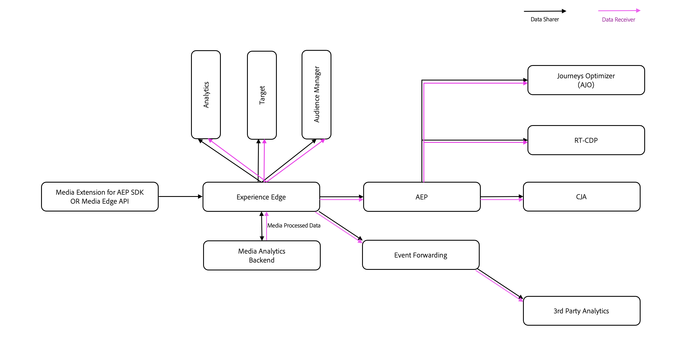

# 联合媒体{#federated-media}

>[!AVAILABILITY]
>
>Federated Analytics服务仅在通过Adobe Analytics使用流媒体功能时可用。 Federated Analytics在Customer Journey Analytics中不可用。

Federated Analytics服务提供一个用于在两个合作伙伴之间共享流媒体数据（音频和视频）的系统。

流媒体服务创建的标准化测量数据是联合媒体的标志，这使得来自多个源的相同数据可以进入单个报表。

通过管理联合媒体的规则和逻辑，可以轻松地控制和个性化数据，以满足每个合作伙伴的需要。

联合媒体使音频和视频测量更高效、更简单和更可操作。

## 优点 {#benefits}

* **透明：**&#x200B;通过跨公司使用相同的逻辑，消除数据创建的黑匣子
* **广泛：**&#x200B;了解跨合作伙伴关系、平台和设备的音频和视频使用情况的触及范围和影响
* **安全：**&#x200B;通过规则和逻辑控制服务器端数据共享
* **标准化：**&#x200B;使用与合作伙伴相同的数据语言
* **可操作：**&#x200B;通过 Adobe Analytics 将音频和视频数据量化为播放器基准、监控趋势并检测异常
* **集中化：**&#x200B;在一个 Adobe 位置收集音频和视频测量数据
* **合同：**&#x200B;轻松满足法律数据共享要求
* **及时：**&#x200B;近乎实时地发送和接收数据
* **简单：**&#x200B;使用 Adobe SDK 标记播放器一次，即可与许多合作伙伴共享数据

## 定义 {#definitions}

* **发件人：**&#x200B;为自有播放器生成音频和视频分析数据的客户
* **接收者：**&#x200B;从发件人接收音频和视频分析数据的客户

## 要求 {#requirements}

* **媒体流合同：**&#x200B;接收者和发件人必须已签订适用于媒体流的 Adobe Analytics 合同，然后才能在 Adobe Analytics 中访问音频和视频数据。有关更多详细信息，请与您的帐户团队联系。
* **联合附录：**&#x200B;在发送或接收数据之前，每个发件人和接收者都必须拥有 Adobe 的已签名附录。要求每个客户一个附录，而不是每个合作伙伴一个附录。有关更多详细信息，请与您的帐户团队联系。

* **流媒体收集实施：**&#x200B;发件人必须在将成为联合数据集一部分的所有播放器上实施流媒体服务。 只有流媒体数据可用于联合。 有关详细信息，请参阅[Adobe流媒体服务概述](/help/media-overview.md)。

* **Adobe 咨询合同：**&#x200B;在初始设置发送者与接收者之间的联合规则时，该合同对于与咨询服务部合作来审查数据和创建数据共享协议，非常有价值。

## 下载联合媒体表单

要参与联合媒体，请下载并完成[联合规则协议](assets/federated_analytics_form.pdf)表单。

## 过程 {#process}

1. 发送者与接收者共同填写联合规则协议表单。联合规则协议表单中包含适用于工程团队的特殊字段，并且只应使用 Adobe Acrobat 进行编辑。[免费下载 Acrobat。](https://get.adobe.com/cn/reader/)
1. 咨询服务会向接收者提供包含发件人播放器实际数据的示例数据文件，以进一步确认定义了正确的数据共享规则，前提是数据文件可用。
1. 发件人和接收者确保数据共享协议将满足双方之间的所有合同要求。
1. 咨询服务会将填写好的表单发送到 Adobe 工程部门以设置数据共享规则。
1. 数据共享到开发Adobe Analytics报表包或Adobe Experience Platform数据流，接收者将在其中查看和验证数据。
1. 接收者确认数据正确后，Adobe工程部门会更新规则以指向生产Analytics报表包或Adobe Experience Platform数据流。
1. 接收者将查看和验证Analytics生产报表包或Adobe Experience Platform数据流中的数据。
1. 如果数据集将发生更改，发件人或接收者可以提交客户关怀票证以寻求支持。
