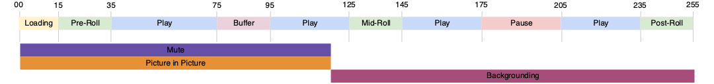

# 多个播放器状态跟踪

有时两个播放器状态同时开始和结束，或者一个状态的结束也是另一个状态的开始，如下图所示：



当前实施允许这两种场景：
- `stateStart(pictureInPicture)` - t0
- `stateStart(mute)` - t0
- `stateEnd(mute)` - t1
- `stateEnd(pictureInPicture)` - t1
- `stateStart(fullScreen)` - t1
- `stateEnd(fullScreen)` - t2

但是，这需要您发出多个 `stateStart` 和 `stateEnd` 事件来表示多个同步状态更改。为了优化此常见行为，已实施一个新的 `statesUpdate` 事件类型，该类型以一组状态结束，并以一组新状态开始。

利用新的 `statesUpdate` 事件，上面的一组事件将变为：
- `statesUpdate(statesEnd=[], statesStart=[pictureInPicture, mute])` - t0
- `statesUpdate(statesEnd=[mute, pictureInPicture], statesStart=[fullScreen])` - t1
- `statesUpdate(statesEnd=[fullScreen], statesStart=[])` - t2

对于同一行为，状态更新调用的次数已从六次减至三次。最后一个事件也可能是一个简单的 `stateEnd(fullScreen)`。

## 媒体收集 API 实施 {#mpst-api}

您可以使用媒体收集 API 实施多个播放器状态跟踪。

### 示例

下面显示了用于多个播放器状态跟踪的媒体收集 API 实施示例。

```
// statesUpdate (ex: mute and pictureInPicture are switched on)
http(s)://<Analytics_Visitor_Namespace>.hb-api.omtrdc.net/api/v1/sessions/<SID>/events
{
  "eventType": "statesUpdate",
  "params": {
    "statesStart": [
      {
        "media.state.name": "mute"
      },
      {
        "media.state.name": "pictureInPicture"
      }
    ]
  },
  "playerTime": {
    "playhead": 0,
    "ts": 1569999130627
  }
}
```

```
// statesUpdate (ex: mute and pictureInPicture are switched off, fullScreen is switched on)
http(s)://<Analytics_Visitor_Namespace>.hb-api.omtrdc.net/api/v1/sessions/<SID>/events
{
  "eventType": "statesUpdate",
  "params": {
    "statesEnd": [
      {
        "media.state.name": "mute"
      },
      {
        "media.state.name": "pictureInPicture"
      }
    ],
    "statesStart": [
      {
        "media.state.name": "fullScreen"
      }
    ]
  },
  "playerTime": {
    "playhead": 0,
    "ts": 1569999130627
  }
}
```

```
// statesUpdate (ex: fullScreen is switched off)
http(s)://<Analytics_Visitor_Namespace>.hb-api.omtrdc.net/api/v1/sessions/<SID>/events
{
  "eventType": "statesUpdate",
  "params": {
    "statesEnd": [
      {
        "media.state.name": "fullScreen"
      }
    ]
  },
  "playerTime": {
    "playhead": 0,
    "ts": 1569999130627
  }
}
```

## Media SDK 实施

没有 Media SDK 实施。
