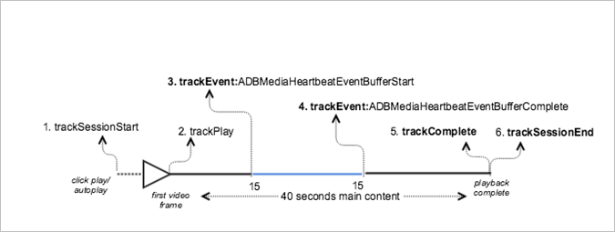

# 带有缓冲的 VOD 播放{#vod-playback-with-buffering}

## 场景 {#scenario}

在此方案中，播放 VOD 内容时会出现一些缓冲。

除非另外指定，否则此方案中的网络调用与[不含广告的 VOD 播放](/help/use-cases/tracking-scenarios/vod-no-intrs-details.md)方案中的调用相同。

| 触发器   | 心跳方法   | 网络调用   | 注释   |
|---|---|---|---|
| 用户点击&#x200B;**[!UICONTROL 播放]** | `trackSessionStart` | Analytics 内容开始，心跳内容开始 | 这可以是用户点击&#x200B;**[!UICONTROL 播放]**&#x200B;或自动播放事件。 |
| 播放视频的第一帧。 | `trackPlay` | 心跳内容播放 | 此方法将触发计时器。只要继续播放，就会每 10 秒发送一次心跳。 |
| 将播放内容。 |  | 内容心跳 |  |
| 缓冲开始。 | `trackEvent:BufferStart` | 心跳缓冲 |  |
| 内容已缓冲。 |  | 内容心跳 |  |
| 缓冲结束。 | `trackEvent:BufferComplete` | 心跳缓冲区，心跳播放 |  |
| 将播放内容。 |  | 内容心跳 |  |
| 内容结束播放。 | `trackComplete` | 心跳内容结束 | 播放头已到达末尾。 |
| 会话结束。 | `trackSessionEnd` |  | `SessionEnd` 是指观看会话结束。即使用户没有观看至视频结束，也必须调用此 API。 |

## 参数 {#parameters}

### 心跳缓冲

| 参数 | 值 | 注释 |
|---|---|---|
| `s:event:type` | `"buffer"` |  |

## 示例代码 {#sample-code}

在此方案中，播放 VOD 内容时出现缓冲。



### Android

要在 Android 中查看此方案，请设置以下代码：

```java
// Set up mediaObject 

MediaObject mediaInfo = MediaHeartbeat.createMediaObject( 
  Configuration.MEDIA_NAME,  
  Configuration.MEDIA_ID,  
  Configuration.MEDIA_LENGTH,  
  MediaHeartbeat.StreamType.VOD 

); 

HashMap<String, String> videoMetadata = new HashMap<String, String>(); 
videoMetadata.put(CUSTOM_KEY_1, CUSTOM_VAL_1); 
videoMetadata.put(CUSTOM_KEY_2, CUSTOM_VAL_2); 

// 1. Call trackSessionStart() when the user clicks Play or if autoplay is used,  
//    i.e., there is an intent to start playback. 
_mediaHeartbeat.trackSessionStart(mediaInfo, videoMetadata); 

...... 
...... 

// 2. Call trackPlay() when the playback actually starts, i.e., when the first  
//    frame of the main content is rendered on the screen. 
_mediaHeartbeat.trackPlay(); 

....... 
....... 

// 3. Track the MediaHeartbeat.Event.BufferStart event when the video player  
//    goes into the buffering state and begins to buffer content. 
_mediaHeartbeat.trackEvent(MediaHeartbeat.Event.BufferStart, null, null); 

....... 
....... 

// 4. Track the MediaHeartbeat.Event.BufferComplete event when the video player  
//    goes into the buffering state and begins to buffer content. 
_mediaHeartbeat.trackEvent(MediaHeartbeat.Event.BufferComplete, null, null); 

....... 
....... 

// 5. Call trackComplete() when the playback reaches the end, i.e., when the 
//    video completes and finishes playing. 
_mediaHeartbeat.trackComplete(); 

........ 
........ 

// 6. Call trackSessionEnd() when the playback session is over. This method must  
//    be called even if the user does not watch the video to completion. 
_mediaHeartbeat.trackSessionEnd(); 

........ 
```

### iOS

要在 iOS 中查看此方案，请设置以下代码：

```
// Set up mediaObject 
ADBMediaObject *mediaObject =  
[ADBMediaHeartbeat createMediaObjectWithName:MEDIA_NAME  
                   length:MEDIA_LENGTH  
                   streamType:ADBMediaHeartbeatStreamTypeVOD]; 
 
NSMutableDictionary *videoContextData = [[NSMutableDictionary alloc] init]; 
[videoContextData setObject:CUSTOM_VAL_1 forKey:CUSTOM_KEY_1]; 
[videoContextData setObject:CUSTOM_VAL_2 forKey:CUSTOM_KEY_2]; 

// 1. Call trackSessionStart when the user clicks Play or if autoplay is used,  
//    i.e., there is an intent to start playback. 
[_mediaHeartbeat trackSessionStart:mediaObject data:videoContextData]; 
....... 
....... 

// 2. Call trackPlay when the playback actually starts, i.e., when the first  
//    frame of the main content is rendered on the screen. 
[_mediaHeartbeat trackPlay];  
....... 
....... 

// 3. Track the trackEvent:ADBMediaHeartbeatEventBufferStart event when the  
//    video player goes in buffering state and begins to buffer content. 
[_mediaHeartbeat trackEvent:ADBMediaHeartbeatEventBufferStart  
               mediaObject:nil  
               data:nil]; 
....... 
....... 

// 4. Track the trackEvent:ADBMediaHeartbeatEventBufferComplete event when  
//    the video player goes in buffering state and begins to buffer content. 
[_mediaHeartbeat trackEvent:ADBMediaHeartbeatEventBufferComplete  
               mediaObject:nil  
               data:nil]; 
....... 
....... 

// 5. Call trackComplete when the playback reaches the end, i.e., when the 
//    video completes and finishes playing. 
[_mediaHeartbeat trackComplete]; 
....... 
....... 

// 6. Call trackSessionEnd when the playback session is over. This method must  
//    be called even if the user does not watch the video to completion. 
[_mediaHeartbeat trackSessionEnd]; 
....... 
....... 
```

### JavaScript

要查看此方案，请输入以下文本：

```js
// Set up mediaObject 

var mediaInfo = MediaHeartbeat.createMediaObject( 
  Configuration.MEDIA_NAME,  
  Configuration.MEDIA_ID,  
  Configuration.MEDIA_LENGTH,  
  MediaHeartbeat.StreamType.VOD 

); 

var videoMetadata = { 
  CUSTOM_KEY_1 : CUSTOM_VAL_1,  
  CUSTOM_KEY_2 : CUSTOM_VAL_2,  
  CUSTOM_KEY_3 : CUSTOM_VAL_3 
}; 

// 1. Call trackSessionStart() when Play is clicked or if autoplay is used,  
//    i.e., there's an intent to start playback. 
this._mediaHeartbeat.trackSessionStart(mediaInfo, videoMetadata); 

...... 
...... 

// 2. Call trackPlay() when the playback actually starts, i.e., when the  
//    first frame of the ad video is rendered on the screen. 
this._mediaHeartbeat.trackPlay(); 

....... 
....... 

// 3. Track event MediaHeartbeat.Event.BufferStart when the video player  
//    goes into the buffering state and begins to buffer content. 
this._mediaHeartbeat.trackEvent(MediaHeartbeat.Event.BufferStart); 

....... 
....... 

// 4. Track the MediaHeartbeat.Event.BufferComplete event when the  
//    video player goes into the buffering state and begins to buffer content. 
this._mediaHeartbeat.trackEvent(MediaHeartbeat.Event.BufferComplete); 

....... 
....... 

// 5. Call trackComplete() when the playback reaches the end, i.e.,  
//    when playback completes and finishes playing. 
this._mediaHeartbeat.trackComplete(); 

........ 
........ 

// 6. Call trackSessionEnd() when the playback session is over. This method must  
//    be called even if the user does not watch the video to completion. 
this._mediaHeartbeat.trackSessionEnd(); 

........ 
........ 
```
