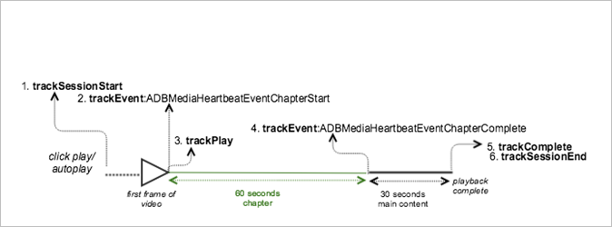

# 包含一个章节的 VOD 播放{#vod-playback-with-one-chapter}

## 场景 {#scenario}

在此方案中，部分 VOD 内容被标记为一个章节。

除非另外指定，否则此方案中的网络调用与[不含广告的 VOD 播放](/help/use-cases/tracking-scenarios/vod-no-intrs-details.md)方案中的调用相同。网络调用在同一时间发生，但负载却不同。

| 触发器   | 心跳方法   | 网络调用   | 注释   |
|---|---|---|---|
| 用户点击&#x200B;**[!UICONTROL 播放]** | `trackSessionStart` | Analytics 内容开始，心跳内容开始 | 我们尚未告知测量库存在前置广告，因此这些网络调用仍与单个 VoD 完全相同。 |
| 章节开始。 | `trackEvent:ChapterStart` | 心跳章节开始 |  |
| 播放章节的第一帧。 | `trackPlay` | 心跳内容播放 | 当章节内容在主内容之前播放时，心跳在章节开始时开始。 |
| 将播放章节。 |  | 章节心跳 |  |
| 章节结束。 | `trackEvent:trackChapterComplete` | 心跳章节结束 | 到达章节结尾时。 |
| 将播放内容。 |  | 内容心跳 | 此网络调用与[不含广告的 VOD 播放](/help/use-cases/tracking-scenarios/vod-no-intrs-details.md)方案完全相同。 |
| 内容结束。 | `trackComplete` | 心跳内容结束 | 此网络调用与[不含广告的 VOD 播放](/help/use-cases/tracking-scenarios/vod-no-intrs-details.md)方案完全相同。 |
| 会话结束。 | `trackSessionEnd` |  | `SessionEnd` 是指观看会话已结束。即使用户没有观看至媒体结束，也必须调用此 API。 |

## 参数 {#parameters}

当章节播放开始时，将发送 `Heartbeat Chapter Start` 调用。如果章节的开头与 10 秒计时器不一致，则 `Heartbeat Chapter Start` 调用将延迟几秒钟，并转到下一个 10 秒间隔。

发生此情况时，`Content Heartbeat` 调用将以相同的间隔发出。您可以通过检查事件类型和资源类型来区分这两种调用：

### 心跳章节开始

| 参数 | 值 | 注释 |
|---|---|---|
| `s:event:type` | `"chapter_start"` |  |
| `s:asset:type` | `"main"` |  |
| `s:stream:chapter_*` |  | 特定于章节数据的流信息。 |
| `s:meta:*` |  | 包含特定上下文数据的章节。 |

## 示例代码，中间的章节 {#sample-code-chapter-in-the-middle}

在此方案中，部分 VOD 内容是一个章节。


### Android

要在 Android 中查看此方案，请设置以下代码：

```java
// Set up mediaObject 
MediaObject mediaInfo = MediaHeartbeat.createMediaObject( 
  Configuration.MEDIA_NAME,  
  Configuration.MEDIA_ID,  
  Configuration.MEDIA_LENGTH,  
  MediaHeartbeat.StreamType.VOD 
); 

HashMap<String, String> mediaMetadata = new HashMap<String, String>(); 
mediaMetadata.put(CUSTOM_KEY_1, CUSTOM_VAL_1); 
mediaMetadata.put(CUSTOM_KEY_2, CUSTOM_VAL_2); 

// 1. Call trackSessionStart() when the user clicks Play or if autoplay is used,  
//    i.e., there is an intent to start playback.  
_mediaHeartbeat.trackSessionStart(mediaInfo, mediaMetadata); 

...... 
...... 

// 2. Call trackPlay() when the playback actually starts, i.e., first frame of the  
//    ad media is rendered on the screen. 
_mediaHeartbeat.trackPlay(); 

....... 
....... 

// Chapter 
HashMap<String, String> chapterMetadata = new HashMap<String, String>(); 
chapterMetadata.put(CUSTOM_KEY_1, CUSTOM_VAL_1); 
MediaObject chapterDataInfo =  
MediaHeartbeat.createChapterObject(CHAPTER_NAME,  
                                   CHAPTER_POSITION,  
                                   CHAPTER_LENGTH,  
                                   CHAPTER_START_TIME); 

// 3. Track the MediaHeartbeat.Event.ChapterStart event when the chapter starts to play.  
_mediaHeartbeat.trackEvent(MediaHeartbeat.Event.ChapterStart, chapterDataInfo, chapterMetadata); 

....... 
....... 

// 4. Track the MediaHeartbeat.Event.ChapterComplete event when the chapter finishes playing. 
_mediaHeartbeat.trackEvent(MediaHeartbeat.Event.ChapterComplete, null, null); 

....... 
....... 

// 5. Call trackComplete() when the playback reaches the end, i.e., completes and finishes playing. 
_mediaHeartbeat.trackComplete(); 

........ 
........ 

// 6. Call trackSessionEnd() when the playback session is over. This method must be called even  
//    if the user does not watch the media to completion.  
_mediaHeartbeat.trackSessionEnd(); 

........ 
........ 
```

### iOS

要在 iOS 中查看此方案，请设置以下代码：

```
when the user clicks Play 
ADBMediaObject *mediaObject =  
[ADBMediaHeartbeat createMediaObjectWithName:MEDIA_NAME  
                   length:MEDIA_LENGTH  
                   streamType:ADBMediaHeartbeatStreamTypeVOD]; 
  
NSMutableDictionary *mediaContextData = [[NSMutableDictionary alloc] init]; 
[mediaContextData setObject:CUSTOM_VAL_1 forKey:CUSTOM_KEY_1]; 
[mediaContextData setObject:CUSTOM_VAL_2 forKey:CUSTOM_KEY_2]; 
 
// 1. Call trackSessionStart when the user clicks Play or if autoplay is used,  
//    i.e., when there is an intent to start playback. 
[_mediaHeartbeat trackSessionStart:mediaObject data:mediaContextData]; 
....... 
....... 

// 2. Call trackPlay when the playback actually starts, i.e., when the  
//    first frame of the main content is rendered on the screen. 
[_mediaHeartbeat trackPlay]; 
....... 
....... 

// Chapter 
NSMutableDictionary *chapterContextData = [[NSMutableDictionary alloc] init]; 
[chapterContextData setObject:CONTEXT_DATA_VALUE forKey:CONTEXT_DATA_KEY]; 

id chapterInfo =  
[ADBMediaHeartbeat createChapterObjectWithName:CHAPTER_NAME  
                   position:CHAPTER_POSITION  
                   length:CHAPTER_LENGTH  
                   startTime:CHAPTER_START_TIME]; 
    
// 3. Track the ADBMediaHeartbeatEventChapterStart event when the chapter  
//    starts to play. 
[_mediaHeartbeat trackEvent:ADBMediaHeartbeatEventChapterStart  
               mediaObject:chapterInfo  
               data:chapterContextData]; 
....... 
....... 

// 4. Track the ADBMediaHeartbeatEventChapterComplete event when the chapter  
//    finishes playing. 
[_mediaHeartbeat trackEvent:ADBMediaHeartbeatEventChapterComplete  
               mediaObject:nil  
               data:nil];  
....... 
....... 
// 5. Call trackComplete when the playback reaches the end, i.e., when the  
//    media completes and finishes playing. 
[_mediaHeartbeat trackComplete]; 
....... 
....... 
// 6. Call trackSessionEnd when the playback session is over. This method must  
//    be called even if the user does not watch the media to completion. 
[_mediaHeartbeat trackSessionEnd]; 
....... 
....... 
```

### JavaScript

要在 JavaScript 中查看此方案，请输入以下文本：

```js
// Set up mediaObject 
var mediaInfo = MediaHeartbeat.createMediaObject( 
 Configuration.MEDIA_NAME,  
 Configuration.MEDIA_ID,  
 Configuration.MEDIA_LENGTH,  
 MediaHeartbeat.StreamType.VOD 

); 

var mediaMetadata = { 
  CUSTOM_KEY_1 : CUSTOM_VAL_1,  
  CUSTOM_KEY_2 : CUSTOM_VAL_2,  
  CUSTOM_KEY_3 : CUSTOM_VAL_3 
}; 

// 1. Call trackSessionStart when Play is clicked or if autoplay is used,  
//    i.e., when there's an intent to start playback. 
this._mediaHeartbeat.trackSessionStart(mediaInfo, mediaMetadata); 

...... 
...... 

// Chapter 
var chapterMetadata = { 
  CUSTOM_KEY_1 : CUSTOM_VAL_1 
}; 

var chapterDataInfo =  
MediaHeartbeat.createChapterObject(CHAPTER_NAME,  
                                   CHAPTER_POSITION,  
                                   CHAPTER_LENGTH,  
                                   CHAPTER_START_TIME); 

// 2. Track the MediaHeartbeat.Event.ChapterStart event when the chapter  
//    starts to play. 
this._mediaHeartbeat.trackEvent(MediaHeartbeat.Event.ChapterStart,  
                              chapterDataInfo,  
                              chapterMetadata); 

....... 
....... 

// 3. Call trackPlay() when the playback actually starts, i.e., when the first  
//    frame of the main content is rendered on the screen. 
this._mediaHeartbeat.trackPlay(); 

....... 
....... 

// 4. Track the MediaHeartbeat.Event.ChapterComplete event when the chapter  
//    finishes playing. 
this._mediaHeartbeat.trackEvent(MediaHeartbeat.Event.ChapterComplete); 

....... 
....... 

// 5. Call trackComplete() when the playback reaches the end, i.e., when playback   
//    completes and finishes playing. 
this._mediaHeartbeat.trackComplete(); 

........ 
........ 

// 6. Call trackSessionEnd() when the playback session is over. This method must be  
//    called even if the user does not watch the media to completion. 
this._mediaHeartbeat.trackSessionEnd(); 

........ 
........ 
```

## 示例代码，开头的章节 {#sample-code-chapter-at-the-beginning}

在此方案中，VOD 内容的播放在开头有一个章节。



### Android

要在 Android 中查看此方案，请设置以下代码：

```java
// Set up mediaObject 
MediaObject mediaInfo = MediaHeartbeat.createMediaObject( 
  Configuration.MEDIA_NAME,  
  Configuration.MEDIA_ID,  
  Configuration.MEDIA_LENGTH,  
  MediaHeartbeat.StreamType.VOD 
); 

HashMap<String, String> mediaMetadata = new HashMap<String, String>(); 
mediaMetadata.put(CUSTOM_KEY_1, CUSTOM_VAL_1); 
mediaMetadata.put(CUSTOM_KEY_2, CUSTOM_VAL_2); 

// 1. Call trackSessionStart() when the user clicks Play or if autoplay is used,  
//    i.e., there is an intent to start playback.  
_mediaHeartbeat.trackSessionStart(mediaInfo, mediaMetadata); 

...... 
...... 

// 2. Call trackPlay() when the playback actually starts, i.e., first frame of the  
//    main content is rendered on the screen. 
_mediaHeartbeat.trackPlay(); 

....... 
....... 

// Chapter 
HashMap<String, String> chapterMetadata = new HashMap<String, String>(); 
chapterMetadata.put(CUSTOM_KEY_1, CUSTOM_VAL_1); 
MediaObject chapterDataInfo =  
MediaHeartbeat.createChapterObject(CHAPTER_NAME,  
                                   CHAPTER_POSITION,  
                                   CHAPTER_LENGTH,  
                                   CHAPTER_START_TIME); 

// 3. Track the MediaHeartbeat.Event.ChapterStart event when the chapter starts to play.  
_mediaHeartbeat.trackEvent(MediaHeartbeat.Event.ChapterStart, chapterDataInfo, chapterMetadata); 

....... 
....... 

// 4. Track the MediaHeartbeat.Event.ChapterComplete event when the chapter finishes playing. 
_mediaHeartbeat.trackEvent(MediaHeartbeat.Event.ChapterComplete, null, null); 

....... 
....... 

// 5. Call trackComplete() when the playback reaches the end, i.e., when the media completes  
//    and finishes playing. 
_mediaHeartbeat.trackComplete(); 

........ 
........ 

// 6. Call trackSessionEnd() when the playback session is over. This method must be called even  
//    if the user does not watch the media to completion.  
_mediaHeartbeat.trackSessionEnd(); 

........ 
........ 
```

### iOS

要在 iOS 中查看此方案，请设置以下代码：

```
when the user clicks Play 
ADBMediaObject *mediaObject =  
[ADBMediaHeartbeat createMediaObjectWithName:MEDIA_NAME  
                   length:MEDIA_LENGTH  
                   streamType:ADBMediaHeartbeatStreamTypeVOD]; 
 
NSMutableDictionary *mediaContextData = [[NSMutableDictionary alloc] init]; 
[mediaContextData setObject:CUSTOM_VAL_1 forKey:CUSTOM_KEY_1]; 
[mediaContextData setObject:CUSTOM_VAL_2 forKey:CUSTOM_KEY_2]; 

// 1. Call trackSessionStart when the user clicks Play or if autoplay is used,  
//    i.e., there is an intent to start playback. 
[_mediaHeartbeat trackSessionStart:mediaObject data:mediaContextData]; 
....... 
....... 

// Chapter 
NSMutableDictionary *chapterContextData = [[NSMutableDictionary alloc] init]; 
[chapterContextData setObject:CONTEXT_DATA_VALUE forKey:CONTEXT_DATA_KEY]; 

id chapterInfo =  
[ADBMediaHeartbeat createChapterObjectWithName:CHAPTER_NAME  
                   position:CHAPTER_POSITION  
                   length:CHAPTER_LENGTH  
                   startTime:CHAPTER_START_TIME]; 
    
// 2. Call ADBMediaHeartbeatEventChapterStart when the chapter starts. 
[_mediaHeartbeat trackEvent:ADBMediaHeartbeatEventChapterStart  
               mediaObject:chapterInfo  
               data:chapterContextData]; 
....... 
....... 

// 3. Call trackPlay when the playback actually starts, i.e., when the 
//    first frame of the main content is rendered on the screen. 
[_mediaHeartbeat trackPlay];  
....... 
....... 

// 4. Call ADBMediaHeartbeatEventChapterComplete when the chapter starts. 
[_mediaHeartbeat trackEvent:ADBMediaHeartbeatEventChapterComplete  
               mediaObject:nil  
               data:nil];  
....... 
....... 

// 5. Call trackComplete when the playback reaches the end, i.e., when the 
//    media completes and finishes playing. 
[_mediaHeartbeat trackComplete]; 
....... 
....... 

// 6. Call trackSessionEnd when the playback session is over. This method  
//    must be called even if the user does not watch the media to completion. 
[_mediaHeartbeat trackSessionEnd]; 
....... 
....... 
```

### JavaScript

要在 JavaScript 中查看此方案，请输入以下文本：

```js
// Set up mediaObject 
var mediaInfo = MediaHeartbeat.createMediaObject( 
 Configuration.MEDIA_NAME,  
 Configuration.MEDIA_ID,  
 Configuration.MEDIA_LENGTH,  
 MediaHeartbeat.StreamType.VOD 

); 

var mediaMetadata = { 
  CUSTOM_KEY_1 : CUSTOM_VAL_1,  
  CUSTOM_KEY_2 : CUSTOM_VAL_2,  
  CUSTOM_KEY_3 : CUSTOM_VAL_3 
}; 

// 1. Call trackSessionStart() when Play is clicked or if autoplay is used,  
//    i.e., when there's an intent to start playback. 
this._mediaHeartbeat.trackSessionStart(mediaInfo, mediaMetadata); 

...... 
...... 

// Chapter 
var chapterMetadata = { 
  CUSTOM_KEY_1 : CUSTOM_VAL_1 
}; 

var chapterDataInfo =  
MediaHeartbeat.createChapterObject(CHAPTER_NAME,  
                                   CHAPTER_POSITION,  
                                   CHAPTER_LENGTH,  
                                   CHAPTER_START_TIME); 

// 2. Track the MediaHeartbeat.Event.ChapterStart event when the chapter starts to play. 
this._mediaHeartbeat.trackEvent(MediaHeartbeat.Event.ChapterStart,  
                              chapterDataInfo,  
                              chapterMetadata); 

....... 
....... 

// 3. Call trackPlay() when the playback actually starts, i.e., when the first  
//    frame of the main content is rendered on the screen. 
this._mediaHeartbeat.trackPlay(); 

....... 
....... 

// 4. Track the MediaHeartbeat.Event.ChapterComplete event when the chapter  
//    finishes playing. 
this._mediaHeartbeat.trackEvent(MediaHeartbeat.Event.ChapterComplete); 

....... 
....... 

// 5. Call trackComplete() when the playback reaches the end, i.e., when playback   
//    completes and finishes playing. 
this._mediaHeartbeat.trackComplete(); 

........ 
........ 

// 6. Call trackSessionEnd() when the playback session is over. This method must be  
//    called even if the user does not watch the media to completion. 
this._mediaHeartbeat.trackSessionEnd(); 

........ 
........ 
```
