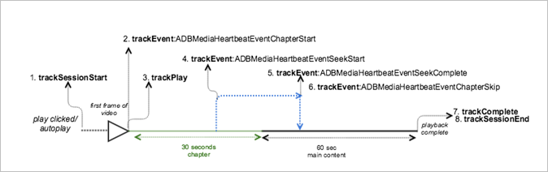

# 跳过一个章节的 VOD 播放{#vod-playback-with-a-skipped-chapter}

## 场景 {#scenario}

在此方案中，用户将跳过主内容中的一章。

此方案与[包含一个章节的 VOD 播放](/help/use-cases/tracking-scenarios/vod-one-chapter.md)方案相同，但此例中的用户希望从章节中搜寻，从而跳过该章节以进入主内容。

| 触发器 | 心跳方法 | 网络调用   | 注释 |
|---|---|---|---|
| 用户点击&#x200B;**[!UICONTROL 播放]** | `trackSessionStart` | Analytics 内容开始，心跳内容开始 | 测量库不知道存在一个前置广告。 这些网络调用仍然与 [iOS 种不含广告的播放](vod-no-intrs-details.md)方案完全相同。 |
| 章节开始。 | `trackEvent:ChapterStart` | 心跳章节开始 |  |
| 将播放章节的第一帧。 | `trackPlay` | 心跳章节播放 | 当章节内容在主内容之前播放时，我们希望在章节开始时开始播放心跳。 |
| 将播放章节。 |  | 章节心跳 |  |
| 搜寻开始跳过第一章。 | `trackEvent:trackSeekStart` |  | 搜寻期间没有心跳 |
| 搜寻结束。 | `trackEvent:trackSeekComplete` |  | 心跳会继续发布此内容。 |
| 应用程序可实现用户从常规的章节边界进行搜寻。 | `trackEvent:trackChapterSkip` |  |  |
| 播放内容。 |  | 内容心跳 |  |
| 内容结束播放。 | `trackComplete` | 心跳内容结束 | 此网络调用与 [iOS 中没有中断的播放](vod-no-intrs-details.md)方案完全相同。 |
| 会话结束。 | `trackSessionEnd` |  | `SessionEnd` 是指观看会话结束。 即使用户没有观看至媒体结束，也必须调用此 API。 |

## 参数 {#parameters}

在章节播放过程中使用的参数与[包含一个章节的 VOD 播放](/help/use-cases/tracking-scenarios/vod-one-chapter.md)场景中的参数相同，不同之处仅在于没有章节结束网络调用。

## 示例代码 {#sample-code}



### Android

要在 Android 中查看此方案，请设置以下代码：

```java
// Set up mediaObject 
MediaObject mediaInfo = MediaHeartbeat.createMediaObject( 
  Configuration.MEDIA_NAME,  
  Configuration.MEDIA_ID,  
  Configuration.MEDIA_LENGTH,  
  MediaHeartbeat.StreamType.VOD 

); 

HashMap<String, String> mediaMetadata = new HashMap<String, String>(); 
mediaMetadata.put(CUSTOM_KEY_1, CUSTOM_VAL_1); 
mediaMetadata.put(CUSTOM_KEY_2, CUSTOM_VAL_2); 

// 1. Call trackSessionStart() when the user clicks Play or if autoplay is used,  
//    i.e., there is an intent to start playback.  
_mediaHeartbeat.trackSessionStart(mediaInfo, mediaMetadata); 

...... 
...... 

// Chapter 
HashMap<String, String> chapterMetadata = new HashMap<String, String>(); 
chapterMetadata.put(CUSTOM_KEY_1, CUSTOM_VAL_1); 
MediaObject chapterDataInfo =  
MediaHeartbeat.createChapterObject(CHAPTER_NAME,  
                                   CHAPTER_POSITION,  
                                   CHAPTER_LENGTH,  
                                   CHAPTER_START_TIME); 

// 2. Track the MediaHeartbeat.Event.ChapterStart event when the chapter starts to play.  
_mediaHeartbeat.trackEvent(MediaHeartbeat.Event.ChapterStart,  
                         chapterDataInfo,  
                         chapterMetadata); 

....... 
....... 

// 3. Call trackPlay() when the playback actually starts, i.e., when the first frame  
//    of the main content is rendered on the screen.  
_mediaHeartbeat.trackPlay(); 

....... 
....... 

// 4. Track the MediaHeartbeat.Event.SeekStart event when the user begins to seek out  
//    of the chapter with the intent to skip it.  
_mediaHeartbeat.trackEvent(MediaHeartbeat.Event.SeekStart, null, null); 

....... 
....... 

// 5. Track the MediaHeartbeat.Event.SeekComplete event when the user seeks out of the  
//    chapter with the intent to skip it.  
_mediaHeartbeat.trackEvent(MediaHeartbeat.Event.SeekComplete, null, null); 

....... 
....... 

// 6. Track the MediaHeartbeat.Event.ChapterSkip event because the user skipped the  
//    chapter by seeking out of it in the steps above.  
_mediaHeartbeat.trackEvent(MediaHeartbeat.Event.ChapterSkip, null, null); 

....... 
....... 

// 7. Call trackComplete() when the playback reaches the end, i.e., when the media 
//    completes and finishes playing.  
_mediaHeartbeat.trackComplete(); 

........ 

........ 

// 8. Call trackSessionEnd() when the playback session is over. This method must be  
//    called even if the user does not watch the media to completion.  
_mediaHeartbeat.trackSessionEnd(); 

........ 
........ 
```

### iOS

要在 iOS 中查看此方案，请设置以下代码：

```
// Set up mediaObject 
ADBMediaObject *mediaObject =  
[ADBMediaHeartbeat createMediaObjectWithName:MEDIA_NAME  
                   length:MEDIA_LENGTH  
                   streamType:ADBMediaHeartbeatStreamTypeVOD]; 
 
NSMutableDictionary *mediaContextData = [[NSMutableDictionary alloc] init]; 
[mediaContextData setObject:CUSTOM_VAL_1 forKey:CUSTOM_KEY_1]; 
[mediaContextData setObject:CUSTOM_VAL_2 forKey:CUSTOM_KEY_2]; 

// 1. Call trackSessionStart when the user clicks Play or if autoplay is used,  
//    i.e., there's an intent to start playback. 
[_mediaHeartbeat trackSessionStart:mediaObject data:mediaContextData]; 
....... 
....... 
 
// Chapter 
NSMutableDictionary *chapterContextData = [[NSMutableDictionary alloc] init]; 
[chapterContextData setObject:CONTEXT_DATA_VALUE forKey:CONTEXT_DATA_KEY]; 
 
id chapterInfo =  
[ADBMediaHeartbeat createChapterObjectWithName:CHAPTER_NAME  
                   position:CHAPTER_POSITION  
                   length:CHAPTER_LENGTH  
                   startTime:CHAPTER_START_TIME]; 
    
// 2. Track the ADBMediaHeartbeatEventChapterStart event when the chapter starts. 
[_mediaHeartbeat trackEvent:ADBMediaHeartbeatEventChapterStart  
               mediaObject:chapterInfo  
               data:chapterContextData]; 
....... 
....... 

// 3. Call trackPlay when the playback actually starts, i.e., when the first  
//    frame of the main content is rendered on the screen. 
[_mediaHeartbeat trackPlay]; 
....... 
....... 

// 4. Track the trackEvent:ADBMediaHeartbeatEventSeekStart event when the user  
//    begins to seek out of the chapter with the intent to skip it. 
[_mediaHeartbeat trackEvent:ADBMediaHeartbeatEventSeekStart mediaObject:nil data:nil]; 
....... 
....... 

// 5. Track the trackEvent:ADBMediaHeartbeatEventSeekComplete event when the  
//    user seeks out of the chapter with the intent to skip it. 
[_mediaHeartbeat trackEvent:ADBMediaHeartbeatEventSeekComplete mediaObject:nil data:nil]; 
....... 
....... 

// 6. Track the trackEvent:ADBMediaHeartbeatEventChapterSkip event because the  
//    user skipped the chapter by seeking out of it in the steps above. 
[_mediaHeartbeat trackEvent:ADBMediaHeartbeatEventChapterSkip  
               mediaObject:chapterInfo  
               data:chapterContextData]; 
....... 
....... 
 
// 7. Call trackComplete when the playback reaches the end, i.e., when the media 
//    completes and finishes playing. 
[_mediaHeartbeat trackComplete]; 
....... 
....... 

// 8. Call trackSessionEnd when the playback session is over. This method must  
//    be called even if the user does not watch the media to completion. 
[_mediaHeartbeat trackSessionEnd]; 
....... 
....... 
```

### JavaScript

要在 JavaScript 中查看此方案，请输入以下文本：

```js
// Set up mediaObject 
var mediaInfo = MediaHeartbeat.createMediaObject( 
  Configuration.MEDIA_NAME,  
  Configuration.MEDIA_ID,  
  Configuration.MEDIA_LENGTH,  
  MediaHeartbeat.StreamType.VOD 
); 

var mediaMetadata = { 
  CUSTOM_KEY_1 : CUSTOM_VAL_1,  
  CUSTOM_KEY_2 : CUSTOM_VAL_2,  
  CUSTOM_KEY_3 : CUSTOM_VAL_3 

}; 

// 1. Call trackSessionStart() when Play is clicked or if autoplay is used,  
//    i.e., there's an intent to start playback. 
this._mediaHeartbeat.trackSessionStart(mediaInfo, mediaMetadata); 

...... 
...... 

// Chapter 
var chapterMetadata = { 
  CUSTOM_KEY_1 : CUSTOM_VAL_1 
}; 

var chapterDataInfo =  
MediaHeartbeat.createChapterObject(CHAPTER_NAME,  
                                  CHAPTER_POSITION,  
                                  CHAPTER_LENGTH,  
                                  CHAPTER_START_TIME); 

// 2. Track the MediaHeartbeat.Event.ChapterStart event when the chapter starts to play. 
this._mediaHeartbeat.trackEvent(MediaHeartbeat.Event.ChapterStart,  
                              chapterDataInfo,  
                              chapterMetadata); 

....... 
....... 

// 3. Call trackPlay() when the playback actually starts, i.e., when the  
//    first frame of the main content is rendered on the screen. 
this._mediaHeartbeat.trackPlay(); 

....... 
....... 

// 4. Track the MediaHeartbeat.Event.SeekStart event when the user begins  
//    to seek out of the chapter with the intent to skip it. 
this._mediaHeartbeat.trackEvent(MediaHeartbeat.Event.SeekStart); 

....... 
....... 

// 5. Track the MediaHeartbeat.Event.SeekComplete event when the user seeks  
//    out of the chapter with the intent to skip it. 
this._mediaHeartbeat.trackEvent(MediaHeartbeat.Event.SeekComplete); 

....... 
....... 

// 6. Track the MediaHeartbeat.Event.ChapterSkip event because the user  
//    skipped the chapter by seeking out of it in the steps above. 
this._mediaHeartbeat.trackEvent(MediaHeartbeat.Event.ChapterSkip); 

....... 
....... 

// 7. Call trackComplete() when the playback reaches the end, i.e., completes  
//    and finishes playing. 
this._mediaHeartbeat.trackComplete(); 

........ 
........ 

// 8. Call trackSessionEnd() when the playback session is over. This method must be  
//    called even if the user does not watch the media to completion. 
this._mediaHeartbeat.trackSessionEnd(); 

........ 
........ 
```
