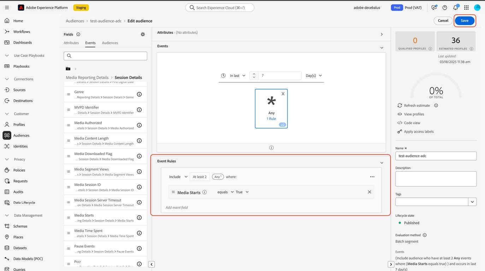

# 将受众迁移到新的流媒体字段

本文档介绍应如何迁移使用Adobe流媒体服务数据类型“媒体”中的字段的受众，以便使用名为“[媒体报表详细信息](https://experienceleague.adobe.com/zh-hans/docs/experience-platform/xdm/data-types/media-reporting-details)”的新对应数据类型。

## 迁移受众

要将受众从名为“媒体”的旧数据类型迁移到名为“[媒体报告详细信息](https://experienceleague.adobe.com/zh-hans/docs/experience-platform/xdm/data-types/media-reporting-details)”的新数据类型，您必须编辑受众，并在每个规则中将已弃用数据类型的旧字段替换为新数据类型的相应字段：

1. 查找包含来自已弃用“媒体”数据类型的字段的规则。 这是以路径`media.mediaTimed`开头的所有字段。

1. 使用新“[媒体报告详细信息](https://experienceleague.adobe.com/zh-hans/docs/experience-platform/xdm/data-types/media-reporting-details)”数据类型的字段复制这些规则。

1. 将这两个规则都保留在适当位置，直到您验证受众是否按预期工作。

1. 从已弃用的“Media”数据类型中删除包含字段的规则。

1. 验证受众是否仍在按预期工作。

查看[音频和视频参数](https://experienceleague.adobe.com/cn/docs/media-analytics/using/implementation/variables/audio-video-parameters#content-id)页面上的[内容ID](https://experienceleague.adobe.com/zh-hans/docs/media-analytics/using/implementation/variables/audio-video-parameters)参数，以便在旧字段和新字段之间映射。 旧字段路径位于“XDM字段路径”属性下，而新字段路径位于“报告XDM字段路径”属性下。

## 示例

为了更便于遵循迁移准则，请考虑以下示例，其中包含具有单个规则的受众。 由于受众只有一个规则，因此您只需应用迁移准则一次。

1. 选择右上角的&#x200B;[!UICONTROL **编辑受众**]&#x200B;按钮。

1. 找到为受众配置的规则。

   

   

1. 选择规则以打开其配置。

   

1. （可选）要查看规则中使用的字段的路径，请选择字段名称旁边的信息按钮。

   

1. 标识字段名称（本例中为“Media Starts”）。

   

1. 请参阅要在旧字段之间映射的[音频和视频参数](https://experienceleague.adobe.com/zh-hans/docs/media-analytics/using/implementation/variables/audio-video-parameters)页。 旧字段路径可在“XDM字段路径”属性下找到，而新字段路径可在“报告XDM字段路径”属性下找到。 例如，对于[Media Starts](https://experienceleague.adobe.com/cn/docs/media-analytics/using/implementation/variables/audio-video-parameters#media-starts)参数，`media.mediaTimed.impressions.value`的通讯对方是`mediaReporting.sessionDetails.isViewed`。

   

1. 使用新字段添加与现有规则相同的规则。

   

   

   

1. 选择&#x200B;[!UICONTROL **保存**]&#x200B;以保存受众。 您可以保留此设置，只要您需要验证受众是否仍按预期工作。

1. 验证完成后，删除旧字段，然后选择&#x200B;[!UICONTROL **保存**]&#x200B;以保存受众。

   

1. 再次验证受众。

   受众迁移过程已完成。
