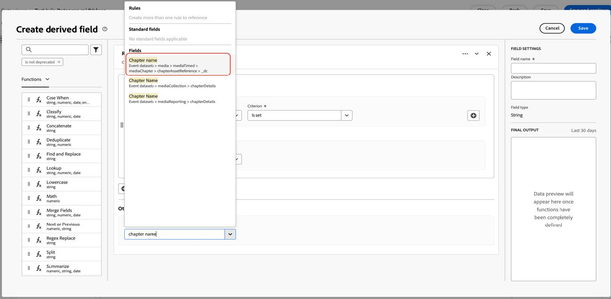

# 迁移Customer Journey Analytics以使用新的流媒体字段

本文档介绍了应如何更新使用名为“Media”的Adobe流媒体服务数据类型的Customer Journey Analytics设置，以便使用名为“[媒体报表详细信息](https://experienceleague.adobe.com/zh-hans/docs/experience-platform/xdm/data-types/media-reporting-details)”的新对应数据类型。

## 迁移Customer Journey Analytics

要将Customer Journey Analytics安装程序从名为“Media”的旧数据类型迁移到名为“[媒体报告详细信息](https://experienceleague.adobe.com/zh-hans/docs/experience-platform/xdm/data-types/media-reporting-details)”的新数据类型，您必须更新以下使用旧数据类型的安装程序：

* 数据视图

* 派生字段

### 迁移数据视图

要将数据视图迁移到新数据类型，请执行以下操作：

1. 使用已弃用的“媒体”数据类型找到所有数据视图。 这是路径以`media.mediaTimed`开头的所有字段。

1. 执行以下其中一项操作：

   * 在这些数据视图中，插入新“媒体报告详细信息”数据类型的字段。

   * 创建一个派生字段，该字段在设置时将使用新的“媒体报告详细信息”数据类型；如果未设置“媒体报告详细信息”数据类型，该字段将回退到旧的“媒体”数据类型。

### 迁移派生字段

要将派生字段迁移到新数据类型，请执行以下操作：

1. 使用已弃用的“媒体”数据类型找到所有派生字段。 这是包含路径以`media.mediaTimed`开头的字段的所有派生字段。

1. 将派生字段中的所有旧字段替换为“媒体报告详细信息”中的新对应字段。

查看[音频和视频参数](https://experienceleague.adobe.com/zh-hans/docs/media-analytics/using/implementation/variables/audio-video-parameters#content-id)页面上的[内容ID](https://experienceleague.adobe.com/zh-hans/docs/media-analytics/using/implementation/variables/audio-video-parameters)参数，以便在旧字段和新字段之间映射。 旧字段路径位于“XDM字段路径”属性下，而新字段路径位于“报告XDM字段路径”属性下。

## 示例

为了更便于遵循迁移准则，请考虑以下示例，其中包含带有旧弃用“媒体”数据类型字段的数据视图。 在此数据视图中，您需要添加新的相应字段。

### 更新数据视图

您可以使用以下任一选项来更新数据视图：

#### 选项1

1. 找到正在使用来自已弃用数据类型的旧字段的量度或维度。

   数据视图中的

1. 检查[章节参数](https://experienceleague.adobe.com/zh-hans/docs/media-analytics/using/implementation/variables/chapter-parameters#chapter-offset)文章中[章节偏移](https://experienceleague.adobe.com/zh-hans/docs/media-analytics/using/implementation/variables/chapter-parameters)节中对应的新字段。

1. 在数据视图中查找新的对应字段。

   

1. 将新字段拖到量度或维度中。

1. 对所有使用已弃用“媒体”数据类型中的字段的量度和维度重复此过程。

#### 选项2

此选项创建一个派生字段，该字段根据特定事件存在的值，从旧字段选择值，或从新字段选择值。 此派生字段替换了使用它的任何项目中的旧“媒体”数据类型。

如果要为“章节名称”创建一个派生字段，该字段在设置时将使用新的“媒体报告详细信息”数据类型；如果未设置“媒体报告详细信息”数据类型，该字段将回退到旧的“媒体”数据类型：

1. 将“Case When”子句拖到派生字段中。

   

1. 使用&#x200B;[!UICONTROL **报告XDM字段路径**]&#x200B;的值填充&#x200B;**If**&#x200B;子句，如[章节参数](https://experienceleague.adobe.com/zh-hans/docs/media-analytics/using/implementation/variables/chapter-parameters#chapter-name)页面上的[章节名称](https://experienceleague.adobe.com/zh-hans/docs/media-analytics/using/implementation/variables/chapter-parameters)参数中所示。

   

   

   

   

1. 使用已弃用的“媒体”数据类型的旧字段填充回退值。

   

   

   这是派生字段的最终定义。

   

1. 要更新派生字段，请找到正在使用旧弃用字段的派生字段（路径以`media.mediaTimed`开头）。

   

1. 将鼠标悬停在要更新的派生字段上，然后选择&#x200B;[!UICONTROL **编辑**]&#x200B;图标。

1. 找到旧数据类型（以`media.mediaTimed`开头的路径）中的所有字段，并将它们替换为新的相应字段。

   

1. 查看[流媒体参数](https://experienceleague.adobe.com/zh-hans/docs/media-analytics/using/implementation/variables/audio-video-parameters#content-name-variable)文章的[内容名称（变量）](https://experienceleague.adobe.com/zh-hans/docs/media-analytics/using/implementation/variables/audio-video-parameters#content-name-variable)部分中的相应新字段。

1. 用新字段替换旧字段。

   

1. 使用旧的已弃用“Media”数据类型的字段对所有派生字段重复此过程。

   CJA设置的迁移已完成。
