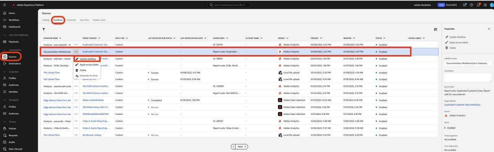

# 将自定义字段的数据准备迁移至新的流媒体字段

本文档介绍了迁移数据准备服务的过程，该数据准备服务位于为Adobe流媒体收集数据启用的Adobe数据收集流之上。 迁移会从名为“Media”的Adobe Streaming Media Collection数据类型转换数据准备映射，以使用名为“[媒体报表详细信息](https://experienceleague.adobe.com/en/docs/experience-platform/xdm/data-types/media-reporting-details)”的新对应数据类型。

## 迁移自定义字段的数据准备

要将数据准备映射从名为“媒体”的旧数据类型迁移到名为“[媒体报告详细信息](https://experienceleague.adobe.com/en/docs/experience-platform/xdm/data-types/media-reporting-details)”的新数据类型，您必须编辑数据准备映射：

>[!IMPORTANT]
>
>为避免丢失数据，在完成此部分中的步骤之前，请确保已使用新的`mediaReporting`字段部署了Analytics源连接器。

1. 在Adobe Experience Platform中的&#x200B;[!UICONTROL **源**]&#x200B;部分下，转到&#x200B;[!UICONTROL **数据流**]&#x200B;选项卡。

1. 找到负责通过Adobe数据收集将流媒体数据从Adobe Analytics导入Adobe Experience Platform的数据流。

1. 选择&#x200B;[!UICONTROL **更新数据流**]&#x200B;以通过用新XDM对象中的新对应字段替换每个包含已弃用字段的自定义源映射来修改数据准备设置。

1. 从已弃用的“Media”对象中找到包含源字段的映射。

1. 使用新“媒体报告详细信息”对象中的字段替换这些源。

1. 验证映射是否仍在按预期工作。

查看[音频和视频参数](https://experienceleague.adobe.com/cn/docs/media-analytics/using/implementation/variables/audio-video-parameters#content-id)页面上的[内容ID](https://experienceleague.adobe.com/zh-hans/docs/media-analytics/using/implementation/variables/audio-video-parameters)参数，以便在旧字段和新字段之间映射。 旧字段路径位于“XDM字段路径”属性下，而新字段路径位于“报告XDM字段路径”属性下。

## 示例

为了更便于遵循迁移准则，请考虑以下包含单个映射的数据流示例。 在这种情况下，您只需应用一次迁移指南。

1. 在Adobe Experience Platform中的&#x200B;[!UICONTROL **源**]&#x200B;部分下，转到&#x200B;[!UICONTROL **数据流**]&#x200B;选项卡。

1. 找到负责通过Adobe数据收集将流媒体数据从Adobe Analytics导入Adobe Experience Platform的数据流。

1. 选择&#x200B;**[!UICONTROL 更新数据流]**&#x200B;进入编辑UI，如下图所示。

   

1. 在&#x200B;**[!UICONTROL 映射]**&#x200B;选项卡中，选择&#x200B;**[!UICONTROL 自定义]**。

1. 确定依赖于`media.mediaTimed`字段作为源的自定义映射。

   

   在此示例中，由于您在开发组织的架构中创建了自定义字段组，因此目标字段位于`_dcbl`下。 自定义字段组路径因组织名称而异。

1. 对于使用`media.mediaTimed`对象的每个映射，请使用此文档在`mediaReporting`对象中找到其对应项。

   例如，对于Network，`media.mediaTimed.primaryAssetViewDetails`.broadcastNetwork的通讯方为`mediaReporting.sessionDetails.network`。

   

1. 在&#x200B;**[!UICONTROL Source字段]**&#x200B;字段中，将`media.mediaTimed`路径替换为`mediaReporting`路径。 目标字段保持不变。

   

1. 选择&#x200B;**[!UICONTROL 下一步]**&#x200B;以保存更改。

   状态为&#x200B;**[!UICONTROL 正在处理]**。 应用更改后，状态显示为&#x200B;**[!UICONTROL 已启用]**。

   

## 不同数据类型的示例

在上述示例中，涉及的所有数据类型都是字符串，因此映射替换是直接的。

如果源字段数据类型不同于目标字段数据类型，则需要遵循[数据准备故障排除指南](https://experienceleague.adobe.com/en/docs/experience-platform/data-prep/troubleshooting-guide)、[使用数据准备](https://experienceleague.adobe.com/en/docs/experience-platform/data-prep/data-handling)处理数据格式和[数据准备映射函数](https://experienceleague.adobe.com/en/docs/experience-platform/data-prep/data-handling)中的准则。

例如，如果源类型是字符串而目标类型是布尔值，则数据准备可以自动解析该值并将源值转换为布尔值。

如果源类型是数字，而目标类型是布尔值，则需要使用数据操作函数：

使用`media.mediaTimed`映射到自定义字段。

与`mediaReporting`映射到同一自定义字段：

