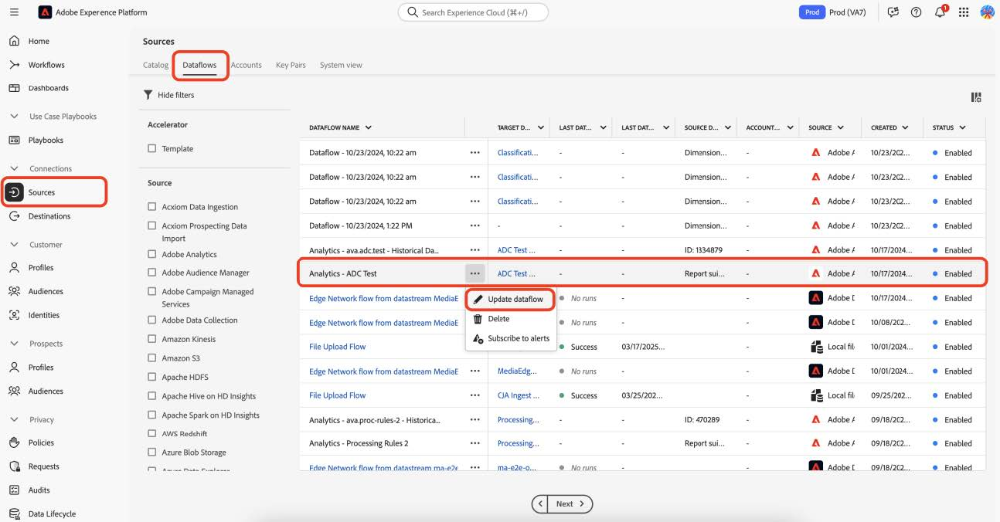

# 将配置文件迁移到新的流媒体字段

本文档介绍了迁移配置文件筛选服务的过程，该服务位于为Adobe Analytics for Streaming Media数据启用的Adobe数据收集流程之上。 迁移将使用名为“Media”的Adobe Streaming Media Collection数据类型转换配置文件筛选服务，以使用名为“[媒体报表详细信息](https://experienceleague.adobe.com/en/docs/experience-platform/xdm/data-types/media-reporting-details)”的新对应数据类型。

## 迁移配置文件

要将配置文件筛选从名为“媒体”的旧数据类型迁移到名为“[媒体报告详细信息](https://experienceleague.adobe.com/en/docs/experience-platform/xdm/data-types/media-reporting-details)”的新数据类型，您必须编辑现有的配置文件筛选规则：

1. 在Adobe Experience Platform中的&#x200B;[!UICONTROL **源**]&#x200B;部分下，转到&#x200B;[!UICONTROL **数据流**]&#x200B;选项卡。

1. 找到负责通过Adobe数据收集将流媒体数据从Adobe Analytics导入Adobe Experience Platform的数据流。

1. 选择&#x200B;[!UICONTROL **更新数据流**]&#x200B;以通过用新XDM对象中的新对应字段替换包含已弃用字段的每个自定义规则来修改配置文件筛选设置。

1. 找到包含已弃用“Media”对象中的字段的筛选器。

1. 通过添加新“媒体报告详细信息”对象中的字段来附加这些过滤器。

1. 在两个字段之间使用OR运算符；

1. 验证配置文件是否仍按预期工作。

查看[音频和视频参数](https://experienceleague.adobe.com/en/docs/media-analytics/using/implementation/variables/audio-video-parameters#content-id)页面上的[内容ID](https://experienceleague.adobe.com/zh-hans/docs/media-analytics/using/implementation/variables/audio-video-parameters)参数，以便在旧字段和新字段之间映射。 旧字段路径可在“XDM字段路径”属性下找到，而新字段路径可在“报告XDM字段路径”属性下找到。

## 示例

为了更便于遵循迁移准则，请考虑以下包含单个配置文件筛选规则的示例数据流。 在这种情况下，由于只有一条规则，因此您只需应用迁移准则一次。

1. 在Adobe Experience Platform中的&#x200B;[!UICONTROL **源**]&#x200B;部分下，转到&#x200B;[!UICONTROL **数据流**]&#x200B;选项卡。

1.找到负责通过Adobe Analytics将流媒体数据从Adobe Analytics导入Adobe Experience Platform的数据流。

1. 选择&#x200B;**[!UICONTROL 更新数据流]**&#x200B;进入编辑UI，如下图所示。

   

1. 选择&#x200B;**[!UICONTROL 下一步]**&#x200B;以转到“筛选”选项卡。

   

1. 在&#x200B;**[!UICONTROL 筛选]**&#x200B;选项卡上，确定依赖于`media.mediaTimed`字段的筛选规则。

   

   对于使用meda.mediaTimed对象的每个筛选器，使用`mediaReporting`音频和视频参数[页面在](https://experienceleague.adobe.com/zh-hans/docs/media-analytics/using/implementation/variables/audio-video-parameters)对象中查找其对应项，以在旧字段和新字段之间进行映射。 旧字段路径位于“XDM字段路径”属性下，而新字段路径位于“报告XDM字段路径”属性下。 例如，对于[Media Starts](https://experienceleague.adobe.com/en/docs/media-analytics/using/implementation/variables/audio-video-parameters#media-starts)，`media.mediaTimed.impressions.value`的通讯对方是`mediaReporting.sessionDetails.isViewed`。

   

1. 将相关的`mediaReporting`字段拖到筛选规则中，并在两个规则之间使用OR运算符。 使用新字段时添加与现有规则相同的规则。

   

1. 选择&#x200B;**[!UICONTROL 下一步]**&#x200B;以保存更改。
